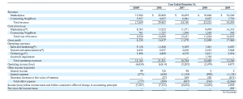
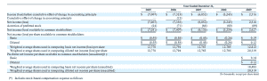

# Reply.com 申请 6000 万美元的首次公开募股

> 原文：<https://web.archive.org/web/http://techcrunch.com/2010/02/22/reply-com-files-ipo/>

本地点击付费市场[Reply.com](https://web.archive.org/web/20230402140034/http://www.reply.com/)希望通过首次公开募股筹集 6000 万美元。该公司今天早上向美国证券交易委员会提交了上市声明。

Reply.com 是一个点击付费的广告网络，其目标是为当地企业投放广告。它的策略是从点击他们广告的消费者那里收集更多的信息，在弹出广告之间插入一个“中间页”,询问他们住在哪里，或者在给他们看广告之前，他们喜欢什么品牌来提高针对性。

2009 年的收入增长了 75%，达到 3260 万美元。该公司的毛利率为 50%，2009 年首次实现净利润 250 万美元。该业务在 2009 年产生了 470 万美元的现金流，但在年底时只有 130 万美元的现金。Reply.com 从搜索引擎、展示广告网络和其他来源获得点击流量。这些流量获取成本几乎占据了其全部收入成本。仅在第四季度，就为 5000 家广告商创造了 490 万次“增强点击”和 70 万条线索。该公司雇佣了 127 名员工，其中 103 人从事销售和市场营销。

自 2005 年以来，该公司已经从 Scale Venture Partners、Outlook Ventures、ATEL Ventures 和苹果前首席财务官彼得·科尔曼那里筹集了 2750 万美元。首席执行官 Payam Zamani 是最大的股东。他拥有 43%的已发行股票(发行前)。Scale 是第二大股东，拥有 21.5%的股份。

扎马尼之前是 Autoweb 的联合创始人，他一直为 Reply.com 提供资金支持。过去两年，该公司一直在动用他的个人信用额度来提高流动性。根据该文件，“截至 2009 年 12 月 31 日，我们根据这些信用额度偿还给扎马尼先生的本金总额为 590 万美元。”截至 2009 年 12 月 31 日，所有欠首席执行官的个人债务都已偿还，但这确实表明了公司可能需要更多营运资金的一个原因。它还计划利用这些收入来拓展新的广告类别和地理区域(并且，据推测，雇佣更多的销售人员——当地的广告活动是非常销售密集的)。

点击下表查看其合并损益表。

