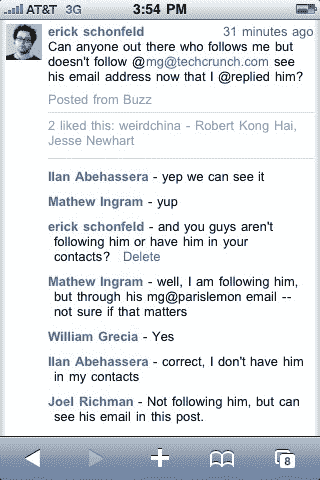

# 注意你在 Google Buzz 上回复的人，你可能会暴露他们的电子邮件地址 

> 原文：<https://web.archive.org/web/http://techcrunch.com/2010/02/11/reply-google-buzz-exposing-email/>

像 Google Buzz 对 Gmail 所做的那样，围绕电子邮件联系人创建即时社交网络的危险在于，隐私和公开之间的界限并不总是清晰的。今天早些时候提出的一个问题是，默认情况下，你关注的人和关注你的人在你的个人资料页面上是公开的，但基于你私下发邮件最多的人。你可以[隐藏这些列表](https://web.archive.org/web/20230204175226/http://gmailblog.blogspot.com/2010/02/millions-of-buzz-users-and-improvements.html)，但这仍然是一个选择退出的过程，而不是选择加入的过程。

原来 Google Buzz 还有另一个隐私漏洞，可以将私人电子邮件地址暴露给关注你的每个人。Google Buzz 借鉴了 Twitter 的@reply 惯例，所以如果你想回复某人或对他们发表评论，你只需在他们的名字前面加上@符号。当你开始输入时，谷歌会自动从你的联系人列表中建议名字。通常情况下，如果您选择与此人的公开资料相关联的 Gmail 帐户或聊天名称，这不会导致任何问题。它最终公布的是他们的名字，而不是他们的电子邮件地址。

但如果你选择了一个非公开的名字或账户，Buzz 会用他们的私人邮箱来填写。例如，我想对 TechCrunch 作家 MG Siegler 发表评论，所以我输入“@mg ”,出现了他的三封不同的电子邮件。我选择了他的 TechCrunch 电子邮件，没有意识到他的公开资料链接到了另一个 Gmail 账户。这意味着在 Buzz 上关注我的 231 个人都可以在我的评论中看到 MG 的私人邮箱地址，即使他们之前与他没有直接联系。他们现在可以向他发送大量未经请求的电子邮件和垃圾邮件。现在，将这种潜在风险乘以已经使用 Buzz 的数百万人，你就能明白为什么这个漏洞应该被迅速修补。

我请谷歌解释这一切是如何运作的，下面是他们的回应:

> 通常，键入某人的电子邮件地址会自动补全该人的姓名，因此他们的地址不会被任何人看到。只有在你无法访问一个人的名字，并且没有名字连接到该电子邮件地址的情况下，系统才会显示该人的地址，而不是他们的名字。这是非常罕见的，只有在以下情况下才会发生:
> 
> *   您正在键入其地址的人没有公开个人资料或
> *   他们没有跟踪你，你也没有通过聊天联系他们。
> 
> 当你发帖时，很明显你的邮箱地址是公开可见的，你可以随时编辑和/或删除帖子。

只不过这并不罕见。我的许多联系人，包括使用 Buzz 的人，都有多个电子邮件地址。当我在 Buzz 中输入他们的名字来回复他们时，自动建议框会向我显示我在 Gmail 中为他们准备的所有不同的电子邮件地址，但不会指明哪些是公开的，哪些是私人的。例如，当我输入 MG 的名字时，我选择了 TechCrunch 电子邮件，因为这是我用得最多的邮件。我不知道他的 Gmail 地址是与他的公开资料相关联的，因此我应该用这个地址来保护他的隐私。

在我看来，这是一个设计缺陷。谷歌实际上期望我们捡起这些东西并保护彼此的隐私，而不是相反。当你无意中输入了某人的电子邮件地址时会发生什么？根据谷歌的说法:

> 在这种情况下，一个人试图使用联系人的电子邮件地址键入@reply，键入电子邮件地址，然后在发帖后看到电子邮件地址清楚地显示在帖子中。预计在此之后，大多数人会明白，该电子邮件地址将对帖子的查看者可见。用户可以编辑或删除帖子。

抱歉，但是这对于普通用户来说期望太高了，他们可能甚至不会注意到这样一个微小的细节。警告用户或确保自动补全中只出现公共名称，这真的取决于 Google。这能有多难？相反，谷歌告诉我们，这是我们的问题，我们应该更加警惕使用他们的产品。

总的来说，对于一个 80%的人可能永远不会使用的特性来说，这是一个小的、可修复的缺陷。但这是一个例子，说明当你将私人联系注入公共渠道时会出现什么问题。谷歌需要格外小心像这样的细节。