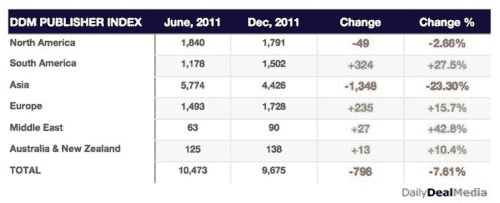
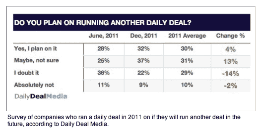
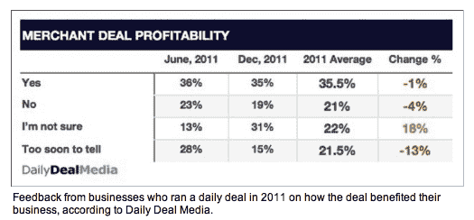

# 报告:2011 年后 6 个月有 798 个每日交易网站倒闭 

> 原文：<https://web.archive.org/web/https://techcrunch.com/2012/01/19/report-798-daily-deal-sites-folded-in-the-last-6-months-of-2011/>

# 报告:2011 年后 6 个月，798 个每日交易网站倒闭

根据来自 [Daily Deal Media](https://web.archive.org/web/20221006202409/http://www.dailydealmedia.com/) 的一份[新报告](https://web.archive.org/web/20221006202409/http://www.dailydealmedia.com/insights-report/?id=3)，一个关于热门的每日交易行业的新闻、信息和数据的巨大来源，在这个星球上的许多 Groupon 追随者中正在发生大量的整合和死亡——至少在一些地区。每日交易媒体在[陡峭的付费墙](https://web.archive.org/web/20221006202409/https://www.dailydealmedia.com/insights-order/?pid=3)后面保留了大部分好东西，但在今天早上早些时候的[新闻稿](https://web.archive.org/web/20221006202409/http://www.prnewswire.com/news-releases/some-like-it-hot-daily-deal-industry-continues-to-be-on-fire-in-2012-137644028.html)中分享了一些来自其报告的关键发现。根据他们的说法，2011 年下半年，全球每日交易网站减少了近 800 个，准确地说是 798 个。

尤其是在亚洲，每日交易网站似乎以极快的速度来来去去。根据 Daily Deal Media 的数据，仅在 2011 年的后 6 个月，就有 1348 个亚洲 Daily Deal 网站消失了。

然而，在同一时间段内，拉丁美洲新增了 324 个每日交易网站(+27.5%)，欧洲新增了 235 个(+15.7%)。美国相当平坦。

总体而言，2011 年下半年，交易发布商总数下降了 7.61%。

每日交易媒体还调查了 2011 年使用每日交易服务的商家，以及去年使用每日交易的 36600 名消费者。

在接受调查的商家中，16.5%的人表示他们对每天的交易活动不满意，35%的公司表示他们的交易是盈利的。

此外，从 2011 年 6 月到 2011 年 12 月，商家对其交易计划的“总体满意度”上升了 17%。

至于最终用户:每日交易媒体合作伙伴 Triton Digital 对 6 万名消费者进行了调查，发现 39%的人从未订阅过交易计划。

在那些至少订阅了一个网站的人中，28.4%的人说他们“浏览了一下交易”以决定他们的兴趣，19.6%的人阅读了整个交易电子邮件，而 10.2%的人订阅了，但认为交易是垃圾邮件，并删除了它们。有些人显然需要参加退订课程。

