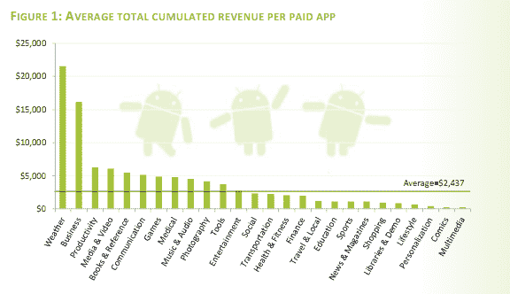

# 报告:Android 市场下载量接近 60 亿次；天气应用程序正在下雨 

> 原文：<https://web.archive.org/web/http://techcrunch.com/2011/09/12/report-android-market-nearing-6-billion-downloads-weather-apps-are-makin-it-rain/>

安卓市场持续爆发。研究公司 Ovum 最近发布的统计数据预测，今年 Android 市场的应用下载量可能达到 81 亿，而 iOS 为 60 亿，[今年应用下载量的总增长率预计将高达 144%](https://web.archive.org/web/20230205044020/http://news.cnet.com/8301-1035_3-20103230-94/android-to-overtake-apple-in-app-downloads/)。今天，移动研究公司 [Research2Guidance](https://web.archive.org/web/20230205044020/http://www.research2guidance.com/) 发布了一份报告，详细介绍了 Android marketplace 目前不断增长的趋势，以及哪些类别的应用程序最赚钱。

传统上，免费的广告支持的应用程序已经吞噬了 Android 市场的大部分份额。但是那些付费应用呢，他们赚了多少钱，值得吗？该研究公司发现，在 8 月份，每个类别的累计收入从 300 美元到 21000 美元不等，自发布以来，Android 应用程序的平均收入为 2500 美元。虽然这不是一个令人难以置信的平均值，但也不算太差。更重要的是，该研究公司表示，仅仅通过“选择竞争力较弱、价格更密集的类别，开发商就可以将他们的潜在收入增加 900%”。

在类别方面，不出所料，Android Market 上下载的所有应用程序中有近四分之一是游戏，因为这一直是 app store 上最大、增长最快的类别，受到所有开发者的青睐。然而，随着过去几个月货币化潜力的下滑，游戏领域的激烈竞争似乎导致了收入的减少。

另一方面，可能更令人惊讶的是市场上最赚钱的应用类别:平均而言， *weather* 应用从付费下载中获得的总收入最高。部分原因是选择有限，它确实是每个智能手机用户的必备应用程序——我们想知道我们是否会走进龙卷风。当然，用例非常具体，大多数人都不愿意使用(或开发)另一个天气应用程序。可能性只有这么多。

相反，这家研究公司建议开发者考虑在商业工具上进行创新——例如，用户并不反对为有助于提高效率的优秀商业应用付费，该公司表示，这个空间远没有其他地方那么拥挤。

但是 app store 的增长如何呢？根据该报告，在内容增加方面，安卓市场仍然领先于苹果的应用商店。在 8 月份，该商店增加了超过 20，000 个应用程序，在此期间，苹果在其 iPhone 应用程序商店中又增加了 15，000 个应用程序。截至本月初，安卓市场的应用总数为 277，252 个，付费应用的份额保持在 35%，这些付费应用的平均售价为 3.13 美元。

报告称，Android Market 的总下载量接近 60 亿次，应该会在 9 月中旬达到，每周有近 1500 家新出版商加入该商店。

更多信息，[请点击此处查看 Research2Guidance 八月份的免费报告](https://web.archive.org/web/20230205044020/http://www.research2guidance.com/shop/index.php/android-market-insights-august-2011)。

