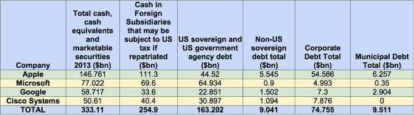

# 报道:改变科技巨头的税收规则对美国政府来说意味着 890 亿美元

> 原文：<https://web.archive.org/web/https://techcrunch.com/2014/03/14/report-changing-tax-rules-for-tech-giants-would-mean-89-billion-for-u-s-gov/>

# 报道:改变科技巨头的税收规则对美国政府来说意味着 890 亿美元

包括谷歌、T2、苹果在内的科技巨头都是离岸避税天堂的狂热粉丝，这为他们在 T4 省下了数十亿美元。调查新闻局的一份新报告发现“如果这些现金被带到国内并按照目前 35%的美国公司税率征税，将为美国财政部带来 890 亿美元的横财——相当于美国今年预计 5140 亿美元预算赤字的 17%。”

虽然争议并不新鲜，但这些发现让不改变税法付出了很高的代价。“如果一家美国跨国公司将其离岸现金存入一家美国银行，并用这笔钱购买美国国债、股票和债券，这些资金应该被视为已被调回国内，并应缴纳美国税，”参议员卡尔·莱文在回应该局的报告时表示。

以下是许多科技巨头海外投资的明细，其中大部分是美国机构债券。

科技公司对这份报告给出了一个标准的答复:“思科支付所有到期税款”。同样，苹果公司说，“我们支付了我们欠的所有税款——每一美元。我们不仅遵守法律，而且遵守法律的精神。”

苹果首席执行官蒂姆·库克(Tim Cook)辩称，如果政府简化税法，苹果公司[将支持将更多](https://web.archive.org/web/20230320210703/https://techcrunch.com/2013/05/21/tim-cook-we-pay-all-of-the-taxes-we-owe-every-single-dollar/)海外账户调回美国。包括共和党总统候选人兰德·保罗在内的一些国会议员为离岸天堂的做法辩护:

[推文 https://Twitter . com/SenRandPaul/status/336867611868536832]

无论如何，目前还不清楚国会是否会在本届会议上着手修改美国税法的这一特定部分。国会仍需就移民改革和国家安全局改革进行辩论——所有这些都将在几个月后的选举年进行。

图片: [Flickr 用户 JD Hancock](https://web.archive.org/web/20230320210703/http://www.flickr.com/photos/jdhancock/3446025121) 下一个 [CC by 2.0 许可](https://web.archive.org/web/20230320210703/http://creativecommons.org/licenses/by/2.0/deed.en)