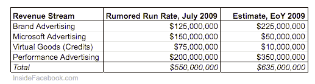

# 报告:脸书 2009 年收入为 7.77 亿美元，净收入为 2 亿美元

> 原文：<https://web.archive.org/web/https://techcrunch.com/2011/01/05/report-facebook-revenue-was-777-million-in-2009-net-income-200-million/>

# 报告:脸书 2009 年的收入为 7.77 亿美元，净收入为 2 亿美元

DST 和高盛在脸书的 5 亿美元投资[显然搅动了](https://web.archive.org/web/20230130100805/https://techcrunch.com/2011/01/05/things-about-the-endless-facebook-speculation-that-have-to-be-said/)科技和金融新闻的大锅饭[各种关于社交网络财务状况的惊人信息](https://web.archive.org/web/20230130100805/http://www.techmeme.com/110105/p68#a110105p68)现已曝光。《华尔街日报》*[报道称](https://web.archive.org/web/20230130100805/http://online.wsj.com/article/SB10001424052748703675904576064210094944044.html?mod=e2tw)高盛正在向潜在投资者提供脸书“快照”,概述网站流量、广告统计和其他分析。*

 *有关 2009 年收入的更多细节也在高盛的招标过程中被披露。从[到*华尔街日报*](https://web.archive.org/web/20230130100805/http://online.wsj.com/article/SB10001424052748703675904576064210094944044.html?mod=e2tw) :

> 据知情人士透露，脸书 2009 年的净收入为 2 亿美元，营收为 7.77 亿美元。2010 年的数字没有披露，但分析师表示，受广告增长的推动，该公司去年的收入可能高达 20 亿美元。

非官方的“[猜猜脸书的收入”](https://web.archive.org/web/20230130100805/https://techcrunch.com/2010/09/01/facebook-will-hit-2-billion-2010-revenue-says-mob-of-unofficial-facebook-spokespersons/)游戏已经进行了很长一段时间，但我们必须说脸书内部最接近 2009 年，在三月份锁定在 7 亿左右。他们的估计细目如下。

*