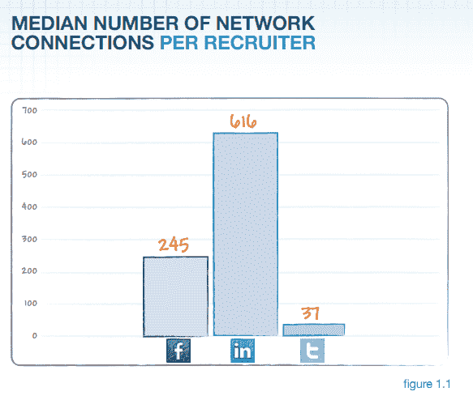

# 报告:LinkedIn 在社交招聘领域领先，其次是 Twitter 和脸书 

> 原文：<https://web.archive.org/web/https://techcrunch.com/2012/02/13/report-linkedin-leads-in-social-job-recruiting-followed-by-twitter-and-facebook/>

# 报告:LinkedIn 在社交招聘方面领先，Twitter 和脸书紧随其后

开发招聘软件和求职者跟踪系统的 Bullhorn 公司发布了一份新的[社交招聘活动报告](https://web.archive.org/web/20221207182220/http://www.bullhornreach.com/content/resources/reports)，该报告调查了社交媒体在高管和职位招聘中的使用情况。Bullhorn 发现，在招聘人员的使用频率和寻找候选人的效率方面，LinkedIn 领先，其次是 Twitter，脸书排名第三。

值得注意的是，这项研究考察的是招聘者的活动，而不是真正的求职者。尽管[脸书](https://web.archive.org/web/20221207182220/https://beta.techcrunch.com/2011/11/16/social-recruiting/)作为求职和职业网络来源的崛起，Bullhorn 的数据显示，招聘人员的 LinkedIn 网络仍然比他们的 Twitter 和脸书网络加起来的浏览量还要多。在社交网络上发布职位的招聘人员可能会收到更多来自 LinkedIn 的申请，社交网络驱动的申请数量几乎是脸书的九倍，是 Twitter 的三倍。

报告中有一个有趣的数据——Twitter 粉丝申请工作的可能性几乎是 LinkedIn 联系人的三倍，是脸书粉丝的八倍多，这表明 Twitter 可能是一个非常未被充分利用的社交招聘渠道。推特粉丝每份工作的浏览量几乎是脸书粉丝群的两倍。

根据该报告，48%的招聘人员只使用 LinkedIn。这些招聘人员平均有 661 个联系，并且不利用其他两个网络进行社会招聘。由此看来，招聘人员使用 Twitter 的次数超过了脸书。尽管招聘人员在 Twitter 上的联系较少(平均 37 个关注者)，但 19%的人同时连接到 LinkedIn 和 Twitter，而只有 10%的人同时连接到 LinkedIn 和脸书(平均 245 个朋友)。

在采用方面，LinkedIn 继续以最快的速度增长。招聘人员平均每周在 LinkedIn 上增加 18.5 个联系，相比之下，Twitter 上有 3.3 个关注者，脸书上有 1.4 个好友。LinkedIn 每份工作的浏览量超过 Twitter 和脸书，是 Twitter 的三倍，脸书的六倍。

