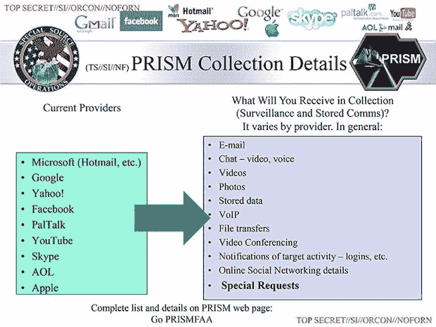
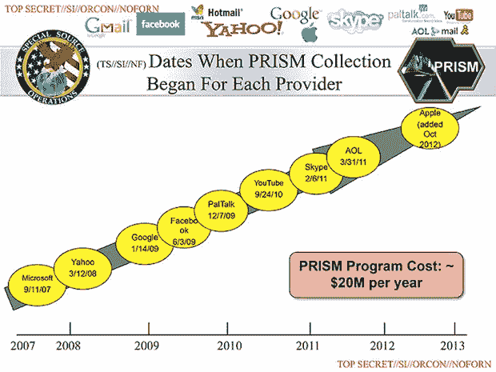

# 报道:美国国家安全局直接从谷歌、苹果、微软、脸书等公司的服务器上收集数据

> 原文：<https://web.archive.org/web/https://techcrunch.com/2013/06/06/report-nsa-collects-data-directly-from-servers-of-google-apple-microsoft-facebook-and-more/>

《华盛顿邮报》报道了一项绝密的国家安全局数据挖掘项目，该项目直接接入谷歌、脸书、微软和苹果等公司的服务器。《华盛顿邮报》报道称，“美国国家安全局(National Security Agency)和联邦调查局(FBI)正直接进入美国九大互联网公司的中央服务器，提取音频、视频、照片、电子邮件、文件和连接日志，使分析师能够跟踪一个人在一段时间内的活动和联系方式。”。

关于高度机密项目“棱镜计划”(Project PRISM)的细节有些模糊，但似乎国家安全局允许司法部长和国家情报总监“向联邦调查局的数据拦截技术部门开放他们的服务器，该部门负责处理国家安全局与美国公司的联络。”

“只需点击几下鼠标，并确认该主题被认为参与了恐怖主义、间谍活动或核扩散，分析师就可以完全访问脸书的‘针对各种在线社交网络服务的广泛搜索和监视能力’，”帖子解释道*。*

从那里，NSA 挖掘嫌疑人的数据，然后“跳到”他们的潜在联系人，成倍增加了 NSA 可以监视的美国人的数量(根据授权，NSA 应该监视外国人)。

这些公司中的大多数现在都否认了这些指控。

我们联系了脸书寻求评论，他们回答说:“我们不为任何政府机构提供直接访问脸书服务器的途径。当脸书被要求提供有关特定个人的数据或信息时，我们会仔细审查任何此类要求，以符合所有适用法律，并仅在法律要求的范围内提供信息。”

在给 TechCrunch 的一份声明中，微软表示:“我们只有在收到具有法律约束力的命令或传票时才会提供客户数据，而不是在自愿的基础上。此外，我们只遵从有关特定账户或身份的请求。如果政府有一个更广泛的自愿国家安全计划来收集客户数据，我们不会参与其中。”

雅虎告诉 TechCrunch:“雅虎！非常重视用户的隐私。我们不会让政府直接访问我们的服务器、系统或网络。"

谷歌在一份声明中表示:“谷歌非常关心我们用户数据的安全。我们依法向政府披露用户数据，并仔细审查所有此类请求。人们不时声称，我们在我们的系统中建立了一个政府“后门”,但谷歌没有让政府获取私人用户数据的后门。"

苹果公司给了美国消费者新闻与商业频道一份声明:

[推特 https://twitter.com/CNBC/status/342778613264945152]

根据邮报的幻灯片(如下)，棱镜合作伙伴的数量在过去几年里稳步增长。微软，第一个合作伙伴，2007 年开始，雅虎 2008 年；2009 年的谷歌、脸书和 PalTalk2010 年的 YouTube2011 年 Skype 和 Aol 最后是苹果，它在 2012 年加入了这个项目，”[卫报](https://web.archive.org/web/20230404193702/http://www.guardian.co.uk/world/2013/jun/06/us-tech-giants-nsa-data)解释道。

昨天,《卫报》曝光了美国国家安全局监控威瑞森网络上每一个美国电话的电话数据。

《华盛顿邮报》指出，鉴于 Twitter 明显不在公司名单中，抵制似乎是可能的。这是一个正在展开的故事，当我们了解更多的时候，我们会发布重要的更新。

* [在 Twitter 上关注格雷戈里·费伦斯坦](https://web.archive.org/web/20230404193702/https://twitter.com/ferenstein)的实时更新(以及偶尔的讽刺评论)。

 **注:美国在线是 TechCrunch 的母公司。**