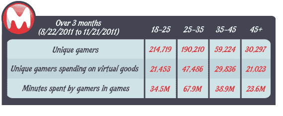

# 报告:年长的游戏玩家比年轻玩家购买更多的虚拟商品

> 原文：<https://web.archive.org/web/https://techcrunch.com/2011/12/20/report-older-gamers-buy-more-virtual-goods-than-younger-counterparts/>

# 报告:年长的游戏玩家比年轻玩家购买更多的虚拟物品

移动游戏社区 [MocoSpace](https://web.archive.org/web/20221005194502/http://www.crunchbase.com/company/mocospace) 发布了一项新的研究结果，该研究关注不同年龄的虚拟商品消费和参与度。该报告发现，年轻的游戏玩家(25-35 岁)花在玩社交游戏上的时间最多，但 45 岁以上的游戏玩家购买的虚拟商品比年轻玩家多得多。这项研究调查了 MocoSpace 的 2200 万用户网络中的近 50 万游戏玩家。

基本上，MocoSpace 报告说，年龄与社交游戏中虚拟商品的花费直接相关。玩家年龄越大，购买的虚拟商品越多。35 岁以上的游戏玩家占被调查游戏玩家的 18%，占所有虚拟商品支出的 42%。相比之下，18 至 25 岁的受访者中有 43%的人只购买了 18%的虚拟商品。

该报告显示，25 至 35 岁的人是迄今为止最活跃的社交游戏人群，他们花在游戏上的时间几乎是其他任何群体的两倍。45 岁及以上的人玩游戏的时间最少。

有趣的是，这项研究显示出一种趋势，年轻的游戏玩家不太可能在虚拟物品上花费，而年长的游戏玩家更有可能购买剑或盾以在游戏中前进。当然，重要的是要考虑到老年人可能有更多的可支配收入，或者希望通过虚拟物品在游戏中进一步发展以节省时间。

研究结果还强调，不同的货币化方法可能适用于不同的年龄组。如果年轻的游戏玩家花费最多的时间，广告驱动的模式可能比纯粹基于虚拟商品的方法更有利可图。

MocoSpace 由软银支持的[，已经筹集了 1050 万美元的资金。](https://web.archive.org/web/20221005194502/https://beta.techcrunch.com/2010/09/23/mobile-social-network-mocospace-raises-3-5m-from-softbank-for-gaming-platform/)

