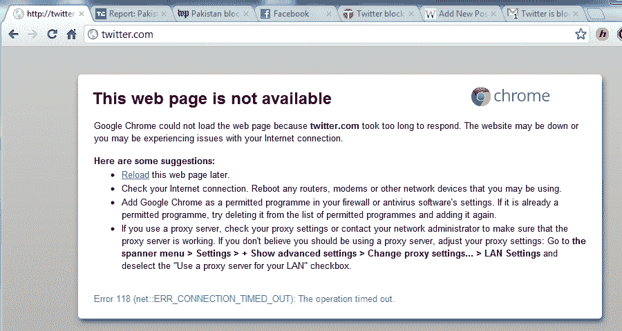

# 报道:巴基斯坦因亵渎内容封锁推特，脸书顺从？[更新:备份 

> 原文：<https://web.archive.org/web/https://techcrunch.com/2012/05/20/report-pakistan-blocks-twitter-over-blasphemous-content-facebook-complies/>

又是一天，又是一个国家让人们更难使用网络和一些最有效的沟通渠道的例子？来自巴基斯坦的报道称，巴基斯坦已经成为最新一个禁止使用 Twitter 的国家。**更新**:现在又回来了——新帖子说明发展[在这里](https://web.archive.org/web/20221006011033/https://beta.techcrunch.com/2012/05/20/twitter-back-up-in-pakistan-after-an-order-from-the-prime-minister/)。阅读下面的完整故事。

据博客 [Dawn](https://web.archive.org/web/20221006011033/http://dawn.com/2012/05/20/twitter-banned-in-pakistan/) 报道，巴基斯坦电信管理局主席今天因亵渎神明的内容实施了限制:据报道，巴基斯坦电信管理局主席穆罕默德·亚塞恩今天屏蔽了该网站，“因为推特拒绝删除与脸书上张贴伊斯兰教先知穆罕默德图像的比赛相关的材料。”该博客称，脸书显然已经满足了这一要求。其他人现在也开始报道同样的事情，下面是我们在拉合尔的一位读者的截图，他说他“根本无法访问这个网站”

如果是真的，在巴基斯坦被阻止尤其具有讽刺意味，因为这两人配对，在最近历史上最重要的新闻事件之一中发挥了主要作用:本拉登的突袭和死亡，这是由至少两人在该国山区目睹突袭发生的推特消息。

这是一个发展中的(有点令人困惑的)故事:就在昨天，大约 12 个小时前，巴基斯坦人民党参议员拉赫曼·马利克[发推文](https://web.archive.org/web/20221006011033/https://twitter.com/#!/SenRehmanMalik/status/203961375087788032)说没有任何东西被屏蔽:“亲爱的大家，我向你们保证，Twitter 和 FB 将继续在我们的国家存在，不会被屏蔽。请不要相信谣言，”他写道。我们联系了 Twitter 和脸书，询问他们对此事的回应。

**更新**:来自巴基斯坦[快报论坛报](https://web.archive.org/web/20221006011033/http://tribune.com.pk/story/381639/twitter-blocked-across-pakistan-over-blasphemous-drawings/)的更多细节:该报称，封锁该网站的请求是由信息和技术部提出的，并引用了一场绘画比赛(更多信息请点击[这里](https://web.archive.org/web/20221006011033/https://beta.techcrunch.com/2012/05/20/sure-draw-something-just-not-the-prophet/))。显然，该部向 Twitter 提出了几项要求，Twitter 回应说，它“无法阻止任何个人在网站上做这种性质的事情。”

包括 PTCL 宽带和 Wi-Tribe 在内的几个地区的互联网服务提供商都收到了屏蔽该网站的指令。它还报告称，Twitter 仍然可以通过 Opera 等安全浏览器以及 Vtunnel 等代理和 VPN 进行访问。[原报告继续]

这不是 Twitter 第一次在中国被屏蔽:据《黎明报》报道，类似的禁令在 2010 年就有过。持续了两个星期。

此举突显出社交网络仍然容易受到政府更高权力的影响。巴基斯坦并不是唯一一个采取这种做法的国家。

像脸书和推特这样的网站在中国仍然被官方禁止(尽管数百万人使用 VPN——虚拟私人网络),对于表达相反意见的人来说，这些禁令通常带有强烈的政治色彩。人口众多的发展中国家代表了面向规模的社交网络的一些最大的潜在增长机会——当它们可以被使用的时候。

甚至像英国这样的发达国家也提出了如何限制社交网络上的信息流的想法——这是去年夏天伦敦骚乱期间出现的事情，一些人认为黑莓 Messenger 等服务在有组织的抢劫团伙中发挥了作用。

**更新 2** :我们在拉合尔的一位令人敬畏的读者[瓦卡斯·阿里](https://web.archive.org/web/20221006011033/http://waqasali.me/)给我们发来了这张截图:

阿里也在过去 T2 的一场阻止脸书被禁的运动中发挥了作用。他说他现在根本无法访问 Twitter，但他的一个朋友可以使用 Opera Mini 浏览器访问该网站。

更新 3:这是一个[的后续帖子](https://web.archive.org/web/20221006011033/https://beta.techcrunch.com/2012/05/20/sure-draw-something-just-not-the-prophet/)一些先知图画的背景故事，以及另一个理论:封锁可能与巴基斯坦测试图像过滤服务有关，这听起来可能性更大。

[图片:[Flickr 上的 Farooq](https://web.archive.org/web/20221006011033/http://www.flickr.com/photos/farooqnasir/2093304565/sizes/m/in/photostream/)