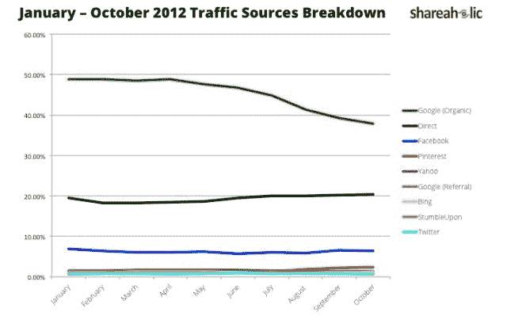
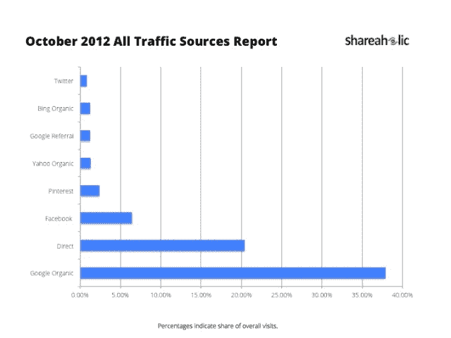

# 报告:自 7 月以来，StumbleUpon 的流量下降了 53% 

> 原文：<https://web.archive.org/web/https://techcrunch.com/2012/11/06/report-stumbleupons-traffic-down-53-since-july/>

# 报告:自 7 月以来，StumbleUpon 的流量下降了 53%

社交插件提供商 Shareaholic 今天发布的新数据显示，StumbleUpon 向出版商网站发送的流量持续下降。根据其网络流量趋势，StumbleUpon 的流量自 7 月份以来下降了 53 %, Twitter 现在比 StumbleUpon 的流量份额略高 0.22%。

【T2

值得注意的是，在之前引入“频道”的重新设计失败后，StumbleUpon】于 9 月发布了一个类似 Pinterest 的重大重新设计。流量明显下降，到 6 月份比去年同期下降了 24%。值得注意的是，StumbleUpon 的联合创始人 Garrett Camp [今年 5 月](https://web.archive.org/web/20230207093828/https://techcrunch.com/2012/05/08/stumbleupon-garrett-camp-steps-down/)辞去了首席执行官一职，随后该公司宣布将在下个月停止“频道”测试。

StumbleUpon 现在已经采用了 Pinterest 用户界面，这一事实也不乐观。然而，Shareaholic 表示，现在真正看到这一最新改进是否会在出版商网站的点击率和流量方面有所回报还为时过早。此外，Shareaholic 指出，当读者访问 StumbleUpon 时，[一切都被包裹在一个 iFrame](https://web.archive.org/web/20230207093828/http://searchengineland.com/stumbleupon-kills-direct-links-iframes-everything-109919) 中，因此即使读者可能会点击阅读该网站，浏览量也可能不会被记录为推荐流量。此外，一些读者在第一次通过 StumbleUpon 发现一个新网站后，可能会决定以后自己回来，在这种情况下，很难看到他们的点击最初是由访问 StumbleUpon 引起的。

[")](https://web.archive.org/web/20230207093828/https://techcrunch.com/2012/11/06/report-stumbleupons-traffic-down-53-since-july/january-october-2012-all-traffic-sources-report-shareaholic-jpg-718x452/)

与此同时，在推动网站流量方面，Pinterest 继续领先雅虎！有机交通——这是它在 8 月份开始做的事情。它也是全球网站的第四大流量驱动者，紧随谷歌(organic)、direct 和脸书之后。从 6 个月前的 4 月份到现在，Shareaholic 还看到谷歌的有机流量下降了 48.88%，目前谷歌拥有 37.86%的流量。当然，谷歌有机流量仍然远远领先于其他流量来源。

【T2

Shareaholic 的数据虽然只能代表整个互联网，但却来自一个大样本。这项服务现在包括 200，000 个出版商，每月覆盖 3 亿人。

*更新，11/8/12–stumble upon 提供了以下声明:“我们不同意这些数据。我们的内部数据显示，自 7 月以来，失误和推荐流量的数量在这段时间内有所增加。我们与 Shareaholic 取得了联系，以更好地了解他们的方法。展望未来，我们相信我们重新设计的网站和移动应用将继续为我们的社区和合作伙伴提供最佳的网络内容发现体验。”*