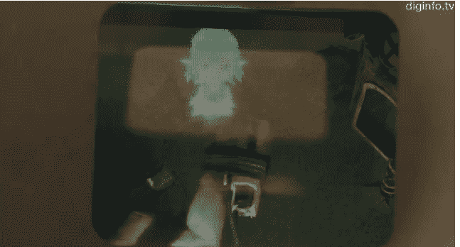
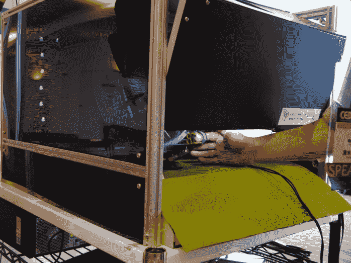

# RePro3D:裸眼 3D 显示器让你“触摸”虚拟 3D 角色(视频)

> 原文：<https://web.archive.org/web/http://techcrunch.com/2011/09/16/repro3d-naked-eye-3d-display-lets-you-touch-virtual-3d-characters-video/>

# RePro3D:裸眼 3D 显示让你“触摸”虚拟 3D 角色(视频)

这里有一种不同的 3D 屏幕:T2 庆应义塾大学的一个研究小组开发了一种显示器，允许用户“触摸”虚拟 3D 人物。所谓的 [RePro3D](https://web.archive.org/web/20230203133854/http://tachilab.org/modules/projects/repro3d.html) 的工作方式是，它将裸眼全视差 3D 显示器与触觉界面相结合，让用户用手指操纵 3D 环境中的虚拟物体。

制造商解释道:

> RePro3D 是适用于交互式 3D 应用的全视差 3D 显示系统。该方法基于回射投影技术，其中来自投影仪阵列的几个图像显示在回射屏幕上。当观众通过半透半反镜观看屏幕时，他们看到的是叠加在真实场景上的 3D 图像，而无需佩戴眼镜。

整个系统在这一点上看起来有点粗糙，但计划是进一步改进 RePro3D，并在未来将其用于交互式 3D 应用程序(即游戏)。

 

这里有一个视频提供了更多的见解(由东京的 [DigInfo TV](https://web.archive.org/web/20230203133854/http://www.diginfo.tv/2011/09/16/11-0184-r-en.php) 拍摄，英文):
【YouTube = http://www . YouTube . com/watch？v = HINWoOyZIwY&feature = player _ embedded]