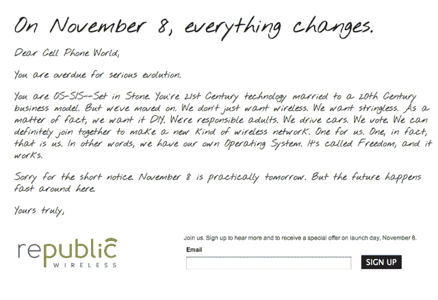

# Republic Wireless:Android 驱动的 VoIP/蜂窝混合运营商，将使您的电话账单减少一半 

> 原文：<https://web.archive.org/web/http://techcrunch.com/2011/10/31/republic-wireless-an-android-powered-voipcellular-hybrid-carrier-that-will-cut-your-phone-bill-in-half/>

说到好时机。

上周末，我写了一篇博文,恳求谷歌最终为谷歌语音带来 VoIP 功能——也就是说，为 Android 提供一个应用程序。这款应用将有一些主要的好处:它可以让你在家里和工作时随时通过 Wifi 网络拨打和接听电话(这意味着在办公室更少的掉线电话，即使你在一栋大楼的深处)。当你不在 Wifi 附近时，你可以回到你的运营商分钟。不幸的是，尽管谷歌很久以前就在致力于为 Android 开发一款基于 VoIP 的应用，但它搁置了它，可能是因为它担心激怒运营商。

但在那篇文章发表后不久，我开始听到一些传言。事实证明我不是唯一一个有这种想法的人——还有一种大鱼(尽管不太为人所知)即将引起轰动。准备好迎接[共和国无线](https://web.archive.org/web/20230203154442/http://republicwireless.com/preview/)，这是来自[Bandwidth.com](https://web.archive.org/web/20230203154442/http://www.bandwidth.com/)的一项新的移动电话服务，将于 11 月 8 日推出，可能会成为你一直想要的手机运营商。

首先，一点背景。如果你在 Twilio、Skype、Google Voice 或其他各种使用 VoIP 的服务上打过电话，很有可能 Bandwidth.com 也参与其中。该公司广泛的 VoIP 基础设施处理这些服务的大部分繁重工作，它还提供一些自己的产品，如 [Phonebooth](https://web.archive.org/web/20230203154442/http://www.phonebooth.com/#_) ，这是一种面向企业的高级 VoIP 服务。

这又让我们回到了 [Republic Wireless](https://web.archive.org/web/20230203154442/http://republicwireless.com/preview/) ，这是 Bandwidth 自己的最新产品。这项服务本质上将是一个移动虚拟网络运营商——换句话说，它是威瑞森和美国电话电报公司的替代品。与这些运营商的设备不同，它将根据你所在的位置，在 Wifi 和普通蜂窝连接之间切换。

该产品的主页最近更新了一条大胆的信息，承诺在 11 月 8 日推出“新型无线网络”。底部的链接证实了它确实是由 Bandwidth.com 制造的。该网站的其余部分缺乏细节，但我们有更多的感谢，部分是因为该公司一直在向其内部测试人员展示幻灯片。

以下是一些基础知识，其中一些是从幻灯片中收集的，另一些来自其他来源:

*   这项服务将使用它所谓的“混合呼叫”——只要有 Wifi，你的手机将主要依赖 Wifi。当你没有连接到无线网络时，它会回到手机网络上。
*   用户不必手动在 Wifi 和蜂窝网络之间切换，手机会自动解决这个问题
*   这项服务将要求用户获得一部新手机。我不清楚最初是否会有多种型号，但这款手机运行在 Android 上。因为混合呼叫依赖于硬件和软件，所以需要新的电话
*   第一个作为备用的蜂窝网络将是 Sprint。该公司要么正在计划，要么已经在与其他航空公司签约
*   电话只有一个电话号码(VoIP/蜂窝电话号码不能互换)
*   你可以通过 Wifi 发送电话和短信
*   我们听说定价细节仍在敲定中，但据描述，它们比传统运营商为 Android 设备(即智能手机)提供的任何其他产品都要便宜得多，可能只有一半左右
*   你不需要签合同，所以没有任何终止费。也没有超龄费。

**更新** : GigaOm [报道](https://web.archive.org/web/20230203154442/http://gigaom.com/2011/10/31/republic-wireless-to-launch-19-voice-sms-service/)这项服务每月 19 美元，包括无限的语音、文本和数据。

简而言之，这听起来非常棒，前提是没有任何我们还没有听说过的陷阱。

我会继续打听更多的细节。与此同时，值得看看 Republic Wireless 网站——如果你向右滚动，你会发现一张很长的照片，可能包含 11 月 8 日会发生什么的暗示。我想知道下面显示的手机(虽然是许多部件)是否是网络上的第一个设备。

[scribd id = 71069267 key = key-g 9 aiaa 7t 8 ouah m3 ko 9 o mode = list]

