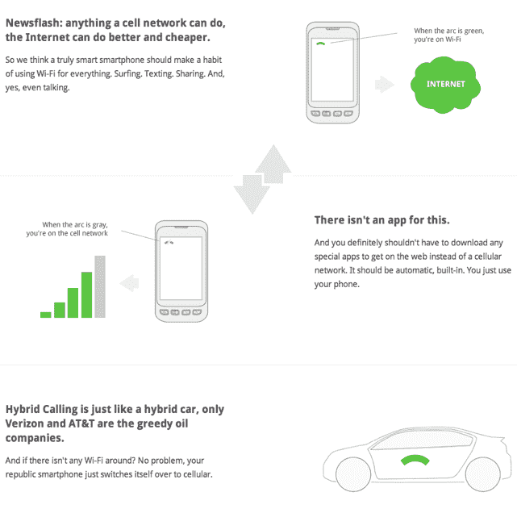

# Republic Wireless 正式推出每月 19 美元的服务:无限一切，无合约 

> 原文：<https://web.archive.org/web/http://techcrunch.com/2011/11/07/republic-wireless-officially-unveils-19month-service-unlimited-everything-no-contracts/>

上周，我们在一家名为 [Republic Wireless](https://web.archive.org/web/20230203071718/http://www.republicwireless.com/) 的移动运营商上[披露了这条新闻](https://web.archive.org/web/20230203071718/https://techcrunch.com/2011/10/31/republic-wireless-an-android-powered-voipcellular-hybrid-carrier-that-will-cut-your-phone-bill-in-half/)，从那以后，我一直在密切跟踪这家公司。到目前为止的故事是:为包括谷歌语音和 Twilio 在内的服务提供 VoIP 主干网的 Bandwidth.com，正在推出一个名为 Republic Wireless 的替代移动运营商。

正如 GigaOm [上周报道](https://web.archive.org/web/20230203071718/http://gigaom.com/2011/10/31/republic-wireless-to-launch-19-voice-sms-service/)的那样，每月只需花费 19 美元就可以获得无限的文本、数据和语音服务。它之所以能提供如此低的费率，是因为它的手机使用一种特殊的“混合通话”系统，这种系统只要有可能就会依赖 Wifi，当 Wifi 不可用时就会回到蜂窝连接。最初的移动合作伙伴是 Sprint，但 Republic 也在努力使用其他运营商作为后备选择。

现在，该公司已经正式宣布了关于这项服务的更多细节，这项服务刚刚[推出](https://web.archive.org/web/20230203071718/http://www.republicwireless.com/)。

关键的新细节:

Republic Wireless 提供的第一款手机是 LG Optimus 的改良版，运行 Android 2.3(姜饼)，用户需要购买才能使用该服务。这款手机由其他运营商提供，通常被认为是一款坚固的低端设备(它不会在 Galaxy S II 旁边看起来很棒，但对很多人来说已经足够了)。该设备将以 199 美元的价格出售，没有合同，如果你使用促销代码“welcome19”，则在 11 月 27 日之前可以以 99 美元的折扣价购买。同样，这是没有合同的——没有终止费。

以下是新闻稿中的更多细节:

> 第一个月的服务捆绑了启动费
> 运行 Android 2.3 的 LG Optimus 智能手机(“姜饼”)
> 每月免于合同和终止费
> 无限的语音通话时间
> 无限的短信量
> 无限的数据兆字节
> 在服务范围内时自动默认为 Wi-Fi
> 自动网络电话(VoIP)通过 Wi-Fi 呼叫
> 网络协议通过 Wi-Fi 发短信
> Wi-Fi 不可用时覆盖全国蜂窝网络

**以下是来自 Republic Wireless 网站的更多细节，该网站刚刚上线:**

这项服务依赖于用户登录他们的 Wifi。Republic Wireless 表示，人们大约 60%的时间都在 Wifi 周围，你应该在可能的时候登录——手机将监控你的“蜂窝使用指数”，该指数绘制了与社区其他地方相比，你通过 Wifi 和蜂窝连接发送了多少数据。这里有一个[难题](https://web.archive.org/web/20230203071718/http://www.republicwireless.com/catch):如果你经常使用大量的蜂窝数据，那么这项服务将保留启动你的权利。

> “每个人都有权度过糟糕的一天、一周或一个月。然而，戒掉手机习惯并不适合每个人。这里的会员资格是一种特权。因此，随着时间的推移，如果您的 CUI 没有回到合理的范围，我们将帮助您找到更合适的传统手机运营商。”

但这可能没有听起来那么糟糕。我个人一直都在 Wifi 附近，所以我不太担心过度使用我的手机连接——网站上说你可以在完全不使用 Wifi 的情况下使用 550 分钟，发送 150 条短信，下载 300 兆字节，而没有收到警告的风险。

* * *

那么，为什么这是一件大事呢？

与我们习惯的荒谬的智能手机账单相比，还有其他相对便宜的计划——特别是维珍移动(Virgin Mobile ),它提供 35 美元的无合约计划，包含无限的数据和短信。但这比维珍便宜，我认为它具有更大的颠覆性潜力(毕竟，维珍移动是 Sprint 所有的)。

还有基于 Wifi 的通话，我认为这本身就是一个杀手锏(我最近[大声希望](https://web.archive.org/web/20230203071718/https://techcrunch.com/2011/10/29/its-time-for-google-to-let-google-voice-live-up-to-its-promise/)谷歌语音能通过安卓应用提供 VoIP 通话)。事实上，我经常被 Wifi 网络包围，还必须处理掉线和手机信号差的问题，这有时令人抓狂——拥有一部可以随时自动切换到 Wifi 的手机将大大有助于解决这个问题。

是的，已经有其他带 Wifi 通话功能的手机可用(T-Mobile 在一些 Android 设备上提供了一个可以实现这一功能的应用程序)，但你仍然需要购买一个完整的 T-Mobile 计划才能让它们工作。Republic Wireless 的价格还不到 T-Mobile 套餐的一半。

我仍然有很多问题没有答案，直到我手中有了一台设备(它们一上市，我就会买一台)。手机能无缝处理 Wifi 和蜂窝网络之间的切换吗？在 Sprint 上我将获得什么样的数据速度？还有其他不可预见的问题吗？

但是我——我敢说——很兴奋。这真的可能是破坏性的，虽然我认为可能需要一些时间来加速，但每月 20 美元的价格具有非常广泛的吸引力。

听起来他们也有一些更令人兴奋的手机正在研发中。在下面的评论中，Bandwidth.com·SVP 和移动部门总经理布莱恩·戴利[写道](https://web.archive.org/web/20230203071718/http://www.facebook.com/l.php?u=http%3A%2F%2Fbeta.techcrunch.com%2F2011%2F11%2F07%2Frepublic-wireless-officially-unveils-19month-service-unlimited-everything-no-contracts%2F%3Ffb_comment_id%3Dfbc_10150391261487430_19701199_10150391268692430&h=jAQF0zCEf):

> “炎亚纶，我们也喜欢银河系(双关语)。我们只推出了一款手机的测试版，但更多手机正在推出中…”

(对于那些错过它的人来说，这是指三星的 Galaxy S II)。

来自该网站的常见问题:

> 我如何打无线电话？
> 像拨打其他电话一样拨号。没有要打开的应用程序或要管理的第二个号码。你不必点击一个特殊的按钮或采取任何特殊的行动。相反，一旦你设置了 Wi-Fi 网络，你的 republic 智能手机就会自动通过 Wi-Fi 连接和路由来电。
> 
> 如何确保我一直连接到 Wi-Fi？
> 首先，确保您将手机设置为接入您经常使用的 Wi-Fi 网络。您的手机会记住这些网络，并自动连接到它们。想要登录公共热点？从 Android Market 下载几个可用的应用程序中的一个，为你实现自动化。
> 
> 我可以带自己的手机吗？
> 不会。智能手机的终极自由将是在你想用的时候，在你想用的网络上使用你想用的手机。我们同意……并且正在朝着这个理想努力。目前，大细胞制定规则。Android 手机、Wi-Fi 和网络让我们乐观地认为，未来可能会大不相同。
> 
> 我不能把这个下载到我现在的手机上吗？
> 没有。不过，你可以下载许多应用程序，使用任何安卓或苹果智能手机通过 Wi-Fi 拨打 VoIP 电话。其中一些要求你管理第二个号码，按分钟付费或采取特殊步骤使用它们。所有这些都要求你继续为手机套餐多付钱。只有 republic wireless 提供混合通话功能，这种功能不仅内置于手机中，还内置于价格中。
> 
> 只有一部手机？这是怎么回事？LG Optimus 是我们的第一款手机，接下来还会有更多。我们向你保证，这款手机价格实惠，评价良好，它很好地运用了我们的混合呼叫技术和谷歌 Android 版的代号“姜饼”。接下来应该是什么手机？请发邮件给 yourvoice@republicwireless.com 告诉我们。
> 
> 我家里有 DSL。它能正常工作吗，或者我必须升级到更快的版本？你需要双向 80kbps 来保持通话。带宽越大，通话质量越好。不要忘记，流式视频或下载大文件都会占用带宽，所以如果你试图在打电话或接电话的同时观看网飞，你的里程数可能会有所不同。

这是 Bandwidth.com 的首席执行官和联合创始人大卫·莫肯的一句话。(我很少引用这些新闻稿，但这是一个很好的例子):

> “我们认为这是不言而喻的:最好、最快、价值最高的网络是你家里和办公室里已经有的 Wi-Fi，”共和无线母公司 Bandwidth.com 的联合创始人兼首席执行官大卫·莫肯说。“我们认为大多数智能手机应该通过 Wi-Fi 进行本地通信，并且只在需要时使用蜂窝频谱，而不是一直使用，”Morken 说。“手机皇帝没有衣服穿——聪明的消费者多年来一直呼吁有人来释放我们家庭和办公网络的价值。republic wireless 独一无二地满足了他们的需求。我们今天发布的测试版开创了无线领域的新时代，也是我们为客户带来前所未有的价值这一使命的开始。”

