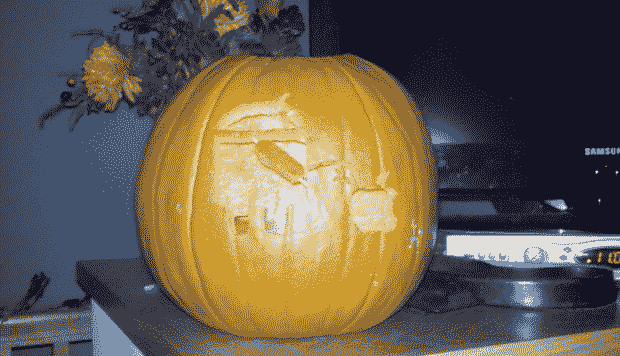

# 书呆子雕刻安卓万圣节南瓜 

> 原文：<https://web.archive.org/web/http://techcrunch.com/2010/10/28/requisite-halloween-post/>

# 书呆子雕刻安卓万圣节南瓜

好吧，好吧，也许“书呆子”在这里是一个强烈的词，因为上面的机器人粉丝[杰克 O' Lantern](https://web.archive.org/web/20230202214516/http://en.wikipedia.org/wiki/Jack-o'-lantern) 实际上有点可怕。TechCrunch 读者 Lee Arnold 的家庭(！)南瓜。

阿诺德把这个作为万圣节主题的提示发给了 TechCrunch，只是因为他认为我们会喜欢它。李，我们完全明白——我们所有人当然除了 MG，他正忙着盯着自己的南瓜看。