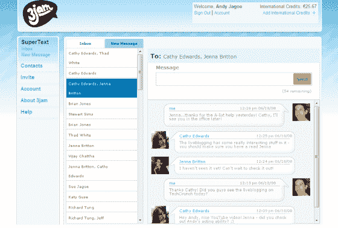

# 使用 3Jam 的 SuperText(私人测试版邀请)将手机短信转发到你的电脑上

> 原文：<https://web.archive.org/web/http://techcrunch.com/2008/06/18/reroute-mobile-text-messages-to-your-pc-with-3jams-supertext-private-beta-invites/>

# 使用 3Jam 的 SuperText(私人测试版邀请)将手机短信重新路由到您的 PC

如果你的手机没有包含短信的“吃到饱”套餐，那些短信真的会加到你的账单上。尤其是如果你是青少年。或者是推特迷。现在有一种方法可以在你上网时绕过那些昂贵的短信费用。T4 的一项名为 SuperText 的新服务正在私人测试中推出，它可以检测你何时在电脑前，让你免费收发短信。

前 100 名向 cathy[at]3jam[dot]com 发送电子邮件的 Techcrunch 读者将优先获得私人测试版的邀请。如果你没有得到一个，你可以[在这里报名](https://web.archive.org/web/20230203025651/http://beta.3jam.com/)被列入等候名单。

当你在电脑上登录该服务时，它会将发送到你手机的短信重新路由，这样你就不用付费了。您发送的短信在收件人看来就像是从手机上发送的一样。它将很快与 3Jam 的脸书到短信应用程序一起工作。首席执行官 Andy Jagoe 将 SuperText 描述为“后端 SMS 的类似即时消息的体验”当你离开电脑或过了一段时间没有反应时，信息会以普通短信的形式发送到你的手机上。

SuperText 将加入 3Jam 现有的回复短信服务，该服务已经被 300 万手机用户使用。我最近写了一篇关于 Jagoe 试图在脸书为 SuperText 投放测试广告的文章，结果却发现术语 [3Jam 被奇怪地屏蔽了](https://web.archive.org/web/20230203025651/http://techcrunch.com/2008/06/04/facebook-is-blocking-ads-from-myspace-friendster-hi5-orkut-and-3jam/)，还有其他术语，如“Myspace”和“Hi5”(帖子发布后，脸书不再屏蔽这些术语)。

