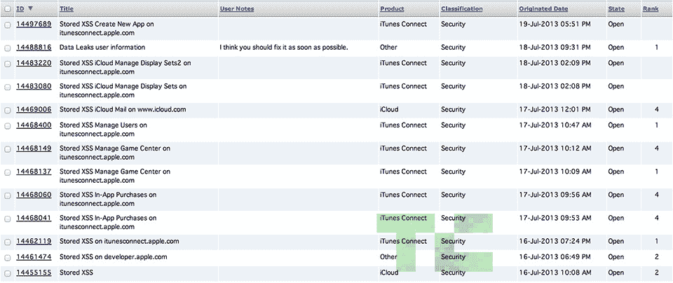

# 研究人员在苹果开发中心陷入黑暗之前报告了 iAd 工作台漏洞，以下是他的发现 

> 原文：<https://web.archive.org/web/https://techcrunch.com/2013/07/22/researcher-reported-iad-workbench-hole-before-apples-dev-center-went-dark-heres-what-he-found/>

苹果的开发者网站[上周四](https://web.archive.org/web/20221005210758/https://beta.techcrunch.com/2013/07/21/apple-confirms-that-the-dev-center-has-potentially-been-breached-by-hackers/)出人意料地陷入黑暗，并在整个周末一直保持黑暗。该公司昨日透露，这是因为一名“入侵者”试图获取苹果注册开发者的个人信息。当苹果继续致力于修复开发中心的安全并使整个系统重新上线时，一位名叫 Ibrahim Balic 的 25 岁的土耳其安全研究员认为这可能是因为他的[。](https://web.archive.org/web/20221005210758/http://thenextweb.com/apple/2013/07/22/researcher-claims-he-told-apple-of-developer-center-vulnerability-but-didnt-maliciously-steal-data/)

但是真的吗？

Balic 发誓他不是一个恶意的黑客。相反，他声称自己只是一个安全爱好者，偶然发现了一种获取大量苹果用户数据的方法，试图就此警告该公司，并在苹果不予回应的情况下制作了一个视频(现为私人视频)，强调了存在的安全漏洞。由于苹果一贯的不透明，我的多次电话和电子邮件都没有得到回复，所以几乎不可能肯定地说，他的四处打听是否导致苹果上周采取行动，但这个时间点肯定看起来很奇怪。

让我们倒回去一分钟。Balic 是一个狂热的 bug 猎人(他已经向[脸书](https://web.archive.org/web/20221005210758/https://www.facebook.com/whitehat/thanks/)等人报告了这些 bug ),自从他 7 月 16 日第一次对苹果感兴趣以来，他已经向苹果提交了总计 13 份 bug 报告。在他的视频中，最受关注的似乎是苹果 bug #14488816，Balic 在 7 月 18 日报告了这一问题，当天用户首次开始报告苹果开发中心停机。

这个小小的安全问题围绕着苹果的 iAd Workbench，这是一个最近推出的工具，让用户可以策划和瞄准 iAd 活动，以更好地围绕他们的 iOS 应用进行宣传。Balic 发现，如果您操纵发送到运行 Workbench 的服务器的请求，它将允许您尝试向帐户添加新用户。在那里，你可以试着输入名字、姓氏——不管是什么——然后服务器会回复一个全名和电子邮件地址。一旦 Balic 理解了问题的全部范围，他(这也是他的基本原理让我有点困惑的地方)写了一个 Python 脚本来收集他能找到的所有数据，并在 YouTube 上展示了一些。

那么开发中心本身呢？7 月 16 日，Balic 确实向苹果提交了一份错误报告(#14461474)，处理了开发中心对存储的 XSS 攻击的漏洞。他说，利用这个问题获取用户数据在技术上是可能的，但他从未尝试过。相反，他声称他报告了问题，然后去寻找下一个要报告的大错误。

然而，太糟糕了，视频看起来如此确定:在展示了苹果被击落的开发中心和该公司官方回应的图像后，Balic 随后展示了一系列似乎包含全名和电子邮件地址的文件。这看起来很糟糕，但是 Balic 说他从来没有直接去过开发者中心网站，他强调的所有用户信息都来自 iAd 工作台。两个独立的错误为一个非常混乱的视频铺平了道路。

当然，他没有很好地解释这一点。在我们最初的 [Dev Center hacking story](https://web.archive.org/web/20221005210758/https://beta.techcrunch.com/2013/07/21/apple-confirms-that-the-dev-center-has-potentially-been-breached-by-hackers/) 的评论中，Balic [指出](https://web.archive.org/web/20221005210758/http://fyre.it/UxfMdt.4)在提到 iAd bug 时,“其中一个 bug 让我可以访问用户的详细信息等”,并接着指出“在我的最终报告发布 4 小时后，苹果开发者门户网站 gas 关闭了，你知道现在仍然是这样。”

糟糕的评论框架让他看起来好像提交了数据泄露错误报告，苹果很快关闭了开发网站，但他的最终错误报告实际上是在几个小时后提交的。他后来补充说，无论是 73 名苹果员工的数据，还是他收集的 10 万份后续数据文件，都与他在 16 日报道的开发者中心漏洞无关。

根据 Balic 发给我的多个文件，从 iAds 问题中收集的数据(谢天谢地)仅限于姓名和电子邮件地址。然而，更令人担忧的是，这个特殊的错误可能不仅仅影响了苹果的开发者社区。苹果公司的一名代表昨天告诉 TechCrunch，只有开发人员的账户可能受到了此次入侵的影响，但 Balic 坚持认为，他发现的问题也反映了常规的电子邮件地址和苹果 id。他在视频中展示的内容没有任何加密——姓名和电子邮件地址都是以明文呈现的。我已经联系了许多其信息出现在视频中但尚未收到回复的用户，因此我们无法确认这些人是开发人员还是 iTunes 的普通用户，或者他们只是一堆随机的电子邮件地址。

> **更新:**在 Balic 最初的#14488816 错误报告中，他列举了一些通过 iAds 漏洞获得的用户数据。他恢复的其中一个电子邮件地址属于我们自己的 Josh Constine，他证实这实际上也是他的苹果 ID。

在我们的谈话中，Balic 坚持说他只是试图帮助苹果，并计划删除他迄今为止收集的所有用户数据。当被问及为什么他下载了所有的用户数据，而不是简单地报告漏洞时，Balic 说他只是想看看他能“深入”到什么程度。他说，如果他想做坏事，他就不会报告他发现的一切。值得一提的是，他还表示，他从未试图重置任何人的密码——他最远的一次是向他发现的一个地址发送电子邮件，并询问这是否真的是那个人的苹果 ID。Balic 没有得到回应。

有没有可能 Balic 的四处打探引起了苹果的注意，促使该公司关闭了开发者网站？是的。iAd 工作台可能会和开发中心处于同一个大伞下，曾经出现在 iAd 工作台中的添加用户功能似乎已经消失了。只有苹果内部的人才真正知道发生了什么，他们只是此刻不太愿意说话；如果他们回复，我会更新这个帖子。