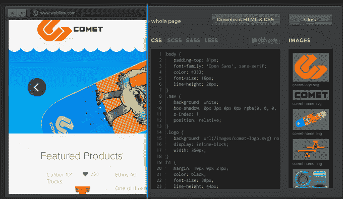
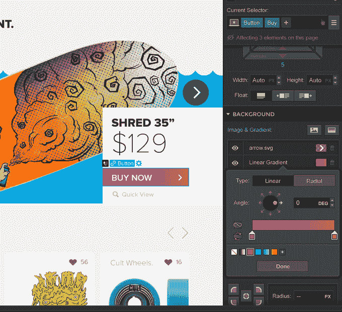

# 响应式网站构建商 Webflow 从科斯拉、蒂姆·德雷珀等人那里筹集了 150 万美元

> 原文：<https://web.archive.org/web/https://techcrunch.com/2014/03/11/responsive-website-builder-webflow-raises-1-5-million-from-khosla-tim-draper-others/>

Y Combinator 支持的初创公司 Webflow 已经筹集了 150 万美元的种子资金，该公司旨在让创意专业人士更容易地可视化设计和托管他们自己的响应式网站。这一轮融资正值该公司的用户群从去年夏天的 1 万人增长到现在的近 10 万人，包括来自 Khosla Ventures、Draper Assoicates、各种天使投资人，当然还有 Y Combinator 的参与。

这家总部位于山景城的公司是由前 Intuit 公司的 Vlad 和 Sergie Magdalin 兄弟与 CTO Bryant Chou 一起创建的。这是 Vlad 在最终实施之前已经思考了多年的事情——他甚至在关于这个主题的高级论文中使用了“webflow”这个名称来描述这个想法。

最初，联合创始人对一项服务进行了市场测试，该服务要求设计师在转向当前产品之前学习一种新的模板语言(他们不喜欢)，这不要求用户知道如何编码。

今天，Webflow 允许设计人员使用具有直观界面的拖放式网站构建器来构建响应性网站，以便使用常见的 web 元素(如滑块、地图、按钮、div、视频、社交小部件等)来定制他们的网站。在后端，Webflow 生成符合 W3C 的 HTML5 和 CSS3 代码。在某种程度上，除了 Bootstrap、Foundation 或 Adobe 的 Edge Reflow 之外，像这样的服务没有多少竞争对手，但这些都需要更高级的技能才能使用。

据 Vlad 报道，自公司去年夏天推出以来，该服务的用户群逐月增长了约 30%。收入也有所攀升，每月收入是发布时的 10 倍。而且，如上所述，Webflow 有近 10 万用户，其中许多人现在都在为其产品付费。

尽管该公司仍提供供个人使用的免费计划，但其付费计划提供了更多功能，价格从每月 14 美元到每月 70 美元不等，具体取决于设计的网站数量、网页数量、所需的备份数量等。

弗拉德还指出，尽管开始时 Weblow 对自由职业者来说效果不错，但该公司在让代理加入方面也取得了良好的进展。目前，超过 50 家机构在使用这项服务——升级的功能以及对多页面和多用户账户的支持使这项服务成为可能。

“组织领导可以邀请其他团队成员，他们可以在整个团队中共享预先构建的网站和模板，这对机构来说是一个巨大的生产力提升，”Vlad 解释道。此外，他指出，Webflow 现在的速度是推出时的 50 倍左右。“回到 8 月份，如果你有一个大网站，当你开始时，你真的必须去喝杯咖啡…当你回来时，你的 Webflow 网站仍然在加载。如今，无论网站规模有多大，它都是即时的，”Vlad 说。

有了额外的资金，该公司正在壮大其团队，并专注于产品。(该公司将是盈利的，除非它只是多雇用了两名员工，目前更愿意投资于业务增长)。现在，该公司共有六个团队，正在开发其他功能，包括一个新的编辑器，允许企业主自己对网站进行简单的更改(例如，新文本、交换照片)，而不必让他们的创意团队参与进来。

对动态网站的支持也在进行中，比如商店或博客。弗拉德说，迄今为止，Webflow 一直非常专注于静态网站，但对博客的支持也有需求。

“WordPress 和其他内容管理系统目前不允许你处理真正动态的数据……它们允许你处理文章，”他说。“因此，如果你经营一家定制企业，或者想建立一家商店之类的东西，你真的是在试图将你的动态内容塞进一个博客平台。我们希望建立一个平台，让设计师和开发人员创建任何类型的内容。”

该公司将在今年夏天宣布这方面的更多信息，并计划在秋季推出。

*更正:Draper Associates 的 Joel Yarmon 进行了投资，而不是之前报道的 Tim Draper。*