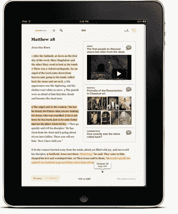

# 重新思考作为社会书籍的圣经 

> 原文：<https://web.archive.org/web/http://techcrunch.com/2011/01/24/rethinking-bible-social-book/>

# 重新思考作为社会书籍的圣经

书籍作为独立的、原始的作品更好，还是作为读者可以修改和评论的社会对象更好？我们马上就会知道了。今天， [Rethink Books](https://web.archive.org/web/20230202232559/http://www.rethinkbooks.com/) 发布了其 [SocialBooks](https://web.archive.org/web/20230202232559/http://www.getsocialbooks.com/) 软件，该软件允许出版商将其[书籍转化为 iPad 应用](https://web.archive.org/web/20230202232559/https://techcrunch.com/2010/11/11/rethink-books-social/)。这些应用程序让读者可以在 Twitter 或脸书上分享他们在书中高亮显示的文字，以及他们的评论、相关照片和视频。私人团体也可以被创建，更多的是一种读书俱乐部的感觉。

以这种方式社会化的第一本书将是《圣经》(哈珀柯林斯出版社出版)。这样，圣经就可以用绘画和其他艺术作品，以及圣经电影的视频片段来说明。当然，人们也可以上传来自巨蟒剧团《布莱恩的生活》的片段，但这正是社交媒体如此有趣的原因。甚至个人照片或视频也能给这本好书增添一层迷人的当代评论和个人解读。

Rethink Books 希望同样的动力能在所有流派中发挥出来。照片和视频被上传到脸书(或 YouTube 上的视频)，这意味着读者可以使用文本以外的媒体将他们的朋友吸引到他们正在阅读的书中。这些应用程序还可以在作者和读者之间创建一个直接的社交渠道，让读者在作者强调或评论自己的书时“关注”作者。这一功能开辟了一种可能性，类似于一本书的导演剪辑，通过突出显示的文本、笔记、照片和视频增加了一层作者评论。下载 SocialBooks 的人也可以互相关注，看看他们朋友的书架上有什么，或许还能通过这个过程发现新书。

从你选择阅读的内容经常受到你的朋友或你尊敬的人的推荐的影响这个意义上来说，书已经是高度社会化的物品了。添加社交软件挂钩会改善社交发现吗，或者这些只是阻碍阅读的噱头？

下面是我去年 11 月与 RethinkBooks 的创始人杰森·伊莲和杰森·约翰逊一起拍摄的视频演示，以及《布莱恩的生活》中的奖励片段。