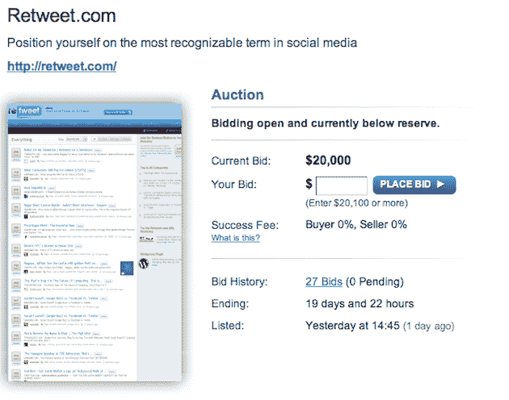

# 出售 Retweet.com。购买它并冒着被 Twitter 起诉的风险。

> 原文：<https://web.archive.org/web/https://techcrunch.com/2010/02/17/retweet-com-for-sale/>

# 出售 Retweet.com。购买它并冒着被 Twitter 起诉的风险。

去年夏天，我们报道了[Retweet.com](https://web.archive.org/web/20230220024114/http://retweet.com/)的发布，这是一个[的推特山寨](https://web.archive.org/web/20230220024114/https://techcrunch.com/2009/08/19/retweetcom-launches-sure-looks-a-lot-like-tweetmeme/)，有一个[杀手的名字](https://web.archive.org/web/20230220024114/https://techcrunch.com/2009/07/26/retweetcom-looks-to-be-a-tweetmeme-competitor-with-a-killer-domain-name/)。Mesiab Labs ，一家与蜂鸟等垃圾 Twitter 项目有关联的公司，在八月大张旗鼓地推出了它。然而，从那以后，Tweetmeme 仍然是这个领域的王者。现在 Mesiab 实验室拍卖了杀手域名。

正如你在本页看到的，目前对 Retweet.com 的出价是 2 万美元。这与昨天在 10 美元左右徘徊的出价相比是一个巨大的增长。到目前为止，有 27 个投标。该网站上的列表声称该域名每月有 1200 万唯一用户，2600 万页面浏览量。如果是这样的话，你一定会想，为什么要卖呢？

部分原因是 Twitter 本身试图将“转发”这个词注册为商标 Mesiab Labs 显然也试图注册这个名字，但不清楚这是失败了，还是他们只是想在此之前卖掉它。去年，Twitter 也试图将[注册为](https://web.archive.org/web/20230220024114/http://samj.net/2009/08/twitters-tweet-trademark-torpedoed.html) [tweet](https://web.archive.org/web/20230220024114/https://techcrunch.com/2009/07/01/twitter-to-developers-tweet-your-heart-out-but-dont-twitter-it/) 商标，但没有成功。

我们也询问了 Mesiab 实验室关于拍卖的事情。以下是他们不得不说的话:

> 当我们最初构思 Retweet.com 时，我们意识到了 Twitter 等社交媒体网站正在改变我们过滤和消费新闻的方式。我们发展和培养了 Retweet.com 及其网络，以帮助探索这一概念。看到故事在一些主要新闻媒体之前爆发，看到博客获得接近主流的地位，这是非常令人兴奋的。看着社交世界的脉搏变换和摇摆也是令人兴奋的。但不仅仅是新奇，我们正在展示难以置信的新方法来应用众包来回答“现在什么最重要”这个问题
> 
> “转发”这个词有一些真正值得注意的地方。首先，众所周知，它是由 Twitter 用户创造的，而不是 Twitter 本身。第二，就像“谷歌”一样，一些东西已经成为使用搜索引擎的同义词，“转发”已经成为网络内容病毒式传播的同义词。
> 
> 虽然我们不是这个领域的唯一参与者，但我们很荣幸能够参与其中。
> 
> 现在，我们已经发展壮大了 Retweet 网络和基础设施，我们准备把它交给能够真正推动它更上一层楼的人。我们很高兴有机会让一个充满激情的新老板来培育和发展 Retweet.com，并继续挖掘无可否认地成为新闻消费巨大转变的潜力。

他们接着指出，如果他们在 30 天内找不到合适的买家，他们将继续自己运营网站。这是一个非常致命的域名，但是如果 Twitter 获得了这个商标，值得冒这个风险吗？

【YouTube = http://www . YouTube . com/watch？v = le 9 bqi 9g 4mg & HL = en _ US & fs = 1 & w = 630]