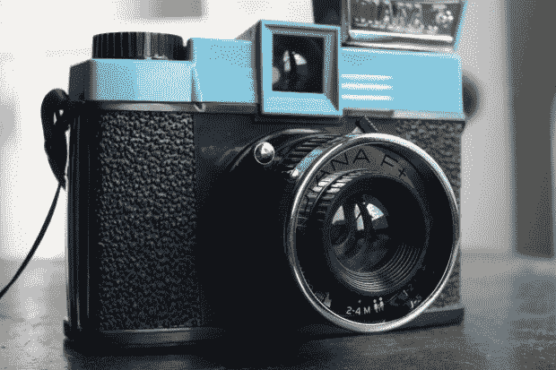
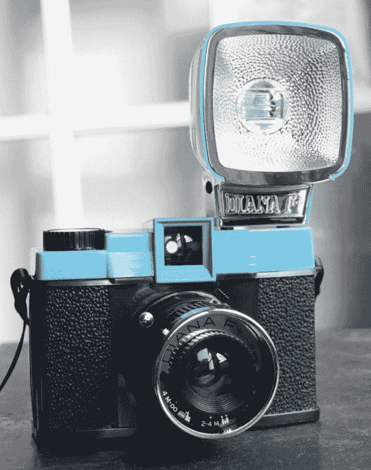
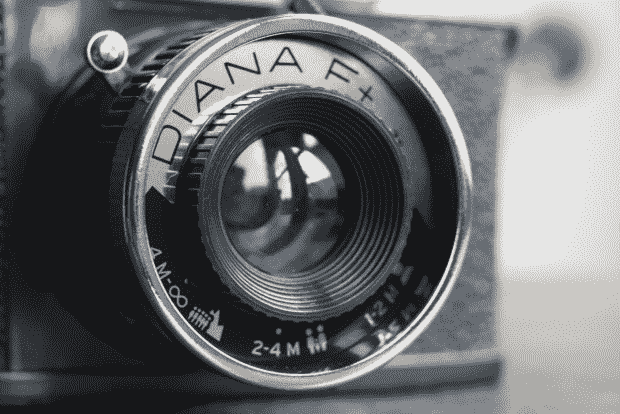
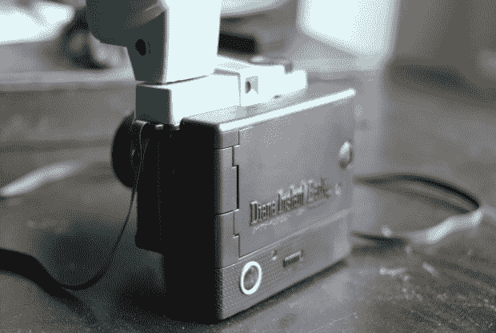
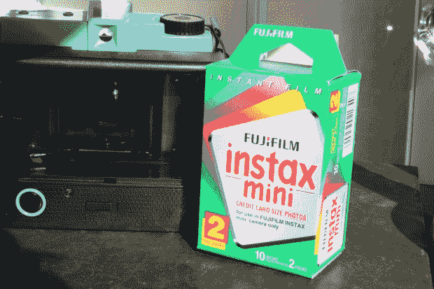

# 回顾和赠品:Lomo Diana F+胶片相机，带即时背面 

> 原文：<https://web.archive.org/web/https://techcrunch.com/2010/04/20/review-and-giveaway-lomo-diana-f-film-camera-with-instant-back/>

 
**短版**:它并不适合所有人，但 Diana F+和即时背面附件是你重现昔日宝丽来的魔力和自发性的最佳选择。脆弱的结构和不稳定的拍照可能会推迟一些，但不可预测性曾经是摄影的本质，对我来说，回到这一点很有趣。

Lomo 也想赠送一个——详情如下。
 **功能:**

*   经典/便宜的塑料结构
*   与许多不同的胶片背面兼容
*   含可拆卸闪光灯
*   自动和手动快门模式，针孔曝光模式
*   建议零售价:95 美元(164 美元，即时回复)

**优点:**

*   迷人的高保真操作
*   即时电影看起来不错，拍起来很有趣
*   很棒的派对相机

**缺点:**

*   廉价建筑
*   Instax 胶片有些贵
*   试错过程并不适合所有人

**全面回顾:**

我上个月写道,“宝丽来的传奇是一个漫长而奇怪的故事。过去几年特别奇怪。[破产](https://web.archive.org/web/20230213181410/http://www.crunchgear.com/2008/12/19/polaroid-files-chapter-11-bankruptcy/)，[起死回生](https://web.archive.org/web/20230213181410/http://www.crunchgear.com/2009/01/20/nederlanders-execute-plan-to-resurrect-polaroid-film/)，[重新启动](https://web.archive.org/web/20230213181410/http://www.crunchgear.com/2009/10/13/the-second-coming-of-the-polaroid/)，[售罄](https://web.archive.org/web/20230213181410/http://www.crunchgear.com/2009/08/19/last-polaroids-ever-to-be-sold-at-urban-outfitters/)，[买断](https://web.archive.org/web/20230213181410/http://www.crunchgear.com/2009/12/29/jwin-licenses-polaroid-name-prepares-to-market/)……如果宝丽来出现在《与星共舞》上，我一点都不会惊讶。”对于写这些东西的小工具评论家来说，所有这些戏剧都足够有趣，但如果你只是想在聚会上或与朋友外出时拥有一台有趣的即时相机，那该怎么办？人们不能再指望宝丽来了，尽管数字技术很棒，但它显然不一样了。我把自己放在这双鞋子上一段时间，在注意到 Lomography 的 LC-A+正在[获得即时回复](https://web.archive.org/web/20230213181410/http://www.crunchgear.com/2010/02/24/lomo-goes-instant-with-lc-a-instant-back/)后，我联系了他们，让他们评估一款像你我这样的人可能会想拿起它享受简单的即时电影乐趣的相机。他们给我指了去戴安娜 F+的路。

戴安娜 F+是 60 年代经典戴安娜的翻拍，“更新”了相当便宜的塑料结构，但总而言之是著名的手动相机的忠实再现。应该马上说这个相机确实感觉像个玩具。而不是一个漂亮的玩具。它像羽毛一样轻，几乎完全是塑料的。够结实，但是摔几下我就不放心了。不过，你必须克服这一点——还记得过去傻瓜电影有多垃圾吗？这并没有更糟。

然而，Diana F+的意义并不在于成为奢侈品。90 美元几乎是冲动购买。它的魅力在于复古因素:它拍摄了许多电影(取决于你是否用不同的背部装饰)，但开箱后，它拍摄了 [120](https://web.archive.org/web/20230213181410/http://en.wikipedia.org/wiki/120_film) 。然而，我不会回顾这一部分。我对相机功能的想法同样适用于没有即时反馈的使用，但当然你必须经历整个开发过程。所以我们继续吧。

相机是完全手动的，在某种程度上让你觉得有点傻。这一切是如此不精确和不可预测，以至于作为像素完美的数字时代的居民，我们的大多数读者会发现，如果他们没有使用老式胶片相机的经验，这是非常陌生的。我碰巧是用佳能单反相机拍摄黑白照片长大的，但即使这样，我也没有为这里正在进行的真正的高保真过程做好准备。

【T2

因为这是一款~~测距仪~~取景器相机，对焦有点像猜谜游戏。有三种设置:1-2 米，2-4 米和 4-∞米。我们这些习惯于英制单位的人可能会有一些麻烦，但在一两次滚动后，它似乎会成为第二天性。对焦是相当宽容的，无论如何，像这样拍摄相机的不精确本质使它显得不那么重要。曝光是一个需要考虑的更重要的问题，它也只有几个设置，只是作为建议:多云，部分多云，晴天和针孔。再说一次，选择正确的照片会成为你的第二天性，尽管在你拍出正确的照片之前，你会对一些不太理想的照片感到满意。最后，快门速度有两种选择:自动和手动。自动曝光大约是 60 分之一秒，适用于移动缓慢的对象，但它只是有一个已知的曝光量。否则你必须用你的大脑使用手动或灯泡快门模式来计时，只要你按住开关，快门模式就会曝光。我用这个和闪光灯拍了一些很棒的照片，但这并不适合每个人，曝光值和类似的知识会有所帮助。

手动推进和曝光意味着你可以在同一张胶片上进行多次曝光。我在这方面的实验基本上没有成功，主要是因为我用完了胶卷，但你可能会有更好的运气。正如我所指出的，实验和不可预测的结果使这款相机与数码相机有着不同的乐趣。

有一个可移动的闪光灯，暗拍时有一个很棒的复古外观。它非常亮，所以你可能会考虑在它前面放一两张餐巾纸，但一旦你了解了它的力量，你就不会过度曝光了。

这款相机的[即开即退](https://web.archive.org/web/20230213181410/http://usa.shop.lomography.com/diana-instant-back)功能使得这款相机对于喜欢找乐子的摄影爱好者来说是值得购买的，而且不会留下一点划痕。它和相机一样贵(95 美元)，但是如果你一起买，你会省下一点钱。安装很容易——尽管一旦你把它组装起来，这款相机看起来相当畸形。背面也会失去平衡，所以如果你对针孔曝光感兴趣，你需要考虑这一点。

它拍摄富士胶片的 Instax 格式，一包两盒的价格约为 12-14 美元，每盒 10 张。算下来大概是 65 美元一杯。肯定很贵，但记住这包括加工和印刷。当然，我们都知道即时摄影纪念品的价值。这就是我做这篇评论的原因。

Instax 胶片明显比宝丽来小。每张照片几乎都有信用卡那么大。我交谈过的一些人喜欢小镜头，一些人更喜欢宝丽来的大镜头。我更喜欢大的，当然，但小家伙也很迷人，宝丽来墨盒是稀缺和昂贵的，所以这一点几乎没有实际意义。120 和 Instax 胶片之间有一些曝光差异(本质上，你必须将相机设置为过度曝光)，但这似乎并不影响我的许多小构图。你可以在下面的画廊里看到其中的一些。

这些是我的第一包胶卷。我已经找到了窍门，但是框架很难，因为没有框架指南。不过，你会有感觉的。

带着 Lomo 去参加当地酒吧的生日聚会，我发现自己被问题包围了。每个人都认为小戴安娜 F+是可爱的，每个人都爱上了小即时镜头。大多数人也表达了对建造质量的不满，但对价格感到惊喜。如果你是一名社会摄影师，强烈推荐这个东西。

还有许多其他的镜头和底片可以用在戴安娜身上，但是我没有机会去尝试。只要记住，如果你有兴趣多花一点钱，你不会受限于它附带的焦距。

**结论…和竞赛！**

显然，像这样的“新奇”相机是否值得花 164 美元，这是一个品味问题。个人觉得很划算。Instax film 不会消失，120 已经存在了一个世纪。拍摄很有趣，结果也很迷人，尽管通常不是你所期望的那样。富士也有自己的 Instax 相机，但它们远没有这么有趣，而且价格也一样高。如果摄影是你的一个爱好，你怀念过去的胶片和瞬间，戴安娜 F+是一个很好的方式回到他们身边，而不需要太多的承诺。

* * *

现在，比赛开始了！很简单，真的。Lomography 想送一个 Diana F+。你所要做的就是发一封电子邮件给 lomography dot com 上的 crunchgear。军规？你将进入他们的销售和新产品邮件列表。当然，你可以稍后通过正常方式选择退出，但你会给他们你的电子邮件地址。我们会在周五随机选出一个赢家，所以快去吧。

[产品页面:Lomography Diana F+](https://web.archive.org/web/20230213181410/http://usa.shop.lomography.com/cameras/camera-best-sellers/diana-f-camera)