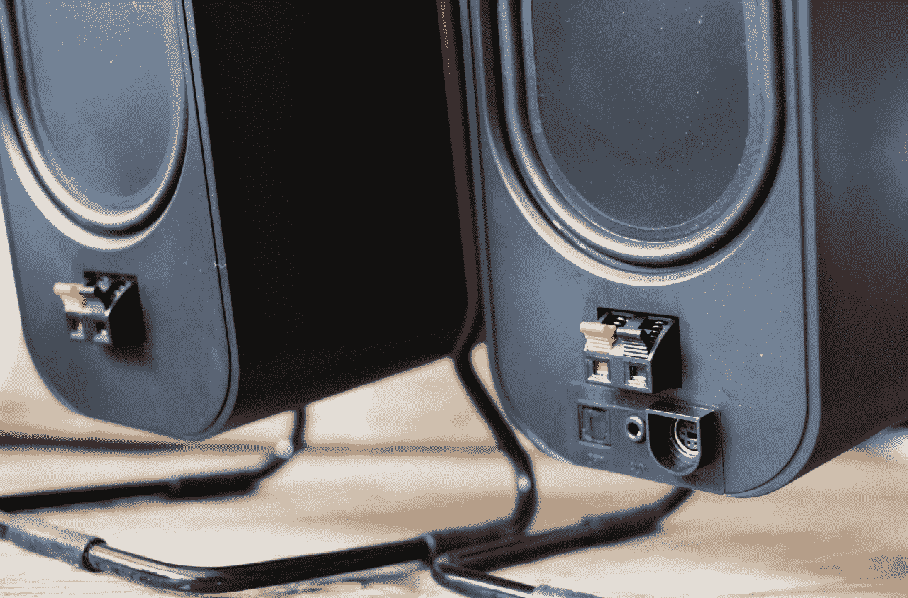

# 点评:奥黛西下东区演讲者 TechCrunch

> 原文：<https://web.archive.org/web/http://techcrunch.com/2011/08/12/review-audyssey-lower-east-side-speakers/>

**短版:**一对坚固的笔记本电脑或台式扬声器，不起眼却温暖有力，设计低调而有魅力。不过，对细节的更多关注将有助于证明其价格的合理性。

**特色:**

*   定制驱动器和数字信号处理
*   3.5 毫米和数字光学输入
*   双扬声器设置，不需要低音炮
*   管理系统更新建议:200 美元

**优点:**

*   经典设计
*   简单的设置和操作
*   对于一个紧凑的系统来说相当不错的声音

**缺点:**

*   音量旋钮/开关感觉很廉价
*   可以过分强调中低(虽然这可能只是我的设置)
*   自动关机可能会惹恼一些人

**全面回顾:**

当谈到 PC 扬声器时，像 Harman-Kardon、Klipsch、Logitech 等知名品牌提供了良好的、可预测的性能。我看到这些发言者宣布不久前，觉得这将是很好的休息一下，从通常的嫌疑人。我很高兴我做到了——Audyssey 的 LES 扬声器并不出众，但它们在大小、功率和保真度方面达到了一个很好的平衡。

这个设计意在唤起曼哈顿下东区的记忆。我不知道如何或为什么，但无论你是否在扬声器中看到那个街区，你至少可以同意这个设计是直截了当的，漂亮的，低调的，也许是朴素的。扬声器外壳本身，其红色橡胶条纹抓住一体式支架，做得很好，令人放心的扬声器形状。这种支架虽然坚固，而且部分涂了橡胶，但似乎并没有被考虑。

在右边的扬声器上有一个红色/绿色电源指示灯 LED，一个 3.5 毫米耳机插孔和音量旋钮，按下它可以打开或关闭扬声器。这个指示灯很暗，呈橄榄色，而不是设备上常见的交通灯绿色。我对音量旋钮的质量没有印象:它的重量很小，而且有很多摆动。并且音量电平凹口非常浅，大多数时候几乎察觉不到。

它们背面有 3.5 毫米和光学音频输入，扬声器用标准扬声器线连接。如果能看到一些更实际的连接方法就好了。

毫无疑问，现在你已经知道了，这是一个双扬声器系统，而不是 2.1。通常双扬声器系统是预算项目，与便宜的笔记本电脑一起赠送或直接插入你的 iPod。LES 扬声器与众不同，更像你桌上的书架扬声器。它们有动力，有相当大的驱动力；Audyssey 声称“无法产生低音的小型扬声器、产生噪音、失真甚至低音量下音质不佳的扬声器箱都是 Audyssey 智能扬声器技术解决的问题，”并且“我们不会提高低音和扭曲声音，我们实际上增强了驱动器的性能，以给你更深的声音。”他们不会吹破你的窗户或做任何事情，但可以肯定地说，他们远远超出了你的平均两个扬声器的能力。

我实际上更喜欢这些超过我最近评论的[罗技 Z623s](https://web.archive.org/web/20230204140313/https://techcrunch.com/2010/09/24/review-logitech-z623-2-1-speakers/) ，听起来很棒，除了我总是担心我是否已经得到了正确的水平——无论如何，将低端分离到一个单独的通道一直困扰着我，尽管这真的只是在卫星和潜艇之间的衰减没有考虑好的时候才是一个问题。LES 扬声器在整个频谱范围内都有很好的电平响应，虽然你不会听到刺耳的低音，但这并不是这种紧凑型扬声器的真正目的。

一些实验让我发现，这些扬声器在平坦的 EQ 上听起来最好，或者接近它。根据你所听的内容，你可能会想碰一下或舀一下，但在大多数情况下，它们会产生一种均匀、相当温暖的声音，很容易达到高音和降到低音，而不会失真或下降太多。如果有的话，我觉得某些中低音被过分强调了，在歌曲的这个或那个部分接管了其余的声音，尽管我开始认为这是我的桌子的共鸣问题。无论如何，我和其他演讲者没有同样的问题。

它们会发出很大的声音，尽管声音很有方向性，如果可能的话，你会想留在最佳听音点。电影和游戏听起来不错。

我希望奥黛西三思的一个怪癖是自动关机功能。如果你有一段时间不使用扬声器，它们会自动关闭。没问题，你想，省一点电。但是当你回来再次点击播放时，它们不会再打开。我知道，按下按钮打开它们是个小问题，但我希望他们也能实现自动打开的功能。

我还认为高音和低音调节旋钮不会错位。我知道你可以均衡器的东西，但它会很好地做到这一点，在扬声器的背面，以及当他们在一个不太可定制的音频环境。

**结论**

对于公寓生活或使用，比如说，工作室环境，这些是一个伟大的选择。或者对于宿舍来说，空间是宝贵的，subs 只会激怒你的邻居。它们的设计即使不算精美，也很有品味，能产生强劲有力的好声音，并提供比 2.1 系统更简单、或许更真实的音频环境。如果你有足够的信心稍微调整你的声音，这样它就能向这些设备发送正确的东西，我会说它们是个人音频的绝佳选择。但是我希望他们会考虑在下一个版本中更加关注用户体验的细节。

[产品页面:奥黛西下东区音箱](https://web.archive.org/web/20230204140313/http://www.audyssey.com/products/les-media-speakers)