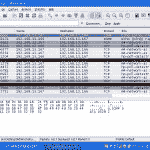
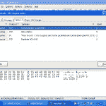
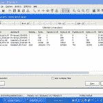
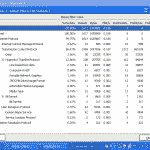

# 点评:Colasoft Capsa 网络分析仪 

> 原文：<https://web.archive.org/web/https://techcrunch.com/2009/08/03/review-colasoft-capsa-network-analyzer/>

如果你负责支持任何规模的网络，你可能需要查看在该网络上来回传递的实际数据包。无论是查看一台特定的机器是否正在发送或接收数据包，或者您想查看数据包本身的内容，您都需要使用数据包嗅探器。有许多数据包嗅探器，有许多不同的功能和许多不同的定价模型。今天我们将看看 Colasoft 的 Capsa 网络分析仪。

乍一看， [Capsa](https://web.archive.org/web/20221006101820/http://www.colasoft.com/capsa/) 就像任何其他可用的数据包捕获程序。它将网卡置于混杂模式，并记录它在线路上看到的所有数据包。运行计数显示网络上各种数据包的信息。如下图所示，我在一分半钟内捕获了近 2000 个数据包。没有发现物理错误，但记录了 130 个 802.3 错误。再往下，您还可以看到数据包大小的分布。

我发现 Capsa 的一个非常有用的功能就是诊断标签。扶贫中心关注的不仅仅是简单的旧包装细节。如你所见，Capsa 发现了慢速 ack、快速重传等等。

毫无疑问，扶贫中心是一个方便用户的项目。即使您不太了解 IP 堆栈，您也可以通过 Capsa 了解您的网络上发生的许多事情。它以非常易读的方式呈现数据。Graphs 选项卡显示了各种网络统计数据的可视化效果。这种图表总是受到头发尖尖的老板们的赞赏。

想要对流经您网络的所有流量进行细分吗？查看协议选项卡，查看网络上流量类型的分类。

我在使用 Capsa 时的问题是:当我可以免费使用 Wireshark 的时候，我为什么要支付现金呢？我认为仍然有商业实体没有真正理解——或者信任——自由软件。这些公司更喜欢温暖和模糊的感觉，因为他们知道他们使用的产品背后有一些商业支持，而不是一群喜欢 Linux 的长发共产主义怪人。

在我看来，扶贫中心的真正好处是用户界面。它以一种非常容易阅读的方式呈现数据，这样你不需要成为一个核心网络工程师就能看到发生了什么。因此，只需几百美元，即使是入门级的技术人员也能合理地了解你的网络中发生了什么。如前所述，漂亮的图表会让经理们高兴。

Wireshark 可以做 Capsa 做的几乎所有事情，但界面没有那么光滑。下面是一些 Wireshark 截图，展示了一些不同之处。显然，它们之间没有一对一的比较。此外，在 Wireshark 中访问这些信息不像在 Capsa 中那么容易。例如，数据包分解仅在 Wireshark 的高级信息报告中可用，而不是在顶级选项卡中。

 

**底线**:如果你不想成为一名网络工程师，但想更好地了解你的网络上发生了什么，Colasoft 的 [Capsa 网络分析仪](https://web.archive.org/web/20221006101820/http://www.colasoft.com/capsa/)是一个相当不错的选择。