# 点评:谷歌的 Android 操作系统可能更适合平板电脑，Nexus 10 就是一个很好的例子 

> 原文：<https://web.archive.org/web/https://techcrunch.com/2012/11/02/review-googles-android-os-might-be-better-suited-for-tablets-and-the-nexus-10-is-a-shining-example/>

本周，谷歌宣布了一系列新设备，它们将运行安卓操作系统[果冻豆 4.2 版](https://web.archive.org/web/20221207194904/https://beta.techcrunch.com/2012/10/29/android-4-2-jelly-bean/)。这些新设备是一部名为 [Nexus 4](https://web.archive.org/web/20221207194904/https://beta.techcrunch.com/2012/11/02/nexus-4-review-not-exactly-perfect-but-close-enough-for-me/) 的手机和一款名为 Nexus 10 的 10 英寸平板电脑。我有机会玩这两款设备，特别是 Nexus 10，我对这款设备如何融入我的日常生活感到惊讶。

首先，简单介绍一下我日常使用的设备类型。我是一个 iPhone 迷，每天都在虔诚地使用 iPhone 5，但我也带着最新的 Galaxy Nexus。我发现 iOS 仍然是我更好的手机操作系统。然而，当 Nexus 7 问世时，[我发现我使用它的次数远远超过了我使用 iPad 的次数](https://web.archive.org/web/20221207194904/http://thenextweb.com/gadgets/2012/07/01/a-nexus-7-tablet-review-from-someone-who-actually-used-it-for-a-few-days/)。也许这是一种侥幸，或者可能是因为 7 英寸的外形尺寸。

直到我拿起 Nexus 10，才意识到对我来说, [Android OS](https://web.archive.org/web/20221207194904/https://beta.techcrunch.com/2012/11/02/idc-android-market-share-reached-75-worldwide-in-q3-2012/) 是更好的“大屏幕”平板电脑体验。我有第一代 iPad，从来不接。事实上，我每周使用它的时间从来不超过两个小时。我通常在我的电脑或手机上，从来没有从设备上获得“中间”体验的需求。因为这个原因，我非常确定我永远不会成为一个平板电脑的人，但是，唉，10 英寸平板电脑上的果冻豆 4.2 就是这么好。

不要误会我的意思，平板电脑并不完美，肯定有一些古怪之处，但总的来说，我认为 Android 操作系统让我成为了一个平板电脑人。如果你是真正的技术人员，并且想要了解设备中硬件的所有细节，[请到这里来查看](https://web.archive.org/web/20221207194904/https://beta.techcrunch.com/2012/10/29/here-are-the-official-specs-for-the-nexus-4-and-nexus-10/)。

我是谷歌用户，也就是说，我大部分时间使用搜索、Gmail、Google Drive 和 [Google+](https://web.archive.org/web/20221207194904/https://beta.techcrunch.com/2012/11/01/the-best-part-about-google-hangouts-is-that-the-technology-itself-completely-disappears/) 。显然，这些东西在装有 iOS 的苹果设备上没有那么好……原因如下。我不是唯一一个使用谷歌产品的人，所以这不会是一个外国概念。

我不是一个真正的游戏爱好者。我发现，当我使用平板电脑时，是因为我想看一些 YouTube 视频、查看电子邮件、发一会儿微博或上脸书。正如你所料，这是一种向后倾斜的体验。然而，我真的很少使用很多应用程序和游戏，即使我确实使用了我的 iPad。也许这很奇怪，但这是我个人的心流。

我有一台 MacBook Pro，非常喜欢使用 Mountain Lion。事实上，我认为这是有史以来最好的桌面操作系统。然而，我确实经常使用 Chrome，因为它可以与我所有的 Android 设备同步，所以打开一个新的硬件并立即开始使用是一种相当愉快的体验。

乍一看，Nexus 10 是一款非常标准的设备。你首先会注意到的是圆形的边缘和它有两个扬声器的事实。真是太贴心了。这个设备的背面，我稍后会谈到，是不稳定的。这看起来很奇怪，感觉也很奇怪。然而，该设备比我预期的要薄，这真的令人印象深刻。

屏幕上像素密度令人印象深刻；还是那句话，完全出乎我的意料。这个宝宝又大又清澈。

[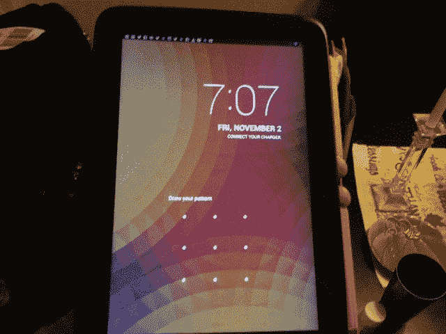](https://web.archive.org/web/20221207194904/https://beta.techcrunch.com/2012/11/02/review-googles-android-os-might-be-better-suited-for-tablets-and-the-nexus-10-is-a-shining-example/photo-1-67/)

[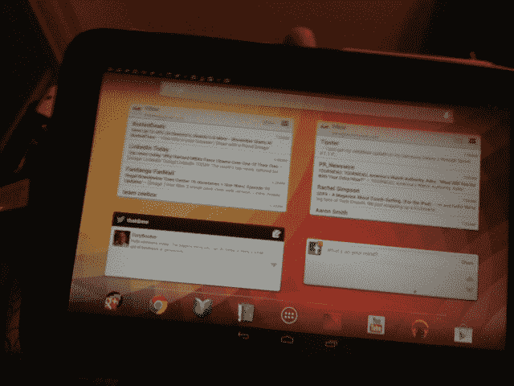](https://web.archive.org/web/20221207194904/https://beta.techcrunch.com/2012/11/02/review-googles-android-os-might-be-better-suited-for-tablets-and-the-nexus-10-is-a-shining-example/photo-3-45/)

一旦你把它拿在手中，圆润的边缘和手感会非常令人愉快。然而，当你触摸设备的背面时，所有这些都很快被搁置。它有两种不同的表面，大部分是橡胶的感觉，然后是顶部的塑料面板，保护它的一些内脏。我不知道三星和谷歌在设计这款设备的背面时是怎么想的，但这有点令人失望。不过，无论如何也算不上是交易破坏者。我只是觉得很奇怪。

你可以拿起的“智能外壳”必须卡入这个奇怪的小面板区域，这又一次…这似乎是一个奇怪的硬件选择。

除此之外，它非常薄，非常轻。我发现使用它一两个小时是一种非常好的体验，而且感觉很耐用。如此耐用，以至于我不介意把它扔在沙发或咖啡桌上，也不用担心它会碎成无数块。我对设备很粗暴，我已经偷了我的 iPhone 5。我认为坚固是好的。

[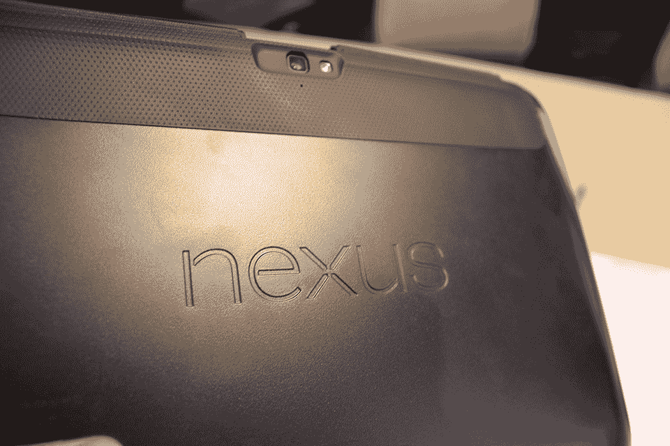](https://web.archive.org/web/20221207194904/https://beta.techcrunch.com/wp-content/uploads/2012/11/nexus10-5.jpg)
[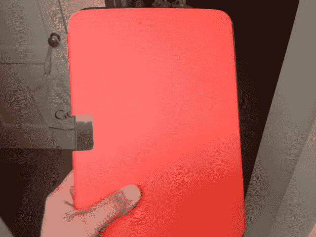](https://web.archive.org/web/20221207194904/https://beta.techcrunch.com/2012/11/02/review-googles-android-os-might-be-better-suited-for-tablets-and-the-nexus-10-is-a-shining-example/photo-6-8/)

[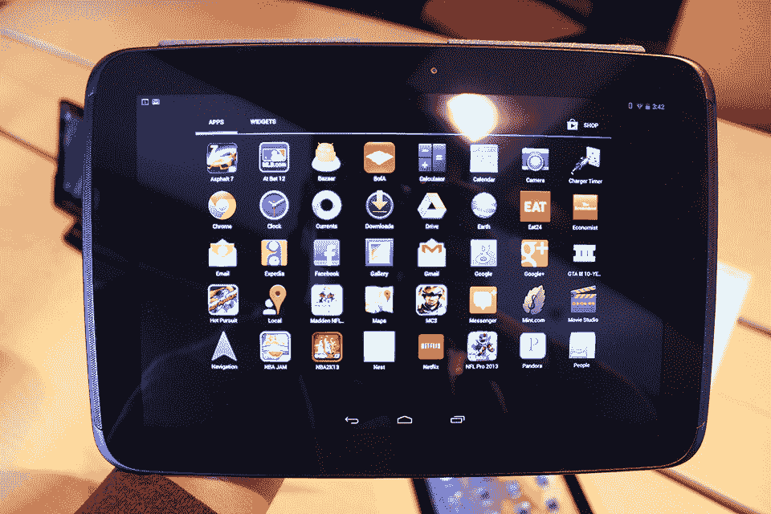](https://web.archive.org/web/20221207194904/https://beta.techcrunch.com/wp-content/uploads/2012/11/nexus10-6.jpg)

正如我在标题中所说，我开始认为谷歌的 Android 操作系统可能更适合平板设备。说到在手机上使用 Android，无论出于什么原因，我都无法理解。在使用笔记本电脑时，我倾向于在上面做所有需要做的事情。我的 iPhone 在旅途中可以充当备份，而且我确实使用的应用程序在苹果的操作系统上非常好用。我还没有在 Android 手机上体验过。

果冻豆 4.2 相当不错，比我在任何 Android 手机上看到的都要棒，但它确实可以在平板设备上唱，特别是 Nexus 10。

当我坐在沙发上使用 Nexus 10 时，我会查看电子邮件、浏览推文、查看 Instagram 照片、使用 Google+、浏览脸书以及上网。与我在 iPad 上的体验相比，这款最新版本的 Android 操作系统和这款设备在所有这些方面都更胜一筹。前后向摄像头并不显眼，因为我从来没有真正把平板电脑当成过“相机”。不过，前置摄像头的质量对于 Hangouts 来说还是相当不错的。

[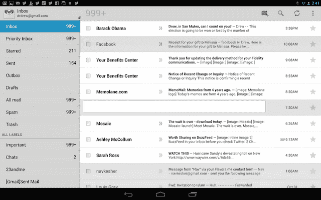](https://web.archive.org/web/20221207194904/https://beta.techcrunch.com/2012/11/02/review-googles-android-os-might-be-better-suited-for-tablets-and-the-nexus-10-is-a-shining-example/12-3-2/)

[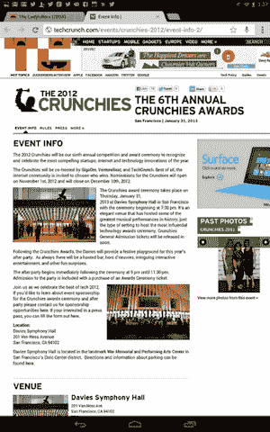 ](https://web.archive.org/web/20221207194904/https://beta.techcrunch.com/2012/11/02/review-googles-android-os-might-be-better-suited-for-tablets-and-the-nexus-10-is-a-shining-example/12-12-2/) 

[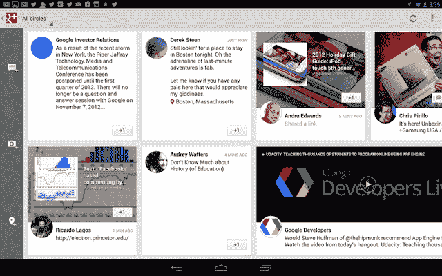](https://web.archive.org/web/20221207194904/https://beta.techcrunch.com/2012/11/02/review-googles-android-os-might-be-better-suited-for-tablets-and-the-nexus-10-is-a-shining-example/12-17/)

**Google Now**

当谈到平板电脑的使用时，我认为不太重要的是编辑文档，完全沉浸在 YouTube 中，进行繁重的谷歌搜索，但可惜的是，有了果冻豆 4.2 和 Nexus 10，我绝对已经开始在平板电脑上做所有这些事情。因为 Google Now 产品，我现在使用它就像我怀疑我会使用 Siri 一样，如果它曾经为我所用的话。我进行搜索，询问天气，查看体育比分，研究周末要去的地方。Google Now 是如此令人惊叹的集成谷歌体验，如果它最终成为该公司有史以来最成功的产品之一，我不会感到惊讶。

[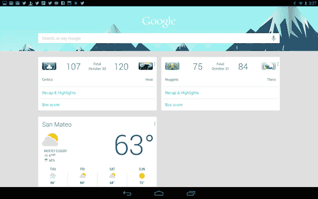](https://web.archive.org/web/20221207194904/https://beta.techcrunch.com/2012/11/02/review-googles-android-os-might-be-better-suited-for-tablets-and-the-nexus-10-is-a-shining-example/12-11-2/)

这已经很说明问题了。

**文件和电视**

此外，我开始更多地使用 Google Drive——注意，不是为了创建文档，而是在一整天的工作后查看和修改文档。此外，我发现自己在浏览我订阅的 YouTube 时，就好像在浏览电视频道一样，尽管我无法忍受有线电视。

[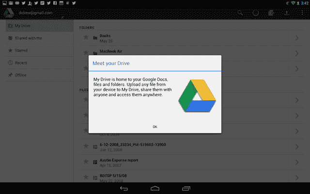](https://web.archive.org/web/20221207194904/https://beta.techcrunch.com/2012/11/02/review-googles-android-os-might-be-better-suited-for-tablets-and-the-nexus-10-is-a-shining-example/12-2-3/)

[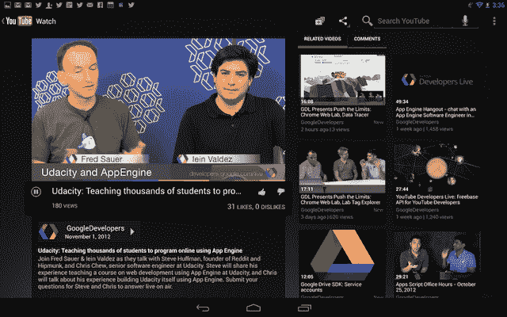](https://web.archive.org/web/20221207194904/https://beta.techcrunch.com/2012/11/02/review-googles-android-os-might-be-better-suited-for-tablets-and-the-nexus-10-is-a-shining-example/12-15/)

这款平板的零售价为 399 美元，比标准的 iPad 还便宜。然而，我并不是让其中一个与另一个对立。我能说的是:如果你是谷歌账户持有人和谷歌产品用户，那么你真的应该考虑拿起这个设备。当然，它并不完美，我对三星制造这款设备并不感到兴奋。

我认为华硕在 Nexus 7 的外观和感觉上做得比三星在这款设备上做得更好。然而，这并不恐怖；事实上它很坚固。Android 的操作系统在平板电脑上可能比 iOS 更好的想法可能会让你不舒服，相信我，我自己也对这种想法感到惊讶。我要说的是，对于我的日常使用和生活方式来说，确实是这样。

要不要再等一个 10 寸的安卓平板？也许吧，但是在谷歌聪明起来并开始制造自己的硬件之前，不会有比这更好的了。是的，是时候了。谷歌是时候挺身而出，控制 Android 和硬件的整个体验了。这是否意味着其他硬件制造商应该得到轴？也许不是，但我认为苹果的头号天才之举是它控制了硬件和软件。

苹果有优势，但谷歌正处于令人惊叹的尖端。也许你不同意我的说法，Android 在平板电脑体验方面有优势，但这值得思考。也许布林先生可以停止玩眼镜几个月，帮助设计一款杀手级的平板电脑。我就买，只要是运行果冻豆 4.2 OS 以上的。

它真的很好，当我没有“连线”时，我可能会在它和 Nexus 7 之间切换。