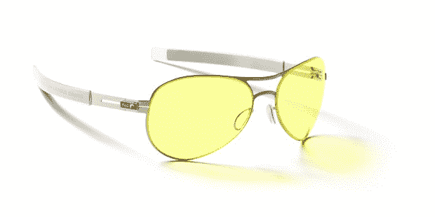
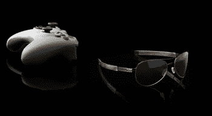

# 点评:贡纳“MLG 传奇”眼镜 TechCrunch

> 原文：<https://web.archive.org/web/https://techcrunch.com/2009/12/04/review-gunnar-mlg-legend-glasses/>

**简称:** [*贡纳的*](https://web.archive.org/web/20221006212501/http://www.gunnars.com/)《MLG 传奇》眼镜对于因长时间盯着屏幕而遭受眼睛问题的游戏玩家和工作者来说都是不错的选择。虽然在电脑或电视屏幕前佩戴琥珀色镜片的专业眼镜的想法对一些人来说似乎有些自命不凡，但这些眼镜的好处超过了任何社会反弹的可能性。99.00 美元的价格是合理的，鉴于其轻便的设计，这些眼镜的耐用性是显着的。

**特性**

*   疏油涂层可抵抗污迹和指纹
***   增强对比度以获得更清晰的图像***   i-AMP 技术镜片旨在减轻眼睛疲劳***   99.00 美元的建议零售价******

 ********优点**

*   减少眼睛疲劳和疲劳
***   轻巧、耐用且坚固的设计***   时尚的飞行员镜头和干净的镀铬边框****

 ********缺点**

*   眼镜高高地坐在脸上

 ****回顾**

几个月前，我开始出现视力问题。我的眼睛会疲劳，我的远距离视力会因为我认为没有明显原因而变得模糊，每当这些症状出现时，我就会有短暂但非常痛苦的头痛。起初，我认为我的视力刚刚开始恶化，我需要的只是最终得到一些处方眼镜。不过看起来很奇怪，我的问题来了又去，而不是持续不断。后来，我在一个游戏网站上看到一则广告，是关于这种特殊眼镜的，它是为像我这样有问题的人设计的。事实证明，每天盯着电脑屏幕看 8 个小时，然后回家再玩几个小时电子游戏，对你的眼睛非常有害。谁能想到呢？

我联系了眼镜的制造商 Gunnar，他们给我寄来了他们特制的 T2 MLG 版眼镜，因为我自称是游戏玩家。这双除了外观之外，与 Gunnar 的另一系列产品没有什么不同。镀铬框架、浅琥珀色镜头和飞行员风格让它们看起来非常时尚。眼镜也很轻，佩戴起来很舒服。他们的镜头旁边有[游戏大联盟](https://web.archive.org/web/20221006212501/http://www.mlgpro.com/)的标志，因为他们是竞技游戏联盟的首选合作伙伴。然而，这些眼镜看起来确实比普通(太阳)眼镜更高。这有点烦人，因为我觉得他们看起来有点尴尬，但谁知道呢，也许我只是有一张奇怪形状的脸。尽管有这个小问题，但在戴了一周之后，我的问题就消失了。不再头疼，也不再视力模糊。我被迷住了。

这种眼镜非常适合那些一天盯着电脑屏幕几个小时的人，但对那些重度游戏玩家来说更好。通过[独立研究](https://web.archive.org/web/20221006212501/https://beta.techcrunch.com/wp-content/uploads/2009/12/ldrus.pdf)，发现许多游戏玩家长达整整三分钟不眨眼，而个人在玩视频游戏时眨眼率可降至正常眨眼率的近百分之二十。试着现在不眨眼地走三分钟，然后每天坚持几个小时。这显然不是你想发生的事情，因为它损害了眼睛的完整性。

我担心戴着耳机戴眼镜，因为我不想让耳机把镜架推到我的头侧，这显然至少会引起轻微的疼痛。然而，超薄的 chrome 框架非常适合像我这样用耳机玩游戏的人。我的 [Astro A40 的](https://web.archive.org/web/20221006212501/http://www.astrogaming.com/products/detail/12/A40-Audio-System-MLG-Edition/)完全适合我的 *Gunnars* 没有任何不适。

这种眼镜使用的专利技术的工作原理是，在光线射到你的眼睛之前弯曲屏幕，让你的眼部肌肉放松:从而减轻压力。考虑到琥珀色镜片的着色，颜色会有轻微的失真。你不会看到真实的颜色，但这是因为*Gunnar*会过滤掉光谱中有害的部分(Gunnar 营销副总裁马克·麦克纳布告诉我，他们有[透明镜片](https://web.archive.org/web/20221006212501/http://www.gunnars.com/gunnar_indoor_collection_clear.php)也适用于平面设计人员)。戴上这种眼镜还有一种我喜欢称之为“放大效应”的东西。我在一台 22 英寸 1080p 的液晶电视上玩视频游戏，玩的时候屏幕似乎大了几英寸。同样，这是由于眼镜的过滤特性。老实说，鉴于我整天盯着屏幕，这是一个受欢迎的副作用。你看到的图像也比没有它们时清晰得多。除了没有视力模糊和头痛，这是他们最大的特点。戴着这副眼镜玩 [*刺客信条 2*](https://web.archive.org/web/20221006212501/http://www.crunchgear.com/2009/12/02/review-assassins-creed-2/) 真是一种享受。

和所有的眼镜一样，污迹和指纹总是令人烦恼。镜片上的疏油涂层有助于减轻这些滋扰。我会说，在密集佩戴的一周内，我只需擦拭镜片约 2-3 次。

这些眼镜的耐用性是最让我吃惊的。当我不戴 Gunnars 的时候，它们通常会放在我的帽子上。他们不止一次从我的帽子上把六英尺高的东西扔到地上，并且经受住了攻击。我在 TechCrunch 总部[做了一个跌落测试，从我头顶上方跌落到地面，增加了两英尺，它们再次经受住了跌落。眼镜配有一个带衬垫的塑料盒，以确保不戴时不会弄脏或摔坏。](https://web.archive.org/web/20221006212501/http://www.beta.techcrunch.com/)

这些眼镜是为 20/20 或矫正视力的人(包括有隐形眼镜的人)设计的。然而，如果你没有完美的视力，贡纳斯可以为你工作。只需与您的验光师交谈，让您的 Gunnars 符合您的视力规格。

许多职业游戏玩家使用这些眼镜，并对它们深信不疑。我穿了它们，虽然它们不会让我仅仅穿上它们就成为职业选手，但它们确实让我的经历更加愉快。这款眼镜售价 99 美元，考虑到它们为我带来的改善，我建议试试。

**产品页面:** [Gunnar Optiks MLG 传奇眼镜](https://web.archive.org/web/20221006212501/http://www.gunnaroptiks.com/store/cart.php?m=product_detail&p=69)**************