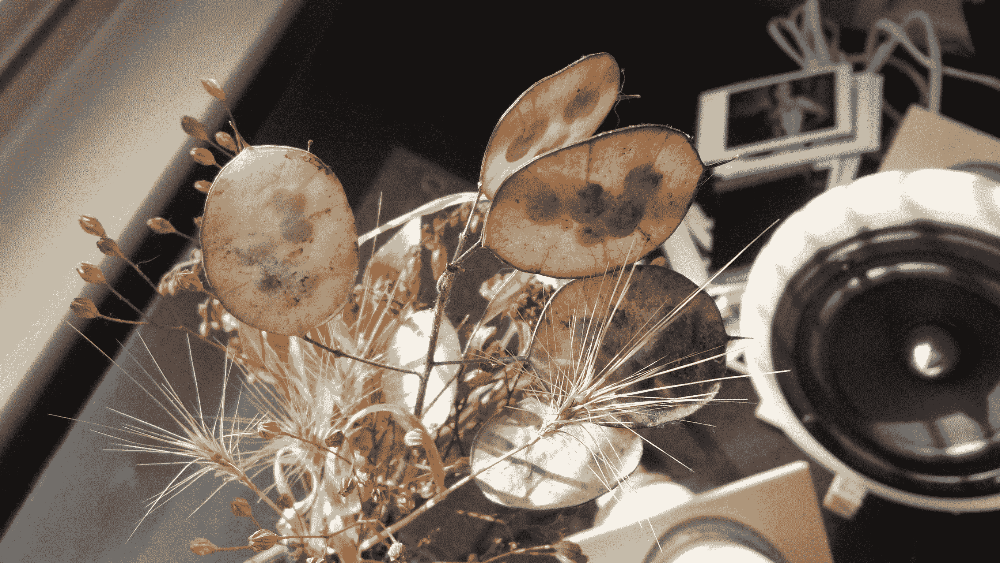

# 点评:摩托罗拉 Atrix 2 

> 原文：<https://web.archive.org/web/https://techcrunch.com/2011/11/09/review-motorola-atrix-2/>

## 简短版:

一款有吸引力、舒适的手机，拥有出色的屏幕和坚固的摄像头。事实上，这并不是对原中庭的重大更新，但它很好，尽管有一些不必要的视觉效果。寻找一部美国电话电报公司安卓手机？这可能是你现在最好的选择。

**特性:**

*   4.3 英寸 qHD 显示屏
*   1GHz 双核处理器
*   800 万像素摄像头，支持 1080p 录制
*   用于轻量级计算的 Webtop 附件
*   建议零售价:美国电话电报公司 99 美元，新的两年合同

**优点:**

*   明亮清晰的屏幕
*   握起来很舒服，背面有很好的纹理
*   相机相当不错，微距拍摄很棒

**缺点:**

*   UI 造型很烦人
*   1GHz 处理器可能不足以满足规格要求
*   美国电话电报公司品牌的应用程序并不真正有吸引力

## 全面审查:

我们会尽量简短。Atrix 2 是一款高端 Android 手机(更不用说 Galaxy S II 这样的“超级手机”)，它在最初的 Atrix 基础上进行改进，增加了更好的显示屏和摄像头，更快的 4G 和其他一些改进。

**硬件**

手机的机身，不得不说，手感很棒。4.3 英寸的屏幕被一个相当宽的边框包围着，让它看起来有点胖，但在我手中感觉非常自然和舒适。按钮的位置很好，尽管它们凹进到齐平的程度，使得它们偶尔很难被击中。电源按钮，当然是你会碰到最多的，感觉有点太粘了，但是总是会被迅速激活，不需要任何额外的努力去寻找或按下。底盘很硬，很结实，在我用力的时候没有嘎吱嘎吱响，也没有开裂。

手机的背面是一种有纹理的塑料，在你的手指下非常舒适和抓握。比起其他手机的普通拉丝或光滑塑料，我更喜欢这款手机。不过，我觉得它比它们更容易捡起面包屑。它的背面也几乎是平的；相机单元可能只突出一毫米，不像其他手机上的驼峰。

最初的 Atrix 有一个指纹读取器，这个版本放弃了，要么是为了节省成本，要么是因为根本没有人想要它。但是 Atrix 2 增加了一个专用的摄像头按钮。作为“快速启动”的解决方案，这并不是很好(击中要害和触摸相机快捷方式一样快)，但当你考虑到新相机是一大卖点时，这是一个受欢迎的补充。

那个相机其实挺好看的。我的主要批评是快门按钮应该是两级按钮，用于设置自动对焦点。此外，它非常坚硬，比其他产品更坚硬——当你敲击它时，它几乎总是会移动手机。但我发现一直开启的自动对焦相当快速、准确，并且能够非常近距离地对焦。看看这些近微距照片的清晰度:

甚至还有一点不错的前景模糊。自然有大量的噪声，你会发现在任何小传感器相机的全尺寸。颜色肯定不是很鲜明，但这是你可以很容易控制的。按下按钮和拍摄之间几乎没有延迟，一两秒钟内就可以准备好拍摄下一张照片。

还有一个多色通知 LED，我仍然不相信这不是所有手机的标准配置。

拆卸和更换电池盖很容易，后面板的弯曲度足以使其更容易，但不足以让您担心其质量。MicroSD 卡插槽无需取出电池即可使用，这始终是一种更好的选择。

**软件**

安卓系统已经做了一些修改，但没有达到摩托罗拉之前用模糊的程度。美国电话电报公司蓝主题贯穿始终，从略显花哨的锁屏到突出其标志的真正不合时宜的浏览器图标。

每当你在主屏幕之间切换时，还有一种极其恼人且不微妙的图标闪光效应。当你第一次看到它时，它就失去了新鲜感。动画看起来也比库存的要长，并且只能一起关闭(没有办法关闭手电筒效果)。冷静点，摩托罗拉。没人想这样。

美国电话电报公司包含了大约 12 个“膨胀软件”应用，这取决于你如何计算，但它们也让移除它们变得异常容易。你打开你的应用程序，在下拉菜单中选择“美国电话电报公司”，他们已经友好地收集了他们所有的应用程序。他们一点也不知道这个应用程序桶将如何使用！在那里，你可以长按一个应用程序来删除它。无需深入菜单，无需等待应用和组件列表填充。很简单。应用程序本身是通常的帐户访问和赞助服务的素材，不太可能动摇许多用户远离他们已经建立的文件、媒体和文档同步解决方案。但没有恶意。

**网速**中等。我在我的邻居那里获得了大约 4 兆比特(大约 500KB/s)，我记得 T-Mobile G2 曾经获得大约 8 兆比特。Speedtest 证实了这一点(下行 3857kbps，上行 1641)。老实说，在实践中，它总是足够快，这些 4G 手机很少真正在最重要的延迟上击败对方。改进的无线芯片组不能保证在任何情况下都有更好的速度，但提高了上限。这完全取决于你最常使用手机的网络条件。我发现，在西雅图，T-Mo 通常比 AT & T 快，但在其他地方会相反。不要在意我的非正式测量。

**续航**我发现非常好。我从大约午夜开始拔掉手机，在 4G 网络上接收电子邮件，拍照，为这篇评论给自己发照片，等等，目前是 80%(当我三个小时后编辑这篇文章时，是 70%)。4G 上的流媒体自然会消耗更多，但在我看来，这是一部全天手机，它已经度过了很多天。我也看到过其他评论抱怨电池的，但我个人没遇到过什么出格的。

然后是网络桌面功能。不幸的是，我没有分配一个单位来测试这一点，所以我会保持沉默，让你检查其他评论对此功能的意见。

## 结论

如果你在美国电话电报公司，不是 iPhone 用户，我会说这是 99 美元的便宜货。它在许多方面击败了来自 HTC 的竞争对手，对我来说，它就像一部简单而坚固的手机。只要你能避开那个愚蠢的手电筒效应。