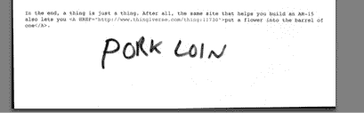
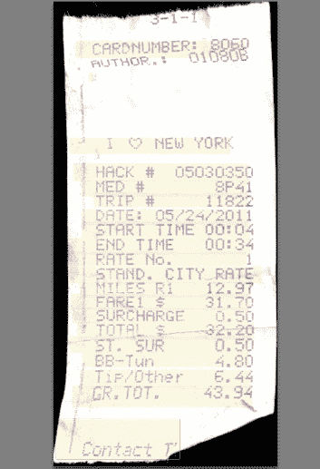

# 点评:面向 Mac 的 NeatDesk 扫描仪 

> 原文：<https://web.archive.org/web/http://techcrunch.com/2011/09/22/review-neatdesk-scanner-for-mac/>

这个东西在我的书桌上放了大半个夏天，就像一只伤心的小狗。它想让我回顾一下，但我像一个任性的、被宠坏的孩子一样，忽略了它。“你只是一个扫描仪，”我说。“谁在乎？”

“你最终会在乎的，”Mac 的 NeatDesk 说。"当你这么做的时候，我可能不会在你身边."

**特性:**

*   50 页扫描仪
*   扫描多种尺寸
*   双面扫描
*   自动对收据、名片和文档进行分类
*   管理系统更新项目:400 美元

迅捷
不引人注目
安静

软件有点混乱
每隔几批就卡纸
较小的收据会变皱

后来有一天，我塞了一张纸到她嘴里，然后又塞了一张。然后是收据，然后是名片。我按下扫描按钮，几秒钟后，我的屏幕上就出现了一份文件的 OCRed 副本。我可以在 Evernote 上添加页面，或者敲几下键盘进行搜索。我可以把我收集的所有名片都加进去，然后扔掉。我可以在几分钟内完成费用报告。“你为什么不告诉我你可以为我这么做？”我说。

“你从没问过，”扫描仪说。

当然，她有时会卡住，有时会一次拿两张卡，而不是一张。有时我小小的出租车收据会被弄皱。但是它从来没有堵塞到破坏纸张的地步，而且整洁的书桌已经成为我存放所有我珍爱的文件的事实上的地方。写合同？整洁的桌子。名片？整洁的桌子。税收垃圾？整洁的桌子。

“我告诉过你你会爱我的，”扫描仪说。

“但这不是爱，”我说。“像你这样的人多着呢。在我有你之前，我有一台 [ScanSnap 扫描仪。](https://web.archive.org/web/20230204174714/https://techcrunch.com/2010/03/08/review-scansnap-s1300-portable-scanner/)扫描仪是扫描仪是扫描仪。”

“我对收据和名片很在行，”扫描仪说。"我有一个很好的桌面应用程序，NeatWorks . "

“你是，但是你的文件 OCR 有点粗糙，”我说。我扫描了一份用 Courier 打印的文档，当我将扫描的文本粘贴回文本编辑器时，得到了一份可以接受的传真。然而，我的笔迹(用黑色墨水写的“猪腰”)显示为“pC/

也就是说，将我所有的扫描文档放在一个地方是非常方便的。该产品可用于 MAC 和 PC，其设计看起来更像一个性感的太空吊舱，而不是扫描仪。弯曲的线条和边缘构成了令人愉快的桌面伴奏，当需要维修时，一个简单的插销可以打开扫描仪。一个专用的电源开关使它很容易关闭，两个按钮-扫描和 PDF 完全按照他们说的做。Scan 将文档扫描到 NeatWorks 中，PDF 将其扫描到文件夹中。

“看看我是怎么扫描收据的，”扫描仪说。

“你的确很擅长这个。我不怀疑你非常适合小文档。”

“那么我们是一对了，”扫描仪说。

“暂时的，直到更好的事情出现。你知道，我试着保留我的选择。我只是想玩得开心，”我说。

“你会回来的。”

“我肯定会的，”我说。

“顺便说一句，压碎一个人的股骨需要 75 磅的反向压力，如果是你的手骨，这个压力会更小，”扫描仪说。

“你没有足够的动力，”我说。

“我有朋友，”扫描仪说。

[产品页面](https://web.archive.org/web/20230204174714/http://store.neatco.com/index/page/product/product_id/107/product_name/NeatDesk+for+Mac)