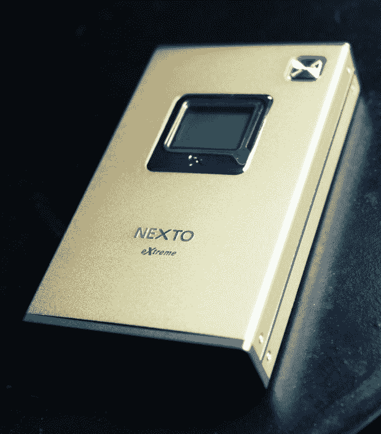
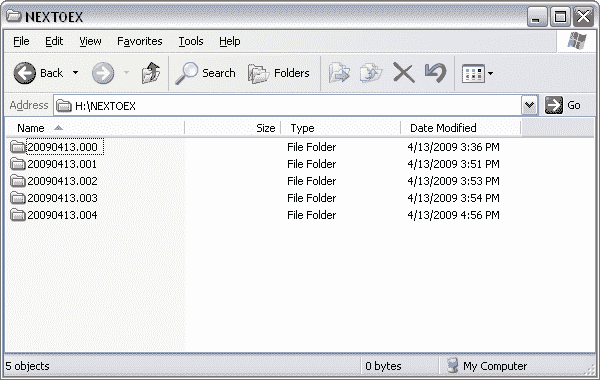
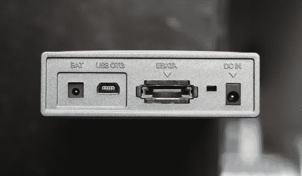

# 点评:Nexto DI eXtreme 便携式媒体存储 

> 原文：<https://web.archive.org/web/https://techcrunch.com/2009/04/14/review-nexto-di-extreme-portable-media-storage/>

【YouTube http://www.youtube.com/watch?v=46kP4dr5u3A&hl=en&fs=1]

便携式媒体存储？你会问，这到底意味着什么？别担心，一切都会水落石出。它并不真的那么极端，但是非常方便。Nexto DI eXtreme 是一种在旅途中备份所有媒体的好方法，根本不用考虑它。

上面的视频解释了你需要知道的几乎所有东西，但这里有一个纲要:Nexto DI eXtreme(我将称之为 Nexto)本质上是一个内置控制器的便携式硬盘驱动器，它可以从你的相机、摄像机、SD 卡、CF 卡或任何东西中吸取数据。只要你的设备可以连接 USB，不需要任何特殊程序就可以工作，我想 Nexto 应该可以应付。

Nexto 被宣传为由于一些秘密的技术酱(因此是“极限”)而以令人难以置信的速度工作，但这可能不足以让你注意到。然而，这很自然；我们倾向于*注意到*进展太慢的事情，而*不会注意到*事情进展顺利甚至比我们预期的还要快。例如，Nexto 在大约 2 英尺 43 秒的时间内复制了 1.5 千兆的高清视频。

这是相当好的时间，但我更多地看到它用于稍微小一点的任务:假设你为你孩子的生日聚会拍了 100 张照片。插入 Nexto，在 20 秒钟内，它们就被存档到它们自己的文件夹里，上面有日期和时间。照片可以保留在相机上，也可以不保留在相机上(Nexto 上有这两种选项)，如果您不小心格式化了卡片，以后从库中删除了照片，或者发生了其他事情，您可以再次拍摄，因为您知道您的 100 张照片是安全的，有时间戳，并且可以作为“胶卷”或其他内容导入。这是一个很好的省心工具。

Nexto 本身构造精良，但设计非常简单。我无法在照片中把它美化——相信我，我尽力了。无论好坏，它都是硬盘形状的，虽然它构造坚固，但它的端口也很容易让灰尘或咖啡进入，所以请保持安全，直到需要它的时候。你可以通过一个按钮来浏览它的菜单，这个按钮可以长按也可以短按，这取决于你想做什么。这听起来很麻烦，但它实际上工作得很好，并且它将物理接口降到了最低。一旦配置好，你只需要按一下按钮就可以打开它；剩下的就是自动的了。

它有一个内置电池，可以通过普通插头或 USB 充电，这很好——不用担心 a a 电池等等。一次充电持续了很长时间，而我一直在审查它，所以它似乎不会吸太多的力量。

 [Nexto DI eXtreme](https://web.archive.org/web/20230125112850/http://www.nextodiusa.com/)的 160GB 起价为 200 美元，然后一路上涨，所以我不会说它是便宜货(300 美元买 500GB 肯定是最划算的——买得多，省得多！).但它很有用，对于工作流程中没有足够冗余的摄影师来说，这是制作另一个备份的简单快捷的方法。带有时间戳的文件夹很方便，速度很快，丰富的输入选项意味着你可以从几乎任何设备上存储东西。对你来说，每样东西都有一份额外的副本是否值得 200 美元是你自己的事情，但如果这个小工具听起来对你有用，我当然可以推荐它。