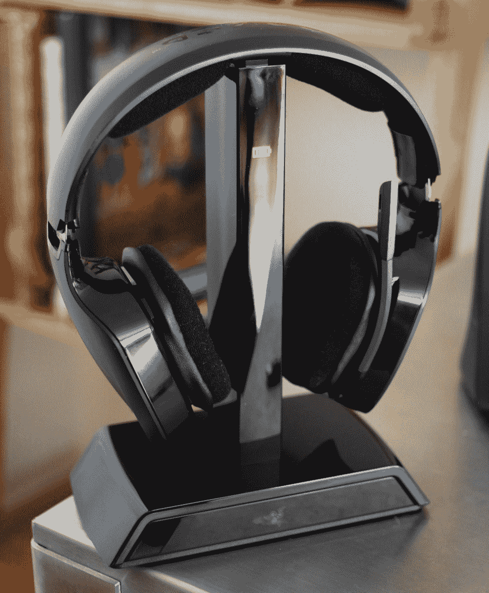

# 点评:Razer Chimaera 无线耳机 TechCrunch

> 原文：<https://web.archive.org/web/http://techcrunch.com/2011/07/12/review-razer-chimaera-wireless-headset/>

**简短版:**好看，听起来不错，适合……好吧。它不适合马拉松游戏或全天使用，但 Chimaera 是家庭游戏的可靠耳机。没什么异常。
 **特点:**

*   2.4 GHz 无线传输(10 米范围)
*   封闭式耳罩
*   兼容 PC 和 Xbox 360
*   3.5 毫米音频输入和内置麦克风
*   建议零售价:129.99 美元
*   **注**:本次评测针对的是立体声耳机，不是虚拟 5.1 耳机。

**优点:**

*   合适的范围(2.4GHz 耳机的正常范围)
*   强大的声音和良好的隔离(如果他们适合你的头)
*   固态电池寿命

**缺点:**

*   巨大的
*   明显倾向于低端
*   僵化的结构意味着如果他们不适合，他们就不适合

**全面回顾:**

很快:Chimaera 有两种口味，129.99 美元的立体声版本(我这里有)和 199.99 美元的虚拟环绕版本(我没有)。你可以在这里看到一个比较，但是你错过的是虚拟环绕(无疑有用，但在游戏中偶尔很好)，数字光学和 RCA in，一个设备上的均衡器，和一个改进的 5.8GHz 无线发射机(在那个频率上应该竞争较少)。所以，从现在开始。

Chimaera 是一个大型的塑料制品，带有用皮革装饰的深布衬里耳罩。左耳罩上有一个翻转式麦克风，可以灵活定位。两个耳罩上都有四个按钮——静音和电源/同步在外面，音频/麦克风音量在后面。

充电座和发射器组合与您的 360 或 PC 相连。同样没有小型化的尝试(例如，相对于 AKG 的 T1)；它更像是一个展示台，应该放在显眼的地方。在支架上，你会发现开关和同步按钮，以及(在立体声版本的情况下)一个 3.5 毫米输入。它必须插上电源——这里没有 USB 接口。

现在观察这张照片，告诉我你是否认为这些有点大，或者你是否认为我只是有一个小脑袋:

不，我很确定这些东西很大。它们并不特别重，至少就它们的尺寸来说，但是它们在你的头上确实感觉很大。合身与否是不确定的:你的头部没有太多的空间来让这些东西合适地放在你的头上。在我的情况下，他们倾向于在我的耳朵上方比下面抓得更紧。虽然还没到破坏密封的地步，但我肯定可以通过在底部压一点来改善声音。我没有这个问题，一副同样大的耳机，罗技 G35s，尽管尺寸很大，但非常适合。

坐在他们的立场是超级容易的，我从来没有任何麻烦得到充电开始。它在展台上显著地展示其地位；没有微小的 LED 要找。Razer 声称这些电池的续航时间为 12 小时，虽然我没有仔细计时，但我很确定我至少获得了 8 个电池，而且我没有把它降低到它们自己关闭的程度。如果 10 分钟内没有输入，它们会自动关闭，所以如果你不得不退出，不必担心手动关闭它们。

 我觉得声音不错，但是低音很重，位于正前方，往往会盖过声景的其他部分。一般来说，这在游戏中并不是一件坏事，但是当你戴着它们的时候，不得不重新平衡你的音乐，这是一件痛苦的事情。如果它们适合你的头部，隔离会很好，所以里程会有所不同。

一个普通的射频发射机的预期范围是:你希望在 20-30 英尺内，没有墙壁，超过一面墙(以我的经验)往往会中断信号。

有很多按钮，其中只有几个你会经常使用。静音和麦克风静音按钮已经足够好了，但是对于这样一个很少使用的功能，同步按钮的位置非常突出。杯子背面的音量按钮控制音量(在右耳罩上，非常方便)和麦克风音量。比起后者，我更喜欢 G35 和其他产品上的媒体控制按钮。当你无线连接到你的电脑或高保真音响时，在你的头上有一个遥控器是值得的。但由于这些也是非常 360 度为导向的，这是一个可以理解的省略。

**结论**

我认为立体嵌合体夸大了。它们的体积有点令人不快，声音是一个大杂烩——对游戏来说很好，对音乐来说有点太重了。对于一款多功能 PC 耳机，我不认为它值 130 美元，尽管它更适合靠在沙发上玩 360 度。不幸的是，这里有很多竞争，像 Gamecom 这样的耳机价格要低得多。环绕声 Chimaera 拥有更多功能，当然还有虚拟环绕，这使它有别于竞争对手，但立体声版本处于一个相当尴尬的位置。看看更贵的版本，或者省下一点钱，买一些不那么奢华的东西。

[产品页面:Razer Chimaera](https://web.archive.org/web/20230204090156/http://store.razerzone.com/store/razerusa/en_US/pd/productID.225974500/parentCategoryID.54297600/categoryId.55106100)