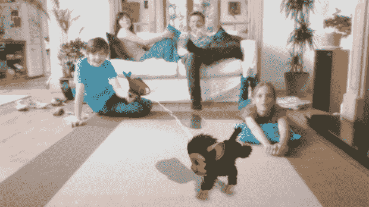

# 点评:索尼 PlayStation Move TechCrunch

> 原文：<https://web.archive.org/web/https://techcrunch.com/2010/10/01/review-sony-playstation-move/>

**简短版:**

索尼给了我们 4 款游戏和 PlayStation Move。其中两个让我想关掉 PS3，蜷缩成胎儿的姿势，哭着把我的痛苦赶走。一个是体面。其中一个非常好，我想邀请所有我认识的人来看一看未来。

索尼在这里建立的平台具有不可思议的潜力——现在就看游戏开发商如何让它物有所值了。

## 长版本:

**工作原理:**

回到 2006 年，任天堂随着 Wii 的发布震动了游戏世界(不管是好是坏)。运动控制突然出现在每个人的脑海中——当然，索尼和微软也不得不加入进来。三年后，索尼是后两者中第一个上架的。

像任天堂的方法一样，这种移动通常要求玩家至少持有一个控制器。鉴于这种相似性，人们可能会认为它们基于相同的技术。它们实际上在原理上是相似的，但在执行上是相反的。

你看，Wii 使用的是屏幕上方或下方的被动红外光，由 Wii 遥控器中的摄像头检测和跟踪。另一方面，Move 在电视下方放置了一个摄像头，它可以检测到一个粘在 Move remote 末端的小发光球。再加上陀螺仪和加速度计，你就有了基本的概念。

**控制器:**

对于移动控制器硬件，我只有一些好的东西要说。它握在手中很舒服，腕带保持良好和安全，而且它们出奇地轻。当然，当你第一次打开发光的球体时，你会觉得自己像一个神奇的童话公主——但是一旦你在游戏中迷失了自己，你几乎不会注意到。

比起 Wii，我更喜欢 Move 的按钮布局。索尼没有试图去寻找一个可以在两个不同方向上工作的控制器，所以这里的布局比 Wii 遥控器要自然得多。

与 Kinect 相比，我更喜欢 Move 的按钮布局，因为它……你知道，有按钮。

旁注:如果你有狗，小心你把你的控制器放在哪里。发光的圆形小块是柔软、有延展性的橡胶——就像你的小狗最喜欢的咀嚼玩具一样。

**摄像机:**

这部相机没有我希望的那么壮观。

当涉及到检测控制器上的小亮点时，它真是太棒了。然而，当游戏试图放弃使用控制器而只是检测玩家的手时(就像 EyePet 所做的那样，见下文)，一切都乱套了。

我的客厅光线相当好，尤其是在白天——尽管如此，照片中相机的噪点还是相当令人失望。有些游戏会在玩游戏时给玩家拍快照(通常玩家不知道)，这本身就是一个非常糟糕的想法。不过那是另一篇文章)；一半以上的时间里，这些照片都很粗糙。这不仅仅是因为我看起来很滑稽。

## 游戏:

如上所述，索尼随后推出了四款游戏(EyePet、功夫骑士、启动派对和体育冠军)，作为这一举措可能带来的影响的样本。在这里，我不打算触及每款游戏的情节、图形或声音之类的东西——这篇评论的重点是移动本身的效果如何，所以这些东西可能有点无关紧要。

让我们来看看，从最差到最好:

**EyePet 移动版:**

*注:这不是我的家庭，与我的一些 CrunchGear 作家同事可能告诉你的相反，我不是那个金发碧眼的小女孩。*

在 EyePet 中，玩家孵化、抚养一只名叫 a 的可爱小动物，并与之互动。当我说可爱时，我是认真的:这东西看起来像是 [Gizmo](https://web.archive.org/web/20221208164440/http://www.google.com/images?q=gizmo+gremlins&um=1&ie=UTF-8&source=og&sa=N&hl=en&tab=wi&biw=1041&bih=989) 和[狨猴](https://web.archive.org/web/20221208164440/http://en.wikipedia.org/wiki/Marmoset)的混合体。

我对这个概念非常兴奋，几个月前我玩过这个游戏的早期版本。不幸的是，它被默认为最差的:我就是不能让它工作。一点也不。

我试着让我的房间变暗，变亮。我试过不同的房间。我想，与我苍白的双手相比，我的棕褐色地毯颜色可能太接近了，所以我放下了一条亮蓝色的毯子。没什么。在游戏中的任何一点，玩家应该放下控制器，用手与他们的宠物互动，这一切都停止工作。

你的里程可能会有所不同，但一个小时的实验后，我放弃了。像这样的技术事故是不可接受的。

**功夫骑士:**

*不知何故，他们设法让坐在办公椅上从山上飞下来不再有趣。*

你在逃避三合会。为什么？因为他们是三合会，废话。他们想杀你，而你不想死。这差不多就是它的要点。

哦，你正坐在办公椅上(或者真空吸尘器，或者其他同样疯狂的东西)炸山。想象托尼·霍克下坡堵塞，除了绝对荒谬。而且也不是很好。

移动支架感觉被钉上了。真的——这说不通。你可以来回挥动控制器来控制方向，笨拙地在空中划水来让你的角色加速。方向盘慢得离谱，而且笨重，把原本应该是快节奏、全速的游戏变成了一种怪异、令人沮丧的体验。就像你在坐过山车，但是轮子是小熊软糖做的。

这个游戏本来可以很棒，如果它只是坚持使用标准控制器的话。相反，开发人员选择配合无意义的移动手势，几乎毁了整个事情。

**开始派对:**

*请锤子不要伤害他们。*

这是事情开始变好的地方。

顾名思义，开始党是一个党的游戏。当控制器在 20 个不同的迷你游戏中旋转时，玩家轮流传递(meh)控制器。

在整个游戏中，摄像机前的任何玩家都会显示在屏幕上。然而，代替移动控制器，每个迷你游戏渲染它自己的相关对象。前一秒，你可能在用网球拍打虫子；几秒钟后，你用一把大牙刷给鳄鱼刷牙。这真是个可爱的想法。

有些迷你游戏比其他的好，但一般来说都足够好。你必须通过控制器(即使你不止一个)这个事实有点令人失望；这个游戏一次只支持一个玩家是完全没问题的，但是不得不摘下手环并传递东西会令人厌倦。

**体育冠军:**

*我懂了，我懂了不，我不懂。*

还记得我说过想和所有认识的人分享的游戏吗？

这就是了。

这个游戏向我证明了这一招确实很棒。

这是一款每个人都应该购买的游戏——这很好，因为它是 99 美元捆绑包中附带的一款游戏。

体育冠军之于 Wii Sports 就像 Wii 之于 Wii 一样。它不那么卡通，但在概念上惊人地相似:你可以在一张光盘上看到各种各样的体育游戏，每个游戏都有自己的挑战和关卡。

这个游戏有它的缺点(例如，可选择的角色几乎都是滑稽的老一套。一个经常跳霹雳舞的黑人？一个巴西女孩在扔飞盘的时候做了一个时髦的柔术翻转？走吧。)但这不是重点。重点是它如何配合移动，以及*热该死的*，它做得好不好。

你有六种游戏可供选择:射箭、排球、地滚球、乒乓球、角斗士决斗和飞碟高尔夫。他们每一个人都很棒。

我不确定我曾经像在这里一样沉浸在一场比赛中。从伸手到我的脖子后面去抓一支箭，到在我的房间里跳来跳去试图藏在我的角斗士盾牌后面，这一切都令人震惊。飞盘高尔夫*实际上感觉就像玩飞盘高尔夫*，直到手腕最精确的轻弹。我喜欢它。爱它，爱它，爱它。

**整体体验:**

虽然每个游戏都带来了非常不同的体验，但有些体验——好的和坏的——在所有游戏中都是共通的。

**好的体验:**这一举动对于菜单导航来说太棒了。有些游戏用遥控器当指针；其他人做一种疯狂的手势，你握住扳机，朝你想去的方向移动。两者都工作顺利。指针方法实际上比在 Wii 上效果更好，因为它不会因为周围的红外光(比如:圣诞灯和蜡烛)而变得奇怪。

**不好的经历:**开始玩游戏。离开房间(或者甚至离开你开始的地方太远)然后回来。突然，你的目标变得疯狂，或者你认为你的手举过头顶，而事实并非如此。这项技术——其中跟踪器(相机)从不移动，而信标(控制器)则不断移动(如上所述，Wii 采取的是相反的方法)——需要精确的校准。离开相框再回来，你需要重新校准。这是一个快速的过程(大约 8 秒左右)，但如果你喜欢在游戏中途暂停一下，去跑一跑，拿一把筹码，那就有点老了。

**结论:**

索尼推出的四款游戏中，有两款糟糕透顶，令人瞠目结舌。这不是一个好兆头。然而，其他两个从不太寒酸(开始派对)到不要烦我-我要玩一场游戏-下周回来(体育冠军)。

Sports Champion 诚实地给了我对这个平台的希望，并向我证明了索尼在建立一些令人敬畏的东西方面做了他们的工作。然而，现在完全由开发人员来开发令人震惊的游戏。他们不能仅仅依靠移动支持来销售他们的游戏。他们不能运送不工作的东西。最重要的是，他们**不能**只是把这个东西钉在上面。如果他们这样做，或者如果索尼允许这种情况发生，这一举动注定会被尘封一生，只会被误认为“我也是！”噱头。