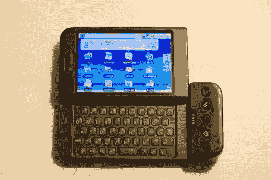

# 点评:T-Mobile G1 

> 原文：<https://web.archive.org/web/https://techcrunch.com/2008/10/16/review-t-mobile-g1-2/>

各位，我会让这篇评论简明扼要。你知道谷歌是如何年复一年地保持测试版本的吗？嗯，安卓也没什么不同。和你们中的许多人一样，我对新操作系统的前景感到兴奋，它将强势进入并击败 iPhone，但我担心 Android 不是它——至少现在不是。操作系统实际上并没有那么糟糕，但它确实有它的问题，这些问题不容忽视。不幸的是，在其他制造商能生产出更好的产品之前，硬件将会是 Android 的蠢事。

先说硬件。
 **好人**

输入机制的多样性是极好的。键盘反应相当灵敏，布局非常好。它几乎与 Sidekick 键盘齐名，我们都知道这是黄金标准。轨迹球有很好的触感，我特别喜欢它的深灰色，所以它不会随着时间的推移显示出灰尘和污垢。但灰尘、污垢和其他任何可以进入它的东西是否会影响它的性能还有待观察。触摸屏漂亮明亮，反应灵敏。它没有 iPhone 屏幕大，但它能完成任务。

当光线充足时，相机工作很好，可以拍出不错的照片，但在光线不足的情况下，它会发出臭味，这是意料之中的。当你用力敲击硬键时，它会很快启动，但是快速敲击对你没有任何作用，所以一定要用力。

当我第一次看到 G1 时，我并不喜欢扬声器的位置，但这比像 iPhone 一样放在手机底部要好得多。声音过大并不总是一件好事，但是当音量开到最大时，G1 的音质并不会变差。它仍然只是一个电话上的扬声器，但它响亮而清脆。即使将扬声器侧朝下放在桌子上，音频也不会变得低沉。写这篇评论的时候，我正在听鲍勃·马利的*传奇*，听起来很棒(扬声器朝下)。

通话质量在两端都相对清晰，在街上也相当不错。这是意料之中的事。没什么了不起，但也不算太坏。

这个屏幕的铰链很奇怪，但是很好用。格雷格和我都是 Helio Ocean 的忠实用户，所以当我们看到一个好的铰链时，我们知道它是什么，HTC 在这方面做得很好。它可以打开和滑出，不像大多数智能手机那样“折叠”。它比其他任何东西都更类似于传统知识。

**坏的**

我对 G1 最大的不满是全球定位系统不工作。我想可能是因为我住在曼哈顿，但我的 iPhone 从来没有在几秒钟内找到我的问题，我的 T-Mobile BlackBerry Curve 也没有(没有 GPS，但至少根据手机信号塔三角测量，我在几百码以内)。不管我是否启动了 GPS 卫星，我都不在我应该在的地方。如果它真的找到了我，它会立刻把我送到两三个街区以外的地方。甚至在本周早些时候去 JFK 的路上，我还以为会有足够的天空让它准确定位我。没有骰子。它发出臭味，打开 GPS 卫星像没人管一样耗尽电池，这就引出了我的下一点。

如果你认为 iPhone 3G 的电池续航时间很差，那么你就不必面对 G1 了。我拥有它的第一天，我设法在六个小时内杀死了它，我只是在网上漫游(中度重度)，发送/接收电子邮件，并习惯了这个设备。我认为它需要一夜之间耗尽电量并充满电才能自愈，但我第二天醒来时做了一些轻微的网络浏览，检查了一些电子邮件，并试图通过 GPS 定位自己 10-15 分钟，电池在一个小时内耗尽了 7%。我不敢想象如果我像用黑莓或者 iP3G 一样用它会是什么样子。电池寿命很糟糕。拔下插头 30 分钟后，甚至不做任何事情，它就会下降 5-10%。

虽然键盘的坚硬按键让你的右手非常笨拙，但我仍然没有找到一种舒适的方式来握持设备并在上面打字。我相信随着时间的推移，我会习惯的，但我不应该这样。说真的，谁给这个设计开了绿灯？这让人想起了[翼](https://web.archive.org/web/20221006183653/http://www.crunchgear.com/2007/05/22/t-mobile-wing-review/)和[倾斜](https://web.archive.org/web/20221006183653/http://www.crunchgear.com/2007/10/04/hands-on-with-the-att-tilt/)，不过这两者的混搭。它很大，有硬键的那部分是向上倾斜的，放在我牛仔裤的前袋里会很不舒服。我也不是穿着紧身牛仔裤的潮人。我看到了 [Touch](https://web.archive.org/web/20221006183653/http://www.crunchgear.com/2008/06/24/first-look-htc-touch-diamond/) 系列，想知道为什么这样的东西没有用于 G1。

最后但同样重要的是，没有 3.5 毫米插孔。没错，你被迫使用 G1 附带的耳机，通过 USB 连接。淡酱。

**现在转到安卓**。

整体 UI 干净，容易搞清楚。我讨厌与 iPhone 进行比较，但 Android 在这方面做得很好。布局是相似的，但有更小的图标，看起来会好很多。我真的不能说 Android 是好是坏，但我最初的反应是，它好像是上一秒钟被人用胶带拼凑在一起的。它不像 iPhone 第一次那样漏洞百出，但它看起来和感觉都很陈旧。

在我暴跳如雷之前，我将指出 Android 必须提供的一些小宝石。通知栏是一个很好的触摸方式，让我了解正在发生的事情，从屏幕顶部向下滑动就可以轻松访问。各种各样的输入有时会令人困惑，我几乎不记得菜单硬键在那里，但这是你必须习惯的事情。这变得容易多了，一旦发生这种情况，你可以很快地浏览设备。

在主屏幕上添加东西的能力也是一个不错的选择，比如快捷方式。拥有可以存放游戏等应用程序的文件夹很方便，而且占用的空间更少。

许多人可能会忽略的一个小细节是我发现非常有用的，那就是设备的状态菜单，可以查看电池电量和信号强度等重要信息。我只是希望我能为它制作一个快捷方式放在我的主屏幕上。

这是坏的(也是好的)

**Gmail**
——不能有一个以上的 Gmail 账户链接到设备上。我知道它会抛弃所有与之相关的东西，比如日历和联系人，但我认为拥有来回切换的选项并不过分。
——令人惊讶的是没有黑莓 Gmail 应用程序那么精致，但一切都更精简。我想这取决于使用者。当你只想发一封垃圾邮件时，翻遍菜单并不有趣。不能清理整个垃圾邮件文件夹也是一个缺点。
——尽管有上述的争论，Android 上的 Gmail 仍然有效，而且运行良好。

**谷歌地图**

-如果 GPS 真的能工作，我可能会在地图上洒满鲜花、小狗和赞美，但它不行，所以我不会。
-街景是非凡的，但它向我展示的位置与我所在的地方或我想去的地方相距甚远。可能是因为 GPS 坏了吧，我也不知道。
-地图中的指南针(你必须下载应用程序备件才能得到它)我认为会很棒，但它并不令人印象深刻，很难告诉你它会把你指向哪个方向。
-由于 GPS 不工作，整个应用程序令人印象深刻，当它能够定位我时，更新很慢。

谷歌日历
——可以用，但是需要一段时间才能同步。
-主屏幕图标应反映实际日期。
-我想在通知栏上看到日历，但当键盘关闭时，不会留下太多通知图标。当你拉下通知栏时，它会显示出来。

**谷歌搜索**
——管用。这里没问题。

**浏览器**当你必须点击+和-图标时，放大和缩小有点痛苦，但就像我说的，它比市场上除 iPhone 之外的其他浏览器都好。八个独立的浏览器对任何人来说都足够了。

**YouTube** 你也可以在每个视频的直接页面上发表评论，但我们真的在乎这些吗？
-除此之外没有专用的视频播放器。那是粗糙的。

**MP3 播放器**
-无均衡器。
-长按专辑、歌名或艺术家会弹出搜索亚马逊 MP3 商店、谷歌和 YouTube 的链接。

**市场**
——我无法给出一个公正的评价，因为目前可用的应用程序都不是很好。但是 Namco 的吃豆人是免费的！欢呼吧！
-整个条码扫描器 app 都是蹩脚的。对我来说，比较商品的价格并不能找到当地的价格，我也不在乎一瓶杰克酒在网上卖多少钱。也许是因为我的全球定位系统坏了。谁知道呢？删除应用程序比想象中要困难得多。当你在主屏幕上按住一个图标时，底部的标签会显示一个垃圾桶，你可能会认为这实际上是一个垃圾桶，但它不是。这是一个存储所有应用程序的容器。你必须从市场中删除应用。失败。我相信随着时间的推移，市场会变得更好，但现在没什么可大惊小怪的。

网络 T-Mobile 的 3G 网络在其目前部署的市场中表现强劲。到目前为止，我在纽约、旧金山和芝加哥都有很好的覆盖，在 EDGE 和 3G 之间切换的次数比在 iPhone 3G 上少。下载速度堪比 AT & T 的网络，而且我没有掉线。哦，实际的电话工作得很好。

**其他抱怨**
他们选择黑色作为背景仅仅是因为 iPhone 使用了白色(灰色/蓝色)吗？从主页上看，一切都充满活力，但一旦你进入设置或即时消息或任何东西，它就会变得黑暗和沉闷。至少让我们换个主题什么的。在主页之外，这是一个丑陋和不愉快的经历。

**结论**
如果你一直在等待 Android，那么我建议你继续等待。整个操作系统似乎是用胶带粘在一起的，需要大量的工作。苹果专注于微小的细节，以丰富 iPhone 用户的整体体验，安卓可以从中吸取一到十个教训。硬件设计已经过时，虽然触摸屏和键盘很棒，但你不能忘记糟糕的电池寿命、糟糕的 GPS 和它的整体人体工程学。我希望 G1 在各方面都更好，因为我不认为 iPhone 有那么好，但我发现自己希望它更像它。这是 iPhone 的最佳替代品，但目前还没有。