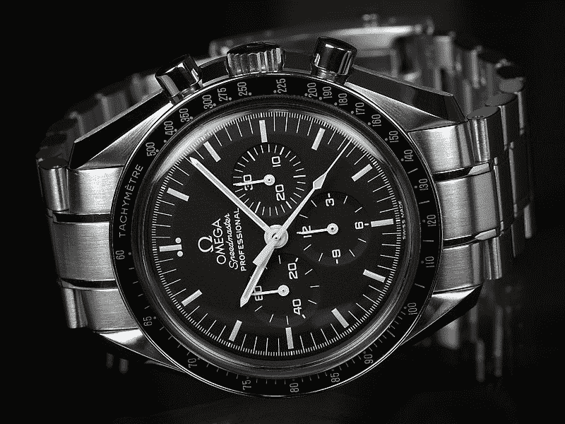
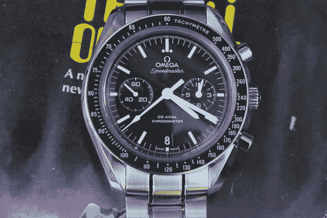

# 点评:Speedmaster Moonwatch 同轴计时表深入我心 

> 原文：<https://web.archive.org/web/http://techcrunch.com/2011/11/11/review-the-speedmaster-moonwatch-co-axial-chronograph-speeds-into-my-heart/>

在机械腕表的万神殿中，Speedmaster 占据着重要位置。最初建于 1957 年，是对竞争对手推出的第一款腕表计时表的回应，标志性的设计——黑底白字，带有醒目、清晰可读的章环和指针——在 1969 年巴兹·奥德林佩戴 Speedmaster 腕表登上月球时，它巩固了自己在历史上的地位。从那以后，欧米茄一直在大力发展这种关系，这在很大程度上有利于品牌的利益，Speedmaster 的粉丝疯狂地寻找新老车型，就像疯子一样渴望拥有明星。

几十年后，Speedmaster 保持了这种原始的风格和功能，除了在 20 世纪 70 年代和 80 年代发生的一些奇怪的变化，它没有远离黑底白字的设计。这款全新的同轴月表首先向这款腕表在太空竞赛中的重要性致敬，其次也向最伟大的现代制表师之一 [George Daniels 的贡献致敬。](https://web.archive.org/web/20230203073032/https://techcrunch.com/2011/10/24/horological-genius-george-daniels-dead-at-85/)

我在中国戴了这只手表一周，把它和我自己的另一只 GMT 手表放在一起，以评估它的易读性和可用性。我最初吃了一惊，原因应该是任何一个 Speedmaster 粉丝都清楚的。传统的 Speedmaster(专业版)有四个计时表——9 点钟位置的秒针、3 点钟位置的分钟计时表、6 点钟位置的 12 小时计时表，以及一个主秒针。需要澄清的是，主“长”秒针并不记录“运行”秒，而是由手表右侧的按钮激活。没有日期的专业和它有标准的指挥棒手与 lume 运行的长度。**职业长这样:**

**我今天复习的车型是这样的:**

对于一般的手表购买者来说，这种差别充其量只是装饰性的。然而，对于速度大师纯粹主义者(我把自己放在那个受人尊敬的书呆子鸟舍里)来说，反应是恐怖的。“这是什么邪恶？”你哭了。"工时记录在哪里？"

令人惊讶的是，小时和分钟显示在同一个表盘上。分钟在 3 点钟位置快速转动，而时针比分钟稍短，转动得稍慢一些。您还会注意到六点钟位置有一个日期窗口，取代了原来的小时刻度。

这一微小的变化在普通的 Speedmaster 粉丝中引起了很大的怀疑，但我在这里告诉你不要害怕:这款 Speedmaster 和你能拥有的其他 Speedmaster 一样好，甚至更好。可读性非常好，一旦你克服了最初的震惊，小小的音域变化是完全可以接受的。我也喜欢这个小日期窗口，它极大地改进了 Speedmaster。就连日期字体也可以追溯到一个更简单的时代，采用一种大胆的装饰艺术风格，这种风格在手表上已经很少见了。

我为什么喜欢这块表？

首先，动作准确无误，推杆比标准的 Speedmaster 有了显著的改进。乔治·丹尼尔斯的[同轴擒纵机构](https://web.archive.org/web/20230203073032/http://en.wikipedia.org/wiki/Co-axial_escapement)大大减少了维护的必要性，这要归功于该产品在使用寿命期间所需润滑剂的减少。作为 Speedmaster Automatic 和一些 Seamasters 的所有者，欧米茄手表需要定期维护以保持准确。我希望这款手表能提供多年的优质服务，无论你是否去太空旅行。

这款手表配有精钢表链或皮革表带，直径约为 44.25 毫米——这无疑是一个大胆的尺寸。它的防水深度为 100 米，但它没有拧紧的表冠，所以我有点担心给它洗澡。

这是一款自动手表——这意味着它由表内的一个重物上链——在天气不好的时候，它可以走大约 40 小时，广告上说是 60 小时。在我的测试中，我看到了惊人的 50 多个小时的储备，这是一个受欢迎的改进。

现在是(相对)坏消息。这款手表售价约 7300 瑞士法郎，约合 8060 美元。你会注意到，我在本网站的其他帖子中反对炫耀性消费，这是我的特权，但我反对为消费而消费。简而言之，这件物品是现代钟表工程和机械的缩影，与手工制作的布加迪不相上下，或者，我敢说，是与月球着陆器同等重要的艺术品(至少在钟表制造方面)。非钟表爱好者可能会提出反对意见，但 Speedy 是一款权威腕表，至少值得一点点尊重。

这让最初的收藏家，或者除此之外，想要一块好表的人怎么办？嗯，我可以毫无保留地全心全意地推荐这款特殊的 Speedmaster，因为它汲取了欧米茄过去和未来的精华，并将它们压缩到一款几乎所有人都认为帅气、大胆、机械性能出众的腕表中。然而，手表收藏家是一个奇怪的群体，所以你可能想先看看传统的专业人士，然后再一头扎进这种对原版的改进。

无论哪种方式，欧米茄在这款腕表中保持了月面腕表的传统，更重要的是，在不疏远纯粹主义者的情况下，对其原始设计进行了改进。这是一件很难做到的事情——他们并不总是做得很好(见他们可笑的奥运收藏)——所以这款 Speedmaster 绝对值得再看一眼。

[幻灯片]

[产品页面](https://web.archive.org/web/20230203073032/http://www.omegawatches.com/gents/speedmaster/moonwatch-omega-co-axial-chronograph/31133445101001)