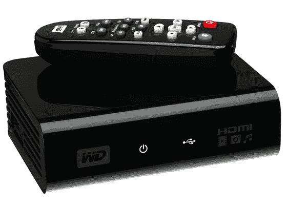

# 点评:西部数据 WD TV 高清媒体播放器| TechCrunch

> 原文：<https://web.archive.org/web/https://techcrunch.com/2008/12/14/review-western-digital-wd-tv-hd-media-player/>

# 点评:西部数据 WD TV 高清媒体播放器

几个月来，我一直在尝试演奏。MKV 和其他视频文件放在我客厅的前置投影仪上。起初，我试图将笔记本电脑直接连接到电视上。但这并不总是有效，音频很糟糕，笔记本电脑连接到投影仪上也很尴尬。

我开始用我的 XBOX 360 播放视频文件。起初，我想通过网络传输文件。这偶尔会奏效，但主要是一种挫败感的练习。由于网络瓶颈，我的快进和倒带能力很差。
 然后我试着用我的 Neuros OSD 做这个。这是一个非首发，因为 OSD 只有一个复合视频输出端口，我想播放高清视频。

最终，我开始将视频文件复制到大拇指驱动器上，并直接插入 XBOX。这对于许多视频文件非常有效，但对于高清文件完全无效，因为它们的大小大多超过 4GB(XBOX 360 只能识别 FAT32 格式的驱动器，而 FAT32 不允许每个文件超过 4GB)。

然后，我开始研究视频转码的黑色艺术。我寻找工具，将我在互联网上找到的视频格式转换成 XBOX 360 友好的格式。但是大多数自动化工具都是一种妥协。如果它将视频转换成 XBOX 友好的东西，并且大小在 4GB 以下，音频将被降级为 2 个通道(从 5.1)。我会在电脑上运行几个小时来转换视频，很多时候会出现问题，文件无法在 XBOX 上播放。

我用头撞墙想弄明白这件事。

一个秋天的下午，西部数据发布了 [WD 高清电视媒体播放器](https://web.archive.org/web/20230325181709/http://www.crunchgear.com/2008/11/03/western-digital-intros-the-wd-tv-hd-media-player/)。它承诺通过 HDMI 和光学音频播放高达 1080p 的高清视频，售价约为 120 美元。起初，我怀疑这样一个小而便宜的设备能否解决我几个月来的视频头痛。但是，当我把这个小玩意连接到我的投影仪上，在大约 20 秒的时间里，我就可以看到带有 DTS 声音的 1080p 高清电视了，所有的怀疑都烟消云散了。

基本上，WD 高清电视媒体播放器(顺便说一句，这个名字很难听)可以播放任何视频格式。你可以将视频放在任何 USB 大容量存储设备上，比如拇指驱动器或外部硬盘，然后将其插入设备。它可以识别驱动器上的文件，并播放找到的任何视频、音频或照片文件。它配有一个方便的遥控器，软件界面非常简单易用。盒子有 2 个 USB 端口，您可以插入任意组合的大容量存储设备。更好的是，它支持 NTFS 文件格式，因此您不会局限于 4GB 以下的文件。

我在一个外部硬盘上加载了各种视频文件，并将其插入媒体播放器。我使用遥控器浏览屏幕菜单，选择了几种不同的文件格式进行测试。小黑盒把每个文件都播放得很美。回放很流畅，即使是在快速的动作场景中。数字音频工作完美，甚至支持字幕。我测试了各种 720p 和 1080p 和 480p 文件。我找不到一个设备有问题的地方。

我通过光学音频和 HDMI 连接了媒体播放器。它还支持模拟音频复合视频，但我没有测试这些端口。

我还对小巧而强大的遥控器感到惊喜。我把小小的媒体播放器盒子藏在房间后面我的媒体柜后面，我的投影仪就在那里。我并不认为遥控器能够击中设备，但果不其然，我只是把它对准了我头顶的天花板，它工作得非常好，记录了每一次按键。

我喜欢这个小黑盒子。它单枪匹马地解决了我的视频播放问题，结束了几个月的沮丧。人们会抱怨缺乏网络支持，但我个人不希望通过我的本地网络传输高清视频。直接硬盘或拇指驱动器连接确保快速和可靠的回放和控制。简单快速，WD 高清电视媒体播放器是一个小巧经济的强大解决方案。

[产品页面](https://web.archive.org/web/20230325181709/http://westerndigital.com/en/products/products.asp?driveid=572&language=en)