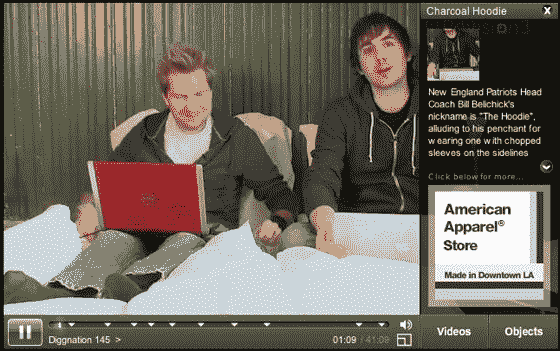

# 可点击视频的修订 3 和视频 Clix 团队 TechCrunch

> 原文：<https://web.archive.org/web/https://techcrunch.com/2008/04/14/revision3-and-videoclix-team-for-clickable-videos/>

# Revision3 和 VideoClix 团队负责可点击视频

修订版 3 与 [VideoClix](https://web.archive.org/web/20221209124537/http://www.videoclix.com/) 合作，为观众提供可点击的网络视频。

VideoClix 的技术允许观众点击视频中的不同对象，包括节目主持人和产品，以了解他们点击的更多信息和事实。该产品被定位为向好奇的电视观众提供获取更多信息的选择，这些观众希望了解他们在屏幕上看到的内容。

这项服务提供的额外信息是货币化的，通过视频中产品功能的附属或赞助链接。

《挖掘国度》是第一个包含互动剧集的改版节目，随后是《互联网巨星》、《Tekzilla》和《Totally Rad》节目，尽管目前只能在 VideoClix 网站上看到可点击的版本。这项技术的第一次挖掘秀可以在这里观看。