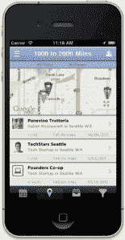

# 倒带。Me 让您探索您的数字历史，然后为此奖励您 TechCrunch

> 原文：<https://web.archive.org/web/https://techcrunch.com/2012/06/14/rewind-me-lets-you-explore-your-digital-history-then-rewards-you-for-it/>

技术是关于展望未来的，但是有这么多不同的虚拟身份和社交网络，很难跟踪你和谁说过话，你去过哪里。倒带。然而，Me iOS 应用程序可以让你通过拉入你的社交网络数据并为你组织这些数据来深入了解你过去的经历。

这个想法很简单。想象一下，你在三月份去了一家美味的希腊餐馆，离你的公寓大约一英里，但是你似乎不记得它在哪里。倒带。Me 会导入您的整个 Foursquare 历史记录，并根据日期、位置和类别进行搜索。您可以选择按距离(1 英里)、类别(希腊餐馆)和日期(2012 年 3 月)进行搜索。您还可以根据朋友们去过的地方搜索附近的地方，并在日历视图中滚动浏览朋友们过去去过的地方。

1.0 版本只与 Foursquare 集成，但其想法是，Rewind 将与你所有的社交网络和服务集成，不仅描绘你过去的虚拟体验，而且最常见的是，你的现实生活体验。

可以添加其他过滤器，包括朋友过滤器和内容类型过滤器(视频、图像、链接、消息等。)让你可以和某个朋友一起反思整个 twitter 历史，或者重温你在海滩上的 Instagram 照片目录。

app 不仅仅是激活那种可爱的怀旧情绪，而是驱动消费行为。为什么你不想回到你过去喜欢的地方？

此外，Rewind 将根据用户过去的活动向他们提供品牌和广告商的奖励。选择加入后，Rewind 会对 300 个不同类别的用户的活动和强度进行评分。像维多利亚的秘密、Warby Parker、BirchBox 和优步这样的品牌可以利用这些信息来奖励他们最忠实的顾客。

倒带。周二，Me 获得了首轮资本(First Round Capital)牵头的 80 万美元种子资金，其他投资者包括 TechStars、新世界风险投资公司、KBS+P 风险投资公司、Silicon Alley Venture Partners，以及天使投资人埃丝特·戴森、埃里克·詹森、巴里·西尔伯特、乔恩·皮奇、格雷格·坎加洛西、埃德·齐默曼、格雷格·雷夫曼和乔希·古特曼。

下面是该应用的快速浏览，你现在可以在[苹果应用商店](https://web.archive.org/web/20221207113500/http://itunes.apple.com/us/app/rewind.me-foursquare-edition/id517526535?mt=8&ign-mpt=uo%3D4)下载:

【YouTube http://www.youtube.com/watch?v=0iUchfEq-O8&w=640&h=480]

点击这里，查看所有来自纽约科技之星展示日[的酷东西。](https://web.archive.org/web/20221207113500/https://beta.techcrunch.com/tag/techstars-demo-day)