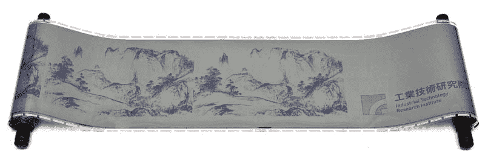

# 可重写的非电电子纸大有可为，但它真的有用吗？

> 原文：<https://web.archive.org/web/https://techcrunch.com/2011/08/08/rewriteable-non-electric-e-paper-makes-big-promises-but-is-it-really-useful/>

# 可重写的非电电子纸大有可为，但它真的有用吗？

一种叫做 i2R 电子纸的新显示技术今天正在流行。它是由台湾[研究](https://web.archive.org/web/20230203043536/https://techcrunch.com/tag/research/)公司 ITRI 研发的，该公司过去生产过[柔性 AMOLED](https://web.archive.org/web/20230203043536/https://techcrunch.com/2010/10/29/new-flexible-amoled-screen-is-a-tenth-of-a-millimeter-thick/) 和 [LCD](https://web.archive.org/web/20230203043536/https://techcrunch.com/2007/12/14/itris-flexible-lcd-screen-bends-like-crazy/) 显示屏。i2R 本质上是一种带有热激活液晶涂层的塑料基板:你让它通过热敏打印机，300dpi 的单色图像就会印在它的表面上——直到你想重写它，根据他们的计算，你可以重写多达 260 次。

抛开与使用铅笔的明显对比，我不确定这项技术是纸张杀手 ITRI，一些网站认为它是。我对这项技术有几个问题:

-该显示器被宣传为不耗电。任何双稳态显示器都可以这么说——电子墨水也是如此，一旦被用来显示某样东西，只要不受干扰，它就会在不使用电力的情况下显示出来。i2R 可能不需要电力(具体来说，它没有底层电路，这使它更接近于纸张)，但它的热敏打印设备肯定需要。本质上，它和电子墨水一样需要电力:改变显示的内容。然而，晶体可能会在一段时间后磨损，从而限制了重写。

-热激活限制了人们与这些显示器互动的方式。支持电路的基板的优点是能够包括诸如 IR 或电阻触摸阵列的传感器，允许人们在上面书写或“点击”内容。很明显，这里的重点不是交互式内容，而是可重复使用的显示器，但这种好处是值得怀疑的。

-无附加记忆意味着改变显示器/纸张上的内容是一个复杂的过程，需要通过特殊的写入器进行输入。用几十台 i2R 显示器做这件事看起来不像是一个店主想要做的事情。

-我不知道哪一个对环境更糟糕:260 张 A4 纸被回收，还是一张 A4 大小的塑料没有被回收(我怀疑晶体涂层是否可以被充分去除以重新处理基底)。

-很光滑！

有利的一面是，与其他显示技术相比，每张 A4 纸 2 美元是便宜的；一个 6 英寸的电子墨水显示器大约需要 60 美元。显然，你不会在你的墙上贴满蜡烛。300dpi 足以在上面获得一些非常详细的图形或代码。

虽然我持怀疑态度，但我认为问题只是 ITRI(和路透社)夸大了它。这不是纸或电子墨水的大规模替代品:这是一种可以而且应该以机构方式应用的利基技术。想想公交车通行证、临时身份证、课堂讲义，这类需要从一个中心源半频繁地重写，但主要作为静态信息片段进行交互的东西。一句“待售！”sign 并不是这项技术的合适应用，更传统的“显示”如白板也是安全的。

[点击这里观看路透社的视频](https://web.archive.org/web/20230203043536/http://www.reuters.com/article/2011/08/08/us-taiwan-paper-idUSTRE7770LU20110808)。不过，我不认为这是叙述者的风格。“打印不需要背光”，的确如此。