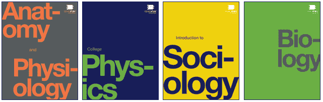

# 莱斯大学和 OpenStax 宣布第一批开源教科书

> 原文：<https://web.archive.org/web/https://techcrunch.com/2012/02/07/rice-university-and-openstax-announce-first-open-source-textbooks/>

当我们想到分销行业被破坏时，我们往往会想到音乐和电影，它们的物理媒体和庞大的运输基础设施在过去十年中几乎已经过时。在较小的程度上，我们听说了印刷，以及电子阅读器和网络消费对书籍和杂志的影响。没有人特别优雅地做出改变，教科书行业也是如此，该行业每年向学生出售价值数百万美元的极其昂贵的商品，而学生可能认为这些商品过时了。

多年来一直在推动学术出版物替代发行机制的莱斯大学宣布了一项新举措，他们希望通过一家名为 [OpenStax College](https://web.archive.org/web/20230404062613/http://openstaxcollege.org/) 的非营利出版商出版免费的高质量核心学科教科书，如物理和生物。这与[苹果的 iBooks 教科书](https://web.archive.org/web/20230404062613/https://techcrunch.com/2012/01/19/houghton-mifflin-mcgraw-hill-pearson-first-textbook-publishing-partners-for-apples-ibooks-2/)截然相反，虽然它们也有助于将这个尘土飞扬的行业拖到现在，但对出版商来说，这更多地是一个新的销售载体，而不是竞争。

Rice 和 OpenStax 并不是第一个提出开源或免费教科书的人。这里和那里都有藏书，像[平世界知识](https://web.archive.org/web/20230404062613/http://www.flatworldknowledge.com/)和苹果的[iTunes U](https://web.archive.org/web/20230404062613/https://techcrunch.com/2012/01/19/new-itunes-u-app-hits-itunes-with-over-500000-free-lectures-videos-books/)——但是他们明显缺少大一新生可能必须为他们一年的调查课程购买的书籍类型:生物 1，物理 1，社会学 1，心理学 1。而 [11 Learning](https://web.archive.org/web/20230404062613/https://techcrunch.com/2011/09/23/imagine-k12s-2011-startup-class-aims-to-invigorate-education-with-technology/) 也有类似的合作出书的想法，但他们的创作模式可能在经济上不可行。

当然，也有许多公司希望将教科书从等式中完全剔除。在像 [Kno](https://web.archive.org/web/20230404062613/https://techcrunch.com/tag/kno/) 和 [Inkling](https://web.archive.org/web/20230404062613/https://techcrunch.com/2011/08/24/sequoia-backed-inkling-updates-ipad-e-textbook-platform-with-collaborative-study-groups-and-more/) 这样的新设备上建立教科书平台，为元课程活动和像 Khan Academy 这样的非传统学习创造环境，或者虚拟化整个教育体验，这是许多大学正在修补的东西。

但是教科书仍然是一项大生意，而且现在很难对它们在教育系统中的效用提出异议。因此，OpenStax 将两者区别开来:在许多私人基金会的资助下(即不是政府资助)，他们正在编写完整的教科书，经过同行评审，专业排版，等等。这些教科书将以档案形式免费提供。但是辅助材料——测验、视频、演示等，大概都是要花钱的。

称之为诱饵和开关是狭隘的，因为大部分材料是免费提供的。一个精明的教授或助教已经可以从网上搜集到相当多的补充材料，这要感谢那些已经提到的课后服务。免费提供肉和有偿提供土豆是完全合理的。

教科书的质量还有待观察。到目前为止，OpenStax 已经和“几十个”大专院校签约使用这些书籍。机构可能正在等待明年左右的结果:一切都在变化，在真正的成本和收益尚不明朗的情况下，致力于一个平台而不是另一个平台将是一个糟糕的举动。

OpenStax 的第一批物理和社会学教材将于 3 月问世，其他教材将于今年晚些时候推出。在某种程度上，这是一个首次亮相的奇怪时间，因为学年正在进行中，许多入门课程将不会提供。但是，这需要时间让学术界的机器注意、认可、检查和判断 OpenStax 产品。也许他们可以展示他们在即时修正、改进和扩展内容方面的灵活性，这可能会给点头的教职员工留下深刻印象，也可能会让他们感到害怕，因为他们一次使用相同的文本长达十年。