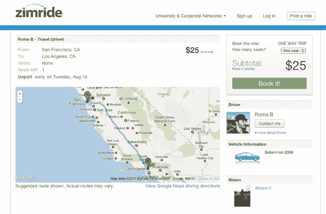

# 拼车平台 Zimride 融资 600 万美元 A 轮 

> 原文：<https://web.archive.org/web/http://techcrunch.com/2011/09/21/ride-sharing-platform-zimride-raises-6-million-series-a/>

# 乘车共享平台 Zimride 轮融资 600 万美元

让人们更容易找到共乘者的服务公司 Zimride 已经筹集了 600 万美元的首轮融资，由 Mayfield Fund 牵头。这一轮使 Zimride 的总资金达到约 720 万美元，去年的[120 万美元](https://web.archive.org/web/20230203092939/https://techcrunch.com/2010/08/23/zimride-funding/)种子轮包括 Floodgate、K9 Ventures 和 Keith Rabois。

Zimride 的平台解决了一个常见的问题:帮助人们协调拼车。它通过帮助有空余座位的人——以及那些希望填满这些座位的人——相互联系来做到这一点。用户也可以选择直接通过网站互相付款。

Zimride 目前用于 120 个不同的网络，每个网络连接属于同一所商学院的用户。通过该平台，学生和员工可以安排拼车上班/上课，或协调一次性乘车。例如，如果我计划从旧金山开车到洛杉矶，我可以卖掉我多余的座位。Zimride 的创始人说，这次旅行实际上每个座位大约 40 美元——这意味着在这些长途旅行中赚钱并不困难。为了了解这项服务在每个网络中有多大的吸引力，Zimride 说脸书在这个平台上，35%的员工在使用这项服务。

Zimride 通过直接向这 120 所大学和企业收费来赚钱，尽管它也可能开始从通过其支付系统的交易中提成。

Zimride 表示，它计划利用这笔资金将使用该平台的网络数量从目前的 120 个增加到明年年底的 300-400 个。他们的产品还有很多领域可以发展，包括通过移动应用程序实现的自发拼车，以及在活动中协调拼车(这项服务已经被戴夫·马休斯、杰克·杰克逊和其他乐队使用)。

