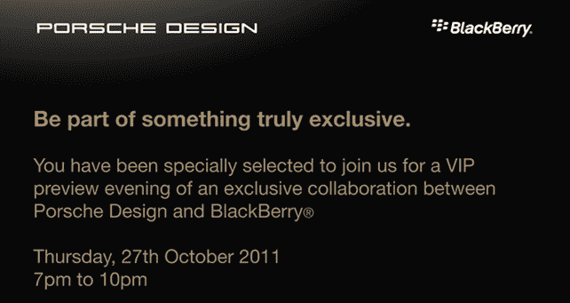

# RIM 和保时捷设计会在下周推出新的黑莓手机吗？(更新:已确认)

> 原文：<https://web.archive.org/web/http://techcrunch.com/2011/10/20/rim-and-porsche-design-blackberry/>

# RIM 和保时捷设计会在下周推出新的黑莓手机吗？(更新:已确认)

这里有一个有趣的消息开始你的一天: [Stuff 中东](https://web.archive.org/web/20230203154321/http://stuffmideast.com/2011/10/20/120116/rim-to-launch-porsche-design-blackberry-exclusive/)报道称，RIM 和保时捷设计将于下周四合作举办一场活动，承诺展示两家公司之间的“独家合作”。传闻中的保时捷设计黑莓手机最终会重见天日吗？

对于那些第一次没有注意到的人来说，一款据称名为“骑士 9980”的时髦黑莓手机的照片于九月首次在[浮出水面](https://web.archive.org/web/20230203154321/http://crackberry.com/some-new-info-about-blackberry-r47-9980)，这是由一个名为 MaxPDA 的中国论坛提供的。它看起来不像我们以前见过的任何其他黑莓手机:Knight 的机箱比典型的黑莓手机更棱角分明，而且(令人不安的是)键盘看起来更扁平。

设计上的彻底改变是因为保时捷设计团队理应负责。它们可能看起来是一个奇怪的选择，但保时捷设计已经超越了其母公司的汽车装饰，设计了从功能手机到[硬盘](https://web.archive.org/web/20230203154321/https://techcrunch.com/2011/06/27/meet-the-sexiest-mobile-drive-ive-ever-seen-lacies-porsche-design-p9220/)到[雪橇](https://web.archive.org/web/20230203154321/https://techcrunch.com/2010/12/17/the-porsche-design-bobsled-is-here-hope-you-brought-your-credit-card/)的一切，所以特别版智能手机并不完全是突然出现的。

就我个人而言，我认为这是一个“当我看到它时，我会相信它”的文件对于一家刚刚从多洲断电中恢复过来、正在努力重新赢得客户信任的公司来说，推出一款利基、时尚的设备似乎是一个非常奇怪的步骤。如果人们觉得他们不能依赖他们的黑莓手机，那么什么会驱使人们再买一部，更不用说一部似乎将形式置于功能之上的手机了？

当然，限量版设备的粉丝可能会抢购它们，但这种情况有点奇怪。我已经向 RIM 寻求澄清，但在撰写本文时尚未收到回复。敬请关注更新。

**更新:**RIM 的一名代表证实，该活动将于下周四在迪拜举行，仅限受邀者参加。

