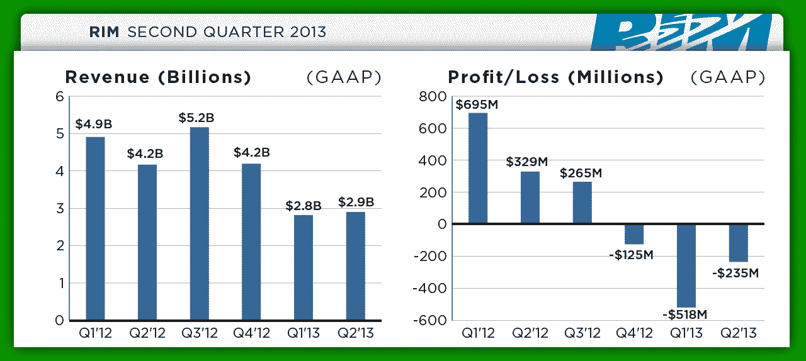
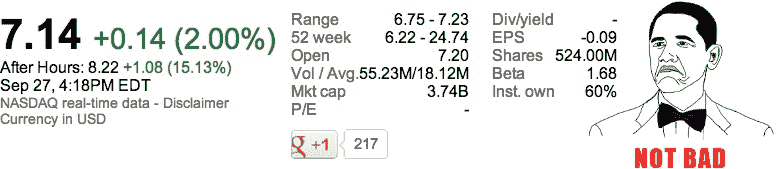

# RIM 2013 财年 Q2 业绩:净亏损 2.35 亿美元，营收 29 亿美元，黑莓出货量 740 万部 TechCrunch

> 原文：<https://web.archive.org/web/https://techcrunch.com/2012/09/27/rims-fiscal-q2-2013-results-net-loss-of-235-million-on-2-9-billion-in-revenue-7-4-million-blackberrys-shipped/>

# RIM 2013 财年 Q2 业绩:净亏损 2.35 亿美元，营收 29 亿美元，黑莓出货量 740 万部

经历了一周的过山车之后，RIM 刚刚发布了其 2013 财年 Q2 财务报告，令人震惊的是，它们并没有一些人想象的那么糟糕。这家总部位于滑铁卢的公司报告了 29 亿美元的收入，净亏损 2.35 亿美元(相当于每股摊薄 0.45 美元)，足以超过分析师的严峻预期。

鉴于 RIM 最近经历的一切，分析师对该公司不太看好也就不足为奇了——根据汤森路透的调查，他们预计该公司将报告每股亏损 0.46 美元，收入为 24.8 亿美元。

对 RIM 来说，这仍然不是好消息，但比起上个季度[报道的糟糕透顶的收入数字(28 亿美元的收入，净亏损 5 . 18 亿美元)，这是一个可喜的变化。更重要的是，这是 RIM 三个季度以来首次成功提高季度收入。](https://web.archive.org/web/20221209222709/https://beta.techcrunch.com/2012/06/28/rim-q1-2013-results/)

首席执行官海托斯顿·海因斯在他的 BlackBerry Jam 主题演讲中透露了该公司用户群的增长，但该发布会更详细地介绍了 RIM 在过去三个月中能够移动多少设备。该公司报告称，本季度出货了 740 万部黑莓手机和 13 万部 PlayBook——与上一季度的 780 万部黑莓手机和大约 26 万部 PlayBook 平板电脑以及 2012 年 Q2 的 1060 万部黑莓手机和 20 万部 PlayBook 相比，这并不是什么好消息。

一年一度的购买狂潮即将到来，但如果早期的报告有任何迹象，RIM 计划在新产品发布时保持低调——7 月份泄露的[路线图正确地预测了支持 LTE 的 PlayBook 的发布，但表明地平线上没有其他东西。该路线图也与海因斯在该公司最近一次年度股东大会上发表的关于](https://web.archive.org/web/20221209222709/https://beta.techcrunch.com/2012/07/03/leaked-rim-roadmap-points-to-2-blackberry-10-phones-in-q1-2013-new-tablet-in-q3/)[削减成本](https://web.archive.org/web/20221209222709/http://www.informationweek.com/mobility/smart-phones/rim-ceo-faces-investors-charts-path-to-b/240003444)的言论相吻合——他指出，RIM 将把制造工厂的数量从 10 个减少到 3 个，并将更多精力放在更少的设备上。

关键是，随着人们购买他们的假日设备，RIM 的许多智能手机竞争对手都将经历某种形式的销售增长，而这是 RIM 在很大程度上错过的潜在增长。与此同时，你可以打赌，HTC、三星和诺基亚等公司将在未来几个月疯狂推广他们的新 Windows Phone 8 设备，这几乎肯定会使海因斯在智能手机市场竞争中获得第三名的计划更加难以实现。正如他们所说，时机就是一切。

这对该公司的下一份财报(定于 12 月 20 日发布)到底意味着什么还有待观察，现在 RIM 不再提供定性指导，很难感受到该公司的预期。尽管如此，该公司确实指出，由于“竞争环境越来越激烈”和“手机销量下降”，它正在为“经营业绩面临的持续压力”做准备——简而言之，该公司在波涛汹涌的大海中的旅行应该会继续下去，许多分析师和专家将在未来的几个小时和几天里重申这一点。

正如我在本周早些时候指出的那样，RIM 的股价在周一创下了九年来的新低，但由于该公司的黑莓 Jam 开发者大会传出了一些令人振奋的消息，股价开始回升。现在，RIM 已经成功超出了分析师的预期(如果只是在某些方面勉强达到)，该公司的股价在盘后交易中上涨了近 15%。

【T2