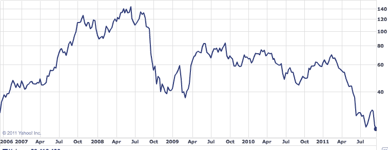

# RIM 股价跌至五年新低技术危机

> 原文：<https://web.archive.org/web/http://techcrunch.com/2011/09/21/rims-stock-price-tumbles-to-a-new-five-year-low/>

上周发布了令人沮丧的 Q2 盈利报告后，RIM 的股价有所下跌，看起来它不会很快停止下跌。当天市场收盘前，RIM 股价继续小幅下跌，直至达到 21.52 美元(撰写本报告时):RIM 五年来的最低价格。

在此之前，RIM 此前的低点出现在去年 8 月，当时他们的股价跌至每股 21.60 美元。

很明显，消费者和股东对 RIM 的信心正在下降，这在很大程度上要归功于他们公司令人失望的财务状况。他们最近的季度盈利报告显示，手机销量全面下降:本季度黑莓销量比上一季度减少了近 300 万部，PlayBook 在 Q1 的销量从 50 万部下降到相对不足 20 万部。

虽然该公司看好他们最近发布的 7 款新黑莓手机，但它们有希望的销售似乎丝毫没有提振 RIM 的股票表现。据报道，RIM 将下调 PlayBook 的价格以止血，但看起来他们越来越希望 QNX 能帮助他们渡过难关。

RIM 对新的操作系统寄予了很大的信心，但有些人已经说它太小太晚了。等到第一批 QNX 黑莓上市的时候，新的 iPhone 已经发布了，更不用说新版本的 Android 和天知道会有多少手机与之配套。QNX 确实可以为黑莓范式提供一个新的视角(能够很好地使用 Android 应用程序也无妨)，但如果黑莓范式本身就是问题所在呢？

由于黑莓的公司血统，它被誉为智能手机世界的主力。像黑莓珍珠手机(巧合的是，差不多正好在五年前推出)这样的手机让 RIM 走出了董事会，进入了背包。即便如此，几年过去了，十几款黑莓手机上市后，一切似乎都没有改变。

让我稍微限定一下:硬件确实变得更好了，RIM 也努力拓展你的黑莓能做什么的想法( [BBM 音乐](https://web.archive.org/web/20230205023624/https://techcrunch.com/2011/08/25/rim-launches-inexplicable-bbm-music-app/)浮现在脑海中)，但不管是好是坏，黑莓的通信友好 DNA 仍然没有改变。你可以把黑莓从一项业务中剥离出来，但你永远不会觉得自己可以把业务从黑莓中剥离出去。这未必是一件坏事，但在我们依赖智能手机来通知、娱乐和联系我们的环境中，黑莓似乎有点古怪。

也就是说，我认为任何人都不应该把 RIM 排除在外。虽然我不认为 QNX 会成为 RIM 所希望的终极目标，但它可以给这个平台带来足够的新鲜空气，让它坚持下去，直到真正重大的事情发生。