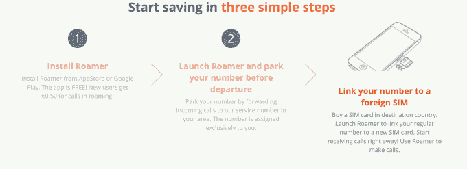

# Roamer 让从国外拨打电话变得更容易 

> 原文：<https://web.archive.org/web/https://techcrunch.com/2014/03/31/roamer-makes-it-easier-to-make-calls-from-foreign-climes/>

# Roamer 使从国外打电话变得更容易

一个月前，我在巴塞罗那会见了 Roamer(T1)的创始人之一，这是一个聪明的 SIM 卡软件/应用程序，可以让你把自己的电话号码带到世界各地。该公司在去年 12 月筹集了 30 万英镑，并与天使共同基金和英国天使基金达成了 100 万英镑的交易。

那么它是如何工作的呢？Roamer 应用程序允许您在世界任何地方以低廉的价格拨打电话。当你准备旅行时，你告诉 Roamer 你的本地、家庭电话号码，然后买一张国际 SIM 卡。任何打到你家的电话都会被转接到你要去的国家的一个本地号码，你可以像在家里一样接听电话，支付本地费用而不是高昂的漫游费。

创始团队西蒙·拉宾、彼得·安特罗普和尼克·乌斯蒂诺夫都有欧洲电信初创公司的经验，拉宾创建了首批移动结账应用之一，名为 Txt2Buy。乌斯蒂诺夫创立了 inbox.lv，拉托维亚的第一个大出口。

这个想法相当有吸引力——你只需几个聪明的黑客就能颠覆漫游费——这对海外的欧洲人来说非常好。该公司正在为美国开发一个版本，并将开始为那些不想麻烦地选择本地卡的用户提供 sim 卡。他们拥有大约 3000 名用户，迄今为止已经处理了 25 万分钟的通话。

该公司希望打破像假日电话这样的公司，它们只是在你出发去旅行之前给你发一张 SIM 卡。例如，因为您的电话被转接到您的本地 SIM 卡，所以无论您身在何处，您所爱的人都可以保持联系。

漫游费通常很贵，这使得漫游费不那么贵了。这是一个有趣的小型创业公司，绝对是一个有趣的想法。