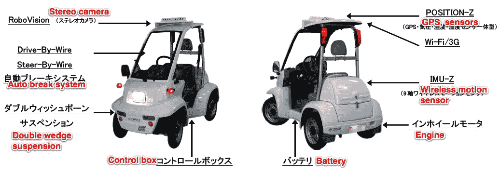

# RoboCar MEV-C:日本获得新型机器人汽车 

> 原文：<https://web.archive.org/web/http://techcrunch.com/2011/08/22/robocar-mev-c-japan-gets-new-robot-car/>

# RoboCar MEV-C:日本获得新型机器人汽车

总部位于东京的机器人公司 [ZMP](https://web.archive.org/web/20230203060209/http://www.zmp.co.jp/en/) 已经生产出[然而](https://web.archive.org/web/20230203060209/https://techcrunch.com/2010/02/26/robocar-g-japanese-venture-to-sell-electric-robot-car-videos/)T4 另一款机器人汽车:这一次，它是所谓的 RoboCar MEV-C，基于 COMS，这是丰田早在 2000 年就开始开发的汽车。就像 COMS 一样，MEV-C 是一辆单人四轮电动迷你车——只是有一个机器人扭曲。

ZMP 表示，这款汽车实际上可以四处行驶，但该公司实际上是将它作为机器人专家、大学和汽车制造商的研究对象进行营销。

尽管传统的 COMS 是一款相当简单的电动汽车，但 ZMP 增加了不少功能，让它更性感:一个立体摄像头，一个 9 轴无线运动传感器，一个 GPS 单元，一个温度和湿度传感器，一个激光测距传感器，蓝牙，Wi-Fi，3G 和所谓的 CAN(控制区域网络)协议，作为一个“开放平台”，允许买家访问每一个硬件。

RoboCar MEV-C 的尺寸为 2.3×1.0×1.6 米，重量为 310 千克。ZMP 已经开始销售，起价为 35000 美元。

Via [机器人](https://web.archive.org/web/20230203060209/http://www.robonable.jp/news/2011/08/zmpevcoms.html) [JP]