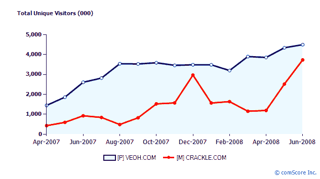

# Rocketboom 与索尼达成七位数分销协议 

> 原文：<https://web.archive.org/web/https://techcrunch.com/2008/08/05/rocketboom-inks-seven-figure-distribution-deal-with-sony/>

每日视频博客  [Rocketboom](https://web.archive.org/web/20230209004842/http://www.rocketboom.com/) 将其发行和广告销售移交给索尼影视公司，以换取七位数的保证和一部分收入。Rocketboom 将在索尼的 [Crackle](https://web.archive.org/web/20230209004842/http://www.crackle.com/) 视频网站上发布，也将在 PS3、PSP 和 Bravia I-Link 电视等其他索尼平台上发布。

Rocketboom 创始人安德鲁巴伦(Andrew Baron)表示，他选择索尼是因为索尼的分销优势，这笔交易让他能够保持对业务的控制。(而将业务出售给另一个媒体买家，比如一年前 WallStrip 以 500 万美元的价格出售给 CBS，则需要他放弃自己的孩子)。这笔交易的结构是分销和广告交易，听起来如果进展顺利，它可能会导致更密切的关系或直接出售。但如果他们不这样做，Rocketboom 将在合同到期后重新获得发行和广告销售的完全控制权。

Rocketboom 目前通过 YouTube、iTunes、Tivo 和其他渠道的发行将保持不变。索尼也将通过这些分销渠道销售广告。Baron 声称，Rocketboom 每月在所有频道的观看次数超过 100 万次，有时会达到几百万次。但作为首批网络视频节目之一，Rocketboom 一直更擅长创作视频，而不是销售广告。

通过与一家主要的媒体公司结盟，Rocketboom 将能够扩大其覆盖范围，Baron 将能够从桌面上拿走一些钱。但是 Rocketboom 现在将被视为索尼的财产。这未必是一件坏事。例如，Crackle 在长期停滞不前之后，终于开始看到一些增长。根据 comScore 的数据，自 4 月份以来，Crackle.com 的美国独立访客增加了两倍，达到 370 万人(相比之下，Veoh.com 的美国访客为 450 万人)。

不过，这笔交易确实提出了一个问题，即网络视频初创公司是可以作为独立实体蓬勃发展，还是需要大型媒体公司的分销力量才能成为主流。

**更新**:在一篇[关于交易的博客文章](https://web.archive.org/web/20230209004842/http://dembot.com/post/44804077/sony-pictures-acquires-exclusive-worldwide-cross)中，Andrew Baron 解释说他选择索尼的一个原因是之前与小公司的广告合作没有成功:

> *我们尝试了像 Federated Media 和 blip.tv 这样的初创广告公司，拒绝在没有某种保证的情况下与任何人长期独家合作。没有人准备好，因为没有人能在我们所有的平台上卖出我们的库存(例如，我们自己的视频格式加上 You-Tube 和 TiVo 上的视频，等等)。).这往往需要管理多个账户和方法，除了我们之外，没有人能够在我们所有的平台上处理销售广告。*

他还指责前 Rocketboom 主播阿曼达·康登(Amanda Congdon)的一场诉讼束缚了公司两年。当其他网络视频初创公司，如 Revison3 和 Next New Networks，筹集了数千万美元时，Rocketboom 却被法院“冻得像冰一样”。

