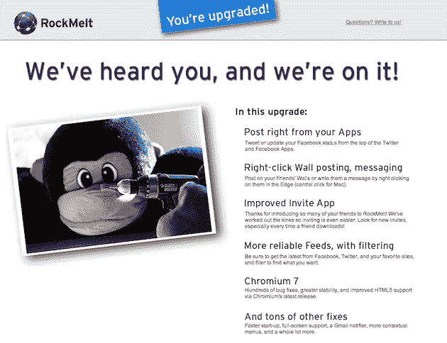

# RockMelt 推出首次重大更新:Chromium 7，更社会化，更好的 Gmail 

> 原文：<https://web.archive.org/web/https://techcrunch.com/2010/11/23/rockmelt-update/>

# RockMelt 推出了第一个重大更新:Chromium 7，更社会化，更好的 Gmail

你记得[罗克梅尔](https://web.archive.org/web/20230202214456/http://www.rockmelt.com/)，对吗？两周前社交浏览器[推出](https://web.archive.org/web/20230202214456/https://techcrunch.com/2010/11/07/rockmelt-browser-sharing-review/)后，关于它的讨论爆发了——然后似乎很快就平息了。但今天带来了一个更新，可能会让人们再次感兴趣。

这项服务刚刚推出了浏览器的首次重大更新。版本 0.8.36.74(性感的名字)包含了大量的 bug 修复和稳定性改进。它还将底层的 Chromium 浏览器最终更新到了第 7 版(对于那些在家工作的人来说，Chromium 开源项目已经进入了第 9 版)。但是这里真正的关键是功能的改进。也就是说，新的 RockMelt 让社交变得更加容易。

在第一个版本中(自发布以来有一些小的更新)，要发微博或更新脸书的状态，你必须点击主工具栏中的图标。尽管 Twitter 和脸书是 Edges 的一部分，但你只能从那里查看更新。现在你可以在 Edge 应用上发微博和更新你的状态。这是一个很好的更新，应该在第一时间出现。

你现在也可以右键点击你的任何一个脸书朋友，给他们发信息，在他们的墙上写字，等等。

或许更好的是 RockMelt 开发的新 Gmail 通知应用程序。以前，你可以将 Gmail 添加到右边缘，但它似乎是使用 RSS 来查看何时有新邮件。换句话说，它很慢。他们的新应用程序似乎会实时更新，让你知道什么时候有新邮件。

随着 Chromium 7 的更新，RockMelt 现在确实感觉更快了。Twitter 和脸书的更新似乎越来越可靠。总的来说，很高兴看到 RockMelt 迅速解决人们面临的问题。

但是产品本身仍然存在一些潜在的问题。这是一个正确的想法，但是执行起来似乎还是有点慢。如果你在脸书有超过 3000 个朋友，不要尝试使用它，那里有一个尚未修复的错误，但他们正在努力。记住，它还在测试阶段。

如果你正在使用 RockMelt，你应该会自动收到这个新更新的提示，或者你也可以点击菜单中的“关于 RockMelt”来手动获取。该产品仍处于封闭测试阶段，但他们也更新了邀请系统，所以也许你可以找到一个。

以下是最新版本中列出的所有更改:

*   新的 Gmail 通知程序可以让你在收到新邮件时知道。要安装，只需前往 gmail.com，登录，然后点击应用程序边缘底部的“添加应用程序”按钮
*   使用顶部新的“撰写”按钮，直接从 Twitter 应用程序发布推文
*   点击顶部新的“撰写”按钮，直接从脸书应用程序更新您的状态
*   通过在新的过滤器框中键入内容，在脸书、Twitter 和新闻应用中进行搜索(Windows 用户按 CTRL+F 调用)
*   撰写消息，在墙上写字，或者当你右击 Edge 中的朋友或应用程序时，通过更丰富的上下文菜单直接进入网站
*   更快、更一致的 Twitter 和脸书源更新和通知
*   在增强型邀请应用中寻找更多邀请和改进的通知
*   在全屏模式下隐藏或显示边缘，就像在普通视图下一样
*   升级到 Chromium 7 可以提高速度和稳定性，并提供更好的 HTML 5 支持

