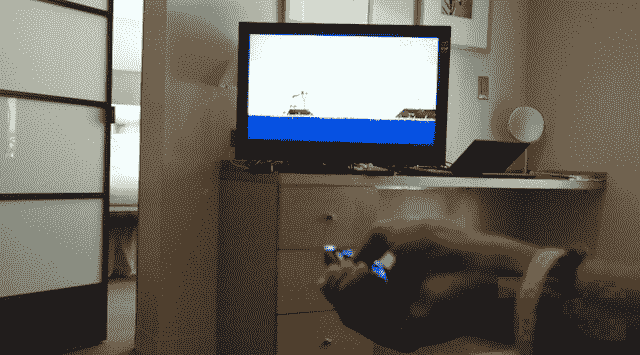
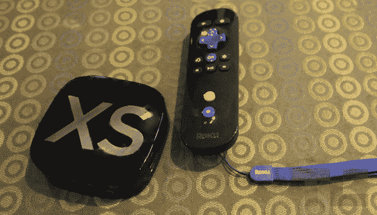

# Roku 推出新的媒体流，配有运动游戏功能，非常适合愤怒的小鸟 TechCrunch

> 原文：<https://web.archive.org/web/http://techcrunch.com/2011/07/19/roku-launches-new-media-streamers-complete-with-motion-gaming-capabilities-perfect-for-angry-birds/>

# Roku 推出新的媒体流，配有完美适用于《愤怒的小鸟》的动作游戏功能

Roku 刚刚宣布了其第四代媒体流，不出所料，它们是迄今为止最好的。它们拥有更多的功能，更小的物理尺寸，和以前一样的苹果电视致命的价格点。

这些新型号，Roku 2 HD，Roku 2 XD 和 Roku 2 XS，比以前的型号有更多的媒体流功能。所有主要的流媒体资源都在:网飞，亚马逊即时视频，Hulu Plus。此外，Roku 还有来自 NHL、NBA 和美国职业足球大联盟的直播体育节目，以及 rdio、Pandora 和 MOG 的点播电台。任何其他设备都无法提供更完整的流媒体服务。但很明显，Roku 希望建立一个不仅限于流媒体的平台。新款机型内置了 2011 年最热门游戏的动作游戏功能。是的，愤怒的小鸟。

如果你已经玩过《愤怒的小鸟》,在发布后会有更多的游戏推出——比如《愤怒的小鸟季》和《愤怒的小鸟里约》以及其他未公布的游戏。随着新硬件的出现，新的流媒体电台也出现了。Roku 现在有超过 300 个电台，随着愤怒的小鸟频道而来的是脸书、EPIX、美国职业足球大联盟、AOL HD 和 FoxNews.com。

 
三款机型都兼容蓝牙游戏遥控器，这种遥控器与 Wii 遥控器出奇的相似。(除了明显的色差)Roku 游戏遥控器配有顶级 XS 型号，在未来几周内，将与 2GB MicroSD 卡捆绑销售，售价 29 美元。在一次新闻发布会上，我们发现 6 轴无线射频蓝牙技术像宣传的那样有效。投掷愤怒的小鸟从未如此有趣。

新型号很小——并不是说旧型号很大——消耗的能量不到两瓦特。整个系列都具有杜比数字增强版、无线连接、HDMI 输出和用于额外游戏存储的 microSD 卡插槽。顶级的 XS 型号还配备了以太网端口、USB 端口，以及中端 XD 型号的 1080P 支持。(更便宜的型号 720p)预计本月底 Roku 2 HD、Roku 2 XD 和 Roku 2 XS 在百思买、亚马逊、Fry's、RadioShack 和 Roku.com 的价格分别为 59 美元、79 美元和 99 美元。
