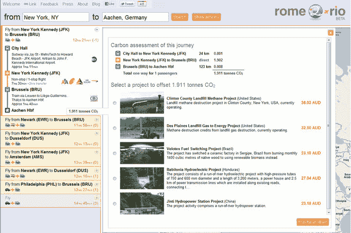

# rome2rio 通过补偿期权合作伙伴关系增加碳中和旅行 TechCrunch

> 原文：<https://web.archive.org/web/https://techcrunch.com/2011/08/01/rome2rio-adds-carbon-neutral-travel-with-offset-options-partnership/>

# rome2rio 增加碳中和旅行与补偿选项合作

由两名前微软工程师领导的搜索引擎
[【Rome 2 Rio】](https://web.archive.org/web/20230203100920/http://www.rome2rio.com/)，让你可以通过带有多模式旅行选项的谷歌地图，准确地计算出如何从 A 地到 B 地(与 FromAtoB.com 相似)，现在已经与 [Offset Options](https://web.archive.org/web/20230203100920/http://www.offsetoptions.com/) 合作，将碳中和旅行添加到其产品中。

这使得用户可以比较每一种旅行选择的碳足迹，从而考虑对地球和他们钱包的影响。他们可以实时计算他们所选择路线的碳足迹和一系列碳抵消项目选择，从而使他们的旅行碳中和。在亚马逊买树，或者其他类似的事情。

如果航空公司已经被 Kayak、SkyScanner 之类的解决了，rome2rio [搜索航班、渡轮、火车](https://web.archive.org/web/20230203100920/https://techcrunch.com/2011/04/07/rome2rio-is-google-maps-with-airfare-train-and-driving-options/)和驾驶路线，向你展示你旅行每一段的交通选择。

正如被 SkyScanner 收购的 Zoombu 发现的那样，人们有兴趣制定飞机和火车路线——特别是在欧洲，这非常合理，既有廉价航空公司，也有火车，甚至还有不错的租车/公路路线可以规划。但到目前为止，我们还没有看到任何 Zoombu 集成到 SkyScanner 中，这让我觉得他们错过了一个技巧。