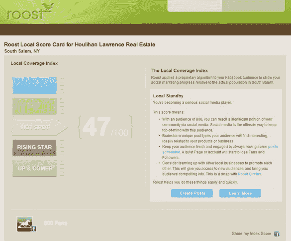
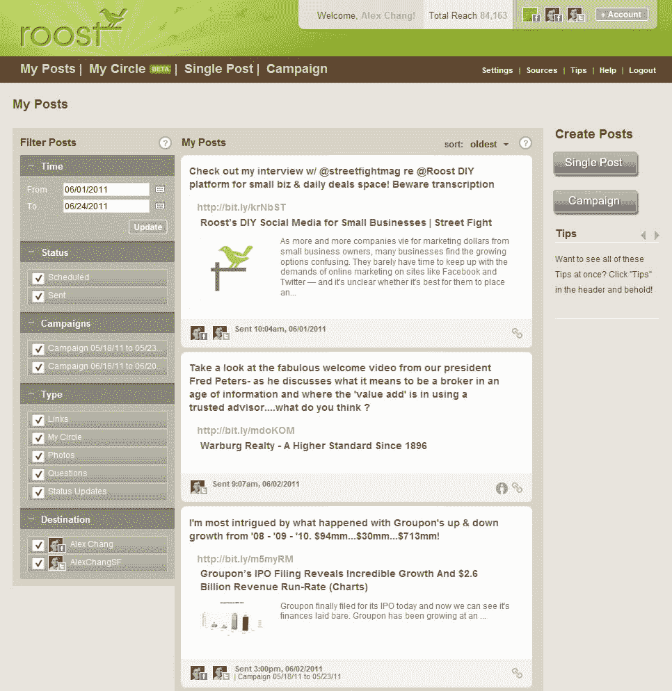

# Roost 将自己重塑为本地企业的超级简单的社交媒体管理器

> 原文：<https://web.archive.org/web/http://techcrunch.com/2011/06/21/roost-social-media/>

# Roost 将自己重塑为本地企业的超级简单的社交媒体管理者

房地产泡沫破裂对最初作为房地产搜索引擎的[栖居地](https://web.archive.org/web/20230313111355/http://www.roost.com/)并不友好。但首席执行官 Alex Chang 在 2008 年末筹集了 800 万美元，并说服投资者支持他走上一条完全不同的道路:为当地企业创建和管理社交媒体营销活动的服务。

Roost 于去年年中重新推出，首先针对的是使用最初 Roost 的 25，000 家房地产代理商。去年 3 月，Chang 向当地其他企业开放了市场。Roost 利用脸书和 Twitter，帮助餐馆、汽车经销商、非营利组织和其他组织在周日晚上的 20 分钟内创建社交媒体活动。

商家告诉 Roost 他们所在的行业，Roost 给他们推荐的 RSS 提要和其他相关内容，他们可以与粉丝、追随者和客户分享。“这些小企业没有时间，他们不知道张贴什么，他们没有一个大的网络，”常说。“你做了所有这些工作，却没有得到那么多。”他试图通过让 Roost 成为一个低接触产品来解决这三个问题，这个产品为商家做了大部分工作。它创建了一个自动化的社交媒体活动，定期发送状态更新或带有链接、照片、问题和引用的推文。Roost 还为企业提供了团结成圈的能力，以便交叉推广优惠、链接和其他内容。

今天，Roost 发布了另一个新特性，Roost 本地记分卡。它着眼于一家企业在脸书有多少粉丝和喜欢，其中有多少来自生活在同一城市的人，以让企业主了解他们如何通过社交媒体信息渗透当地市场。“不是所有的粉丝都是生来平等的，”常说。该分数是一个从 1 到 100 的指数，企业从冉冉升起的新星到热点再到当地传奇不断攀升。

Roost 目前是免费的，但 Chang 计划增加额外的功能，并计划收取月租费。帮助小企业开展社交媒体活动没问题，但如果 Roost 能够帮助他们跟踪和奖励客户忠诚度，而不仅仅是喜欢，那么这一切就开始变得有趣了。

