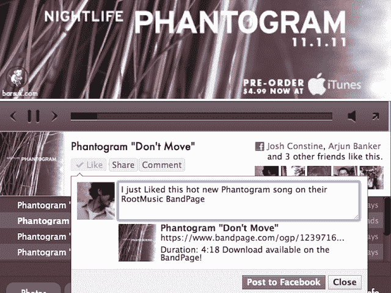

# RootMusic 通过在歌曲中添加 Like 按钮来提升 BandPage 病毒式传播

> 原文：<https://web.archive.org/web/https://techcrunch.com/2011/11/04/rootmusic-like-buttons/>

# RootMusic 通过在歌曲中添加 Like 按钮来提升网页传播力

脸书最受欢迎的音乐应用程序 RootMusic 的 BandPage 刚刚升级到 HTML5，现在包括了一个强大的新病毒频道。使用 f8 推出的 Open Graph 功能，该应用程序的音乐家档案中的所有歌曲现在都包括类似的按钮，可以立即将可播放的歌曲分享到新闻订阅源。RootMusic 的页面总监 Matthew Conn 告诉我“我预计分享量会有非常大的增长”。

考虑到 BandPage 每月有 2860 万活跃用户，分享的歌曲量可能会非常大。更新后的应用程序将使新闻订阅成为一个更好的发现音乐的地方，由于 BandPage 不像 Spotify 那样自动分享收听活动，因此探索没有风险。

【T2

由于脸书没有为想要流媒体音乐的艺术家提供官方解决方案，RootMusic 的 BandPage 像滚雪球一样拥有超过 30 万名音乐人。该公司采用了一种免费增值模式，这种模式是为乐队乞讨租金而建立的，大多数功能都是免费提供的，高级账户每月只需花费 2 美元。尽管如此，包括 ReverbNation 和 Bandcamp 在内的竞争对手正试图通过提供完全免费的应用程序来削弱 RootMusic，而不是向音乐家收取销售歌曲的费用。

为了保持领先地位，RootMusic 一直在稳步推出新功能，并让更多功能免费。虽然时髦的视频播放器和可定制的设计改善了现有粉丝的体验，但大多数乐队真正想要的是曝光率，从而吸引新粉丝。这就是这次更新的内容。

当用户在 BandPage 上播放歌曲或视频时，他们现在可以看到赞和评论按钮，让他们分享可以在提要中在线播放的媒体。以前，用户必须通过国外专有的共享流多次点击才能发布歌曲。康恩告诉我，BandPage 更快、更熟悉的分享流程将增加点击量，因为“用户现在做他们习惯在脸书做的事情:喜欢和评论。”

更多的分享意味着更多的朋友在新闻提要中听歌，点击进入艺术家乐队页面。这种病毒式传播将有助于乐队获得新的粉丝，并推动下载量和演唱会门票的销售。反过来，今天的更新使 BandPage 成为一个更好的流媒体解决方案，更多的艺术家将愿意使用和支付。