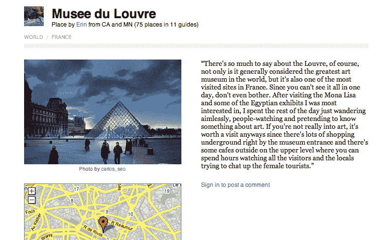

# Ruba:照片胜于语言的在线旅游指南

> 原文：<https://web.archive.org/web/https://techcrunch.com/2009/04/30/ruba-an-online-travel-guide-where-photos-speak-louder-than-words/>

# Ruba:在线旅游指南，照片胜于语言

旅游指南在网上一毛钱一打。但在大多数情况下，它们并不真正有助于*探索*——点击各种指南来感受你想去的地方并不有趣，因为每个指南都装满了文字。今天发布的新旅游网站 Ruba 希望为用户提供一种视觉浏览世界各地城市及其景点的方式，提供照片丰富的指南，并强调让用户更容易快速发现新的地点。

该网站由迈克·卡西迪领导，他创立了许多成功的公司，包括 2006 年以 1 . 02 亿美元卖给维亚康姆的 Xfire。卡西迪说，他的团队已经努力创建了一个非常干净的网站，非常简洁，很容易随意浏览，在搜索上有很强的技术重点。搜索引擎在用户的描述和标题中识别关键词，而不是要求用户标记他们创建的指南。虽然这可能容易出现误报，但在我看到的演示中，它似乎工作得很好(搜索“伦敦儿童”会出现像“伦敦儿童 5 大必做之事”和“伦敦水族馆”这样的指南)。

指南都是由用户编写和提交的，Ruba 从 Google 和 Flickr APIs 中提取来帮助精确定位，并提供一些样本照片(用户也可以提交自己的照片)。卡西迪说，用户一直在建立指南，既作为他人的参考，也作为记录自己旅行的一种方式(其他用户也可以从中受益)。

旅游是一个很难进入的领域，像[猫途鹰](https://web.archive.org/web/20230227002144/http://www.tripadvisor.com/)这样的成熟网站主导着用户评论的提交，而无数较小的网站正在寻找自己的位置。从一开始，Ruba 就在寻求病毒式传播。该网站集成了 Twitter 和脸书连接，允许用户广播他们要去的地方，并要求朋友提供信息(我认为这在脸书会特别好，因为项目会出现在用户的新闻订阅中)。

关于网站生存能力的最大问题是，所有内容都是用户提交的，包括每个地点的简介。如果网站能像 Yelp 和 Flickr 一样建立一个强大的社区，那么这就不是问题了。但是，如果人们频繁访问网站，却找不到他们想要的城市或景点，他们就不太可能提交自己的指南(这又是一个先有鸡还是先有蛋的问题)。也就是说，我怀疑许多人会喜欢建立自己的指南。Trip Advisor 可能有一个更大的社区，但是能够在你的指南上印上你的名字，将其嵌入你的博客并与朋友分享，这样你的想法就不会在混乱中丢失，这是有一定吸引力的。

